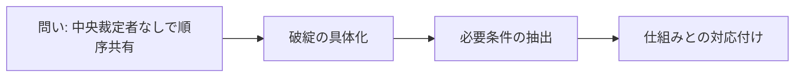

# 序章: この本の問い

ブロックチェーンは、暗号資産を発行するためだけの仕組みではありません。ここで扱いたい中心問題は、中央裁定者がいない環境で、取引の順序をどのように共有するかという点です。[^S-INTRO-001]

この軸が曖昧なまま学び始めると、用語や方式名だけが記憶に残り、何の問題を解く技術なのかが見えにくくなります。序章では、問いの形、日常との接点、対象範囲、読み進める手順をそろえます。

この章の語り手は設計者です。知識を増やすことより、後続章で判断を誤らないための座標づくりを優先します。

## 00-1 問いの設定

銀行やカード会社のような中央主体がいる決済では、競合する取引が出ても、最終判定は運営者の規則へ集約されます。[^S-CH02-001] ところが中央裁定者がいない環境では、その役割を人物ではなく公開規則で置き換える必要があります。[^S-INTRO-001]

そこで立つ問いは一つです。参加者の観測がずれても、全員が同じ順序へ収束できるのか。これは信念や好みの問題ではなく、分散環境で成立する判定規則を設計できるかという工学の問題です。[^S-CH03-001]

ここでよく出る案は、時刻で並べる方法です。ただ、この案は反例で崩れます。反例Aでは、同じ残高を使う二つの支払い要求がほぼ同時に送られ、店Aに近いノード群はAを先に見て、店Bに近いノード群はBを先に見ます。反例Bでは、共有クーポンが二店舗で同時に使われ、各端末は「先に届いた方」を有効と判断します。どちらの場面でも、観測順が一致しないため、時刻だけでは履歴が一本に決まりません。[^S-CH03-001][^S-CH04-001]

ここから引ける条件は明快です。必要なのは高精度な時計そのものではなく、観測差を前提にしても判定が収束する規則です。時計同期は助けになりますが、遅延の非対称性や一時的な輻輳を消せるわけではありません。[^S-CH03-001][^S-CH04-001]

成立条件は、同じ取引集合を受け取った参加者が、同じ規則を適用したときに同じ順序判定へ到達できることです。反対に、参加者ごとに裁量が残る規則、あるいは観測時刻の一致を暗黙前提にする規則は、非成立条件に入ります。設計時はこの対を明示しておくと、実装段階での誤解を減らせます。

## 00-2 日常との接続

普段の支払いで見えるのは「通った/通らない」の結果だけです。けれど裏側では、同時刻付近に届く要求の並べ替え、競合要求の棄却、記録更新の優先順位づけが常時動いています。順序管理は暗号資産特有の話ではなく、決済一般の土台です。[^S-CH02-001]

ここで使う語を早めにそろえます。序章から第3章までを読み切るうえで、次の5語は避けて通れません。

- サーバー（Server）: 要求に応答する側の計算機。
- クライアント（Client）: 要求を送る側の計算機。
- ノード（Node）: 検証と中継に参加する計算機。
- レイテンシ（Latency）: 情報が届くまでの遅延。
- プロトコル（Protocol）: 参加者が共有する公開手順。

語の意味がぼやけたまま読むと、「クライアントが送った順」と「ノードが観測した順」を同じものとして扱いがちです。その瞬間に、本文の因果が追えなくなります。

読みながら迷ったときは、文中の主語が誰かを確認してください。サーバーの話か、クライアントの話か、ノードの話かが切り替わるだけで、同じ「順序」という語でも意味が変わります。[^S-CH01-001][^S-CH04-001]

## 00-3 境界条件

この本が扱うのは、順序共有問題の定式化、必要条件の抽出、仕組みへの対応付けです。投資助言、価格予測、銘柄推奨は中心対象に置きません。

対象を絞る理由は、議論を小さく見せるためではありません。話題を無制限に広げると、順序共有という主線に別の評価軸が流れ込み、章ごとの比較が崩れるからです。

また本書は、実装手順の完全マニュアルではありません。狙いは、実装前に「問題→要件→仕組み」の対応を見分けられる状態へ到達することです。新しい方式が現れても、どの要件を満たし、どこが未充足かを説明できるようになります。

到達上限も明示しておきます。暗号理論の厳密証明や性能最適化コードの詳細は扱いません。ここで整えるのは、方式比較に使える評価軸です。
言い換えると、本書が渡すのは単一の正解ではなく、方式を比較するための物差しです。

## 00-4 読み方

本書は、章ごとに三つの問いで読むと崩れません。いま何の破綻を扱っているか。そこから何の要件を取り出したか。その要件をどの仕組みで満たしているか。この三点を追うだけで、情報量が増えても主線を保てます。

序章で特に重いのは、00-1 の問い設定と 00-3 の境界条件です。問いが曖昧だと後続章は部品知識の寄せ集めになりますし、境界が曖昧だと価格論や投資論が混入して評価軸がぶれます。

第1章から第3章では、順序問題が生まれる理由と難しさの形を固めます。第4章以降では、ネットワーク、データ構造、合意規則という技術部品へ順に接続します。[^S-CH01-001][^S-CH02-001][^S-CH03-001]

読み進める途中で詰まるときは、前章の要件が次章のどの部品へ渡されたかだけを確認してください。復習範囲が絞れ、本文の流れが戻りやすくなります。

具体的には、章末で「この章で増えた要件は何か」を一行で書き出し、次章冒頭で「その要件を受け取る部品はどれか」を照合します。この往復を続けると、説明が長くなっても理解の土台が崩れにくくなります。
この往復確認は、終章まで同じ評価軸を保つための実用的な習慣にもなります。

次の図は、序章から後続章までを一本の評価軸で結ぶ地図です。

この章で持ち帰る結論は単純です。入口で見るべきものは「何を発行するか」ではなく、「どう順序を共有するか」です。[^S-INTRO-001]

## 参考文献

[^S-INTRO-001]: Satoshi Nakamoto, "Bitcoin: A Peer-to-Peer Electronic Cash System" (2008). https://bitcoin.org/bitcoin.pdf
[^S-CH01-001]: Satoshi Nakamoto, "Bitcoin: A Peer-to-Peer Electronic Cash System" (2008). https://bitcoin.org/bitcoin.pdf
[^S-CH02-001]: Visa, "Visa Core Rules and Visa Product and Service Rules" (2025-10-18). https://usa.visa.com/content/dam/VCOM/download/about-visa/visa-rules-public.pdf
[^S-CH03-001]: Leslie Lamport, "Time, Clocks, and the Ordering of Events in a Distributed System" (1978). https://cacm.acm.org/research/time-clocks-and-the-ordering-of-events-in-a-distributed-system/
[^S-CH04-001]: Christian Decker and Roger Wattenhofer, "Information Propagation in the Bitcoin Network" (2013). https://www.research-collection.ethz.ch/handle/20.500.11850/74095
