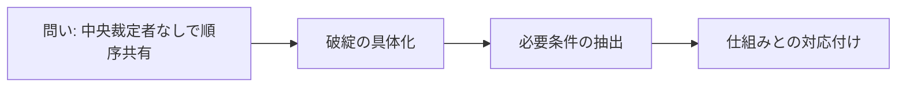

# 序章: この本の問い

この本の中心命題は、ブロックチェーンを「暗号資産を発行する仕組み」としてではなく、「中央裁定者がいない環境で取引順序を共有する仕組み」として理解することです。ここを先に固定しないと、後続章で方式名だけを覚えてしまい、何の問題を解いている技術なのかが見えなくなります。[^S-INTRO-001]

序章の役割は四つです。問いを置くこと、日常の状況と結びつけること、対象範囲を切ること、読み方を与えることです。第1章以降を読むための座標軸を先に作ります。

## 00-1 問いの設定

中央裁定者がいる世界では、競合する取引が出ても最後は一つの判定へ集約できます。銀行や決済ネットワークの運営者が「この順序を正とする」と決めるからです。中央裁定者がいない世界では、この集約機能を人物の判断ではなく公開規則で代替しなければなりません。[^S-INTRO-001][^S-CH02-001]

ここでの問いは一文で書けます。中央裁定者なしで、どうやって全員が同じ取引順序を共有するか。この問いは「誰を信用するか」という性格論ではなく、「観測がずれても同じ判定に収束する規則を設計できるか」という工学的問いです。[^S-CH03-001]

素朴案として「時刻で並べればよい」という案が出ます。ですが、送信時刻・受信時刻・検証時刻は観測者ごとに一致しません。店Aに近いノード群が Tx-A を先に見て、店Bに近いノード群が Tx-B を先に見る状況は自然に起きます。時刻だけで順序を決めると、正当履歴が複数立ってしまいます。[^S-CH03-001][^S-CH04-001]

この破綻から橋渡しされる要件は明確です。必要なのは「もっと正確な時計」ではなく、「観測差を前提にしても判定が収束する公開規則」です。第1章以降は、この要件を満たす部品を順に確認します。

## 00-2 日常との接続

日常の支払いでは、利用者には「通った/通らない」しか見えません。しかし裏側では、同時刻付近に届いた要求の順序付け、競合要求の棄却、記録更新の優先順位が常に処理されています。順序管理は、暗号資産特有の話ではなく、決済全般の土台です。[^S-CH02-001]

序章から第3章で使うIT基礎語を先に定義します。

- サーバー（Server）: 要求に応答する側の計算機。
- クライアント（Client）: 要求を送る側の計算機。
- ノード（Node）: 検証と中継に参加する計算機。
- レイテンシ（Latency）: 情報到達までの遅延。
- プロトコル（Protocol）: 参加者が共有する公開手順。

この5語は次章以降で繰り返し出ます。意味が曖昧なまま進むと、読者は用語の復元に認知資源を使い、肝心の因果を追えません。だから序章で先に定義します。

日常例Aとして、同じ残高を使う二つの支払い要求がほぼ同時に送られる場面を考えてください。ノード群AにはA要求が先に届き、ノード群BにはB要求が先に届くと、局所判定はどちらも正しく見えます。日常例Bとして、共有クーポンを二店舗で同時利用すると、各端末は先に受けた要求を有効と判定しやすく、全体判定は割れます。どちらも「誰かが悪い」からではなく、「観測順が一致しない」から起きる問題です。[^S-CH01-001][^S-CH04-001]

## 00-3 境界条件

本書が扱うのは、順序共有問題の定式化、必要条件の抽出、仕組みへの対応付けです。投資助言、価格予測、銘柄推奨は扱いません。税務や法務の個別判断も中心対象にしません。対象を先に切るのは、議論を狭めるためではなく、主線を壊さないためです。

また、本書は実装手順の列挙本でもありません。実装が不要という意味ではなく、実装の前に「問題→要件→仕組み」の対応を理解するという順序を採ります。要件が見えていれば、新しい方式が出ても比較軸を失いません。

到達点の上限も明記します。本書は暗号理論の厳密証明や最適化コードまでは踏み込みません。到達点は、ある方式がどの要件を満たし、どの要件を満たさないかを説明できる状態です。

出典運用もここで固定します。事実主張はMarkdown脚注やリンクで根拠を示し、未確証は断定を避けます。必要な場合のみ「要検証」を明示し、保留理由を残します。

この方針には実務上の意味があります。読者が本文を読んだあとに「どこまでが確定情報で、どこからが解釈か」を再点検できるからです。順序共有の議論は、制度、ネットワーク、実装の層が混ざりやすく、根拠の境界が曖昧だと誤解が連鎖します。序章で根拠の書き方を固定するのは、後続章の検証可能性を守るためです。

## 00-4 読み方

読み方は三問で固定できます。第一に「この章はどの破綻を扱うか」。第二に「その破綻からどの要件を引き出したか」。第三に「その要件をどの仕組みで満たしたか」。章ごとにこの三問を回せば、情報量が増えても主線は散りません。

第1章は順序が必要になる理由を二重支払いで固定します。第2章は中央裁定者ありの世界を比較軸として整理します。第3章は観測差と部分順序を使って困難を定式化します。第4章以降は、ネットワーク、データ構造、合意規則という技術部品で解を組み立てます。[^S-CH01-001][^S-CH02-001][^S-CH03-001]

読前と読後に一文要約を置くと効果的です。読前は「この章はどの破綻を扱うか」、読後は「どの要件を固定できたか」を一文で言い直します。詰まったときは、問い・破綻・要件・仕組みのどこで止まったかを明示してください。復習範囲をすぐ限定できます。

さらに、章間の接続を追うときは「前章で固定した要件が、次章でどの部品へ割り当てられるか」を一行メモにして残すと有効です。このメモを作る習慣があると、章をまたいだときに論理が飛んだように感じる箇所を早期に検知できます。第1章から第5章までは、この対応メモを作りながら読むと理解速度が上がります。

次の図は、序章から後続章までの評価軸を一本にそろえるための地図です。

序章の結論は一つです。ブロックチェーン理解の入口は「何を発行するか」ではなく「どう順序を共有するか」です。この軸を保持して第1章へ進みます。[^S-INTRO-001]

## 参考文献

[^S-INTRO-001]: Satoshi Nakamoto, "Bitcoin: A Peer-to-Peer Electronic Cash System" (2008). https://bitcoin.org/bitcoin.pdf
[^S-CH01-001]: Satoshi Nakamoto, "Bitcoin: A Peer-to-Peer Electronic Cash System" (2008). https://bitcoin.org/bitcoin.pdf
[^S-CH02-001]: Visa, "Visa Core Rules and Visa Product and Service Rules" (2025-10-18). https://usa.visa.com/content/dam/VCOM/download/about-visa/visa-rules-public.pdf
[^S-CH03-001]: Leslie Lamport, "Time, Clocks, and the Ordering of Events in a Distributed System" (1978). https://cacm.acm.org/research/time-clocks-and-the-ordering-of-events-in-a-distributed-system/
[^S-CH04-001]: Christian Decker and Roger Wattenhofer, "Information Propagation in the Bitcoin Network" (2013). https://www.research-collection.ethz.ch/handle/20.500.11850/74095
