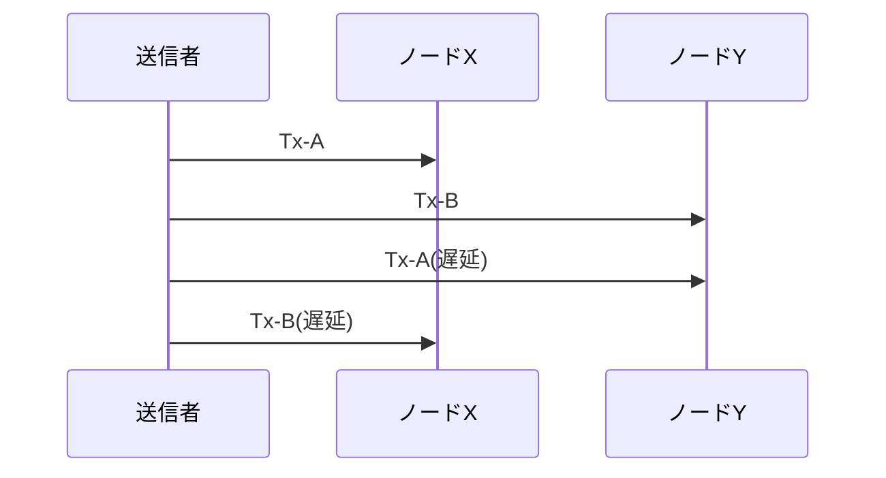
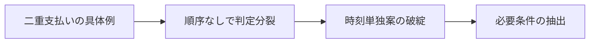

# 第1章: なぜ順序が必要か

この章の目的は、順序がないと何が壊れるかを先に固定することです。ブロックチェーンの説明では、しばしば署名やハッシュの仕組みから始まりますが、順序の必要性を先に押さえないと、技術部品の意味が結びつきません。ここでは二重支払いを中心に、順序不在の破綻を日常例で確認し、最後に必要条件を抽出します。[^S-CH01-001]

## 01-1 二重支払いの具体例

同じ価値を二人へ同時に渡そうとする行為を二重支払いと呼びます。紙幣なら物理的に一枚しか渡せませんが、デジタルデータは複製が容易です。だから「誰が先に正当な受け取りを得たか」を全員で一致させる仕組みが必要になります。[^S-CH01-001]

日常の場面で見てみます。あなたが1,000円相当を店Aと店Bへ同時に送ったとします。店Aは「Aへの送金が先」と主張し、店Bは「Bへの送金が先」と主張できます。双方の端末画面だけを見れば、どちらも成立したように見えるかもしれません。問題は、同じ価値を二度使ってしまっている点です。

中央裁定者がいれば、どちらを有効にするかを後から一つに決められます。中央裁定者がいない場合は、後付けの人手裁定は使えません。最初から「同時に見えても最終的に同じ結論へ寄る規則」が必要です。

ここで重要なのは、攻撃者だけを想定しないことです。悪意がなくても、遅延や再送の差で受信順はずれます。順序問題は不正者の存在だけでなく、分散環境そのものから生じる基礎問題です。[^S-CH04-001]

もう一つ、読者が誤解しやすい点を補います。二重支払い問題は「同じ人が二回送る」場面だけに限定されません。実運用では、アプリ再送、通信途切れ後の再実行、端末の二重送信など、意図しない重複要求でも同型の競合が発生します。したがって設計要件は「不正者対策」ではなく「競合要求全般の順序確定」です。ここを広く捉えると、後続章で扱う規則の意味が明確になります。

実務観点では、順序不一致は利用者説明にも直結します。店Aには「完了」、店Bには「失敗」と表示されると、利用者はどちらを信じるべきか判断できません。表示不一致は単なるUI問題ではなく、背後の順序判定が不一致であるサインです。順序共有を設計課題として先に固定する理由は、技術整合と利用者整合を同時に守るためです。

## 01-2 順序なしの破綻

順序を共有しないと、同じ取引集合を見ても正当履歴の判定が分裂します。これは理論上の細かな差ではなく、実務上の整合性を壊します。会計上の残高、在庫の引当、サービス提供可否の判定が、観測者ごとに食い違うからです。

破綻例A: ノード群Aは `Tx-1 -> Tx-2` の順で受信し、ノード群Bは `Tx-2 -> Tx-1` の順で受信します。両群が「先に見た方を採用する」規則だけで動くと、最終履歴は分岐したまま残ります。破綻例B: 一部ノードで一時的な通信遅延が起きると、遅延復旧後に古い取引が遅れて届き、履歴更新順が逆転します。どちらの破綻でも、局所的に正しい処理が全体整合を壊します。[^S-CH03-001][^S-CH04-001]

この状態では、資産の所有判定を一意に定義できません。所有判定が一意に定義できなければ、支払い完了の判定も一意に定義できません。つまり、順序不在は「便利さの低下」ではなく「取引成立条件の欠落」です。

ここで「後で照合すればよい」という素朴案もよく出ます。しかし後照合は、照合基準が共有されていなければ機能しません。照合時点で「どの履歴を正とするか」が再び争点になるためです。順序共有の問題を後段へ先送りしても、問題が消えるわけではなく、運用コストを後ろへ移しているだけです。

また、順序不在は監査可能性を損ないます。監査で必要なのは、最終残高だけでなく、どの遷移でそこへ到達したかを再現できることです。順序が分裂したままでは、同じ最終値でも遷移経路が複数残り、責任帰属が曖昧になります。したがって順序共有は会計整合だけでなく、責任整合の条件でもあります。

橋渡しとして要件を明確にします。必要なのは、観測順がずれても全員が同じ履歴を採択する規則です。さらに、その規則は第三者が後から検証できる必要があります。検証可能性がない規則は、成立していても共有できません。

## 01-3 時刻基準の限界

「時刻で並べればよい」という素朴案は直感的ですが、分散環境では破綻します。理由は三つあります。第一に、端末時計は完全には一致しません。第二に、送信時刻と受信時刻は別物です。第三に、再送や経路差で到達順が入れ替わります。[^S-CH03-001][^S-CH04-001]

時系列の具体例で確認します。

- 時点 `t0`: 送信者が Tx-A と Tx-B をほぼ同時に送る。
- 時点 `t1`: ノードXは Tx-A を先に受信する。
- 時点 `t2`: ノードYは Tx-B を先に受信する。
- 時点 `t3`: ノードXの時計では Tx-A が先、ノードYの時計では Tx-B が先。

このとき「ローカル時刻の早い方を採用」という規則を使うと、ノードXとノードYは別の履歴を正と判定します。時刻は観測を補助できますが、共有順序を単独で保証できません。

Lamport の議論が示すのも同じ要点です。分散系で自然に得られるのは部分順序であり、すべてのイベント対に対して全順序が自明に決まるわけではありません。したがって、時刻値の大小だけで順序共有問題を解くことはできません。[^S-CH03-001]

時刻を使う設計そのものが無意味だと言いたいわけではありません。時刻は運用監視、遅延分析、トラブル解析には有効です。ただし、時刻は「補助情報」であり「最終採択規則」ではありません。この役割分離を守ると、設計議論が整理されます。時刻は観測の説明に使い、採択は別の公開規則で行う、という分担が必要です。

さらに、時計同期が強い環境でも限界は残ります。同期誤差を小さくしても、同時到達近傍の競合や通信再試行による順序逆転は消えません。つまり「同期精度を上げれば本質問題が解ける」という期待は過大です。ここで求めるべきは高精度時計ではなく、時計誤差が残る前提で一致判定を作る規則です。

次の図は、同じ二取引でも観測者によって先後が逆転する状況を示します。

図から読み取るべき点は、どちらのノードも「間違った処理」をしたわけではないことです。それでも先後判定は割れます。だから必要なのは、観測者の善悪判定ではなく、観測差を吸収する規則設計です。

## 01-4 必要条件の抽出

ここまでの破綻から、順序共有の必要条件を四つに整理できます。

1. 観測差があっても最終判定が収束すること。  
2. 採択規則が公開され、第三者が検証できること。  
3. 同じ価値の重複利用を機械的に排除できること。  
4. 運用時に「暫定」と「確定」を区別して扱えること。

この四条件は、方式比較の共通物差しになります。たとえば新しいチェーンを評価するときも、最初にこの四条件で点検すれば、宣伝文句ではなく設計要件で比較できます。

比較を実践するときは、四条件をチェックリスト化すると効果的です。条件1では「どの故障条件で収束が壊れるか」を確認し、条件2では「第三者が同じ入力から同じ判定を再現できるか」を確認します。条件3では「重複利用の検出単位」を明示し、条件4では「暫定から確定へ移る運用条件」を明示します。各条件に未記載があれば、方式説明としては不十分です。

このチェックリストは、学習にも運用にも使えます。学習段階では章理解の自己点検に使い、運用段階では障害時の切り分けに使います。どの条件が崩れたかを先に特定できれば、対応策の優先順位を短時間で決められます。順序問題を抽象論で終わらせず、運用可能な問いへ落とすことが本章の狙いです。

実務シナリオをもう一段具体化します。EC事業者が同一在庫1点を複数チャネルで販売している状況を考えます。チャネルAの決済通知が先に見えたノード群と、チャネルBの通知が先に見えたノード群で順序判定が割れると、在庫引当と返金判断が分岐します。ここで競合通知の採択条件と確定条件が未定義だと、返金処理が遅れ、利用者説明と会計処理が同時に破綻します。順序問題は資産移転だけでなく、在庫・配送・返金の連鎖処理全体へ波及します。

別シナリオとして、ウォレット事業者の内部帳簿を考えます。入金通知が複数経路から届く構成では、通知重複と通知順逆転が同時に起きます。重複通知を除外する規則だけでは不足で、逆転通知に対してどの履歴候補を採択するかを定義しなければなりません。つまり重複排除規則と順序採択規則は別物であり、両方が揃って初めて「同じ価値を一度だけ使う」条件が成立します。

ここまでの議論を読むと「では常に厳格な確定待ちをすればよい」と考えがちです。しかし確定待ちを増やすと体験遅延が増え、少額高頻度の利用では実用性が下がります。逆に待ち時間を短くすると誤判定リスクが上がります。したがって運用は、金額、再実行コスト、利用者期待時間を踏まえた閾値設計が必要です。本章の四条件は、この閾値設計を場当たりにしないための土台でもあります。

最後に、章末で使える自己点検質問を置きます。第一に「自分の説明は受信順と採択順を区別しているか」。第二に「破綻例を観測者・時点・結果で書けているか」。第三に「必要条件を第三者検証可能な文で言えているか」。この三問に答えられれば、第2章以降の比較議論へ無理なく接続できます。答えられない場合は、用語不足ではなく因果不足が原因であることが多いため、破綻例と橋渡し文を先に見直すと改善が速くなります。

次の図は、本章での論理遷移を圧縮したものです。

本章の結論は明確です。順序は「あれば便利」な要素ではなく、取引の正当性を成立させる前提条件です。次章では比較のために、中央裁定者ありの世界がこの前提をどう処理しているかを整理します。[^S-CH01-001][^S-CH03-001]

### 補助ケース: 失敗を先に設計する

順序設計を現場へ導入するときは、成功ケースより失敗ケースを先に定義すると品質が上がります。たとえば「同時送信」「再送遅延」「部分分断」「再接続直後」の四場面を標準シナリオとして準備し、各場面でどの規則が働くかを事前に書き下します。書き下しの形式は、観測者、時点、候補履歴、採択結果、利用者表示の五項目です。この五項目が一貫していれば、運用担当と開発担当の認識を揃えやすくなります。

現場で頻出する失敗は、規則がないことより、規則があるのに参照されないことです。原因は、規則が文章として長く、運用時に素早く参照できないことにあります。対策として、章の四条件をそのまま運用チェックカードに変換します。カードには「収束」「検証可能」「重複排除」「暫定/確定」の四欄を置き、インシデント時に必ず四欄を埋める手順を定義します。これだけで、場当たり対応から条件ベース対応へ移行できます。

もう一つの実践ポイントは、章末レビューです。週次レビューで、実際に起きた競合事例を一つ選び、四条件で再評価します。再評価の目的は担当者の反省ではなく、規則の穴の発見です。もし「どの条件が崩れたか」を一意に答えられないなら、規則の記述粒度が粗すぎる可能性があります。規則を改定するときは、必ず破綻例と橋渡し文をセットで更新し、読み手が因果を再現できる形を守ります。

この補助ケースで強調したいのは、順序問題を理論知識のまま閉じないことです。順序共有は運用の瞬間に評価されます。障害時に三分以内で「いま何が起き、どの条件が崩れ、どの手順で戻すか」を説明できる状態まで落として初めて、設計として成立したと言えます。本章の四条件は、その説明を可能にする最小単位です。

運用教育の観点では、四条件を新人研修の演習へ組み込むと効果があります。単に用語定義を覚えるのではなく、実際の競合ログを使って「どの条件が未達か」を判定する訓練を行うと、障害対応の初動品質が上がります。順序問題は理論理解だけでは運用に落ちないため、章内の概念を必ず実務手順へ接続することが重要です。

この章で扱った内容は、後続章の評価基準として再利用します。第2章で中央型を見るときも、第3章で分散困難を定式化するときも、「順序不在がどの業務破綻を生むか」を起点に読むと論点がぶれません。つまり第1章は入門章であると同時に、全章共通の検証テンプレートを定義する章です。

補足として、章を読み終えた時点で「時刻を使う範囲」と「時刻に依存しない採択範囲」を分けて書き出してください。この切り分けができると、時刻同期改善をどこまで投資対象にするべきかを現実的に判断できます。

最後に、実務での確認観点を一つ加えます。インシデント報告を書く際は、必ず「競合を検知した時刻」「採択規則を適用した時刻」「利用者へ確定を通知した時刻」を分けて記録してください。この三時刻が分離されるだけで、順序問題を説明するときの因果が崩れにくくなります。

この三時刻を分ける習慣は、第2章以降の比較でも効きます。中央型では時刻差を制度で吸収し、分散型では規則で吸収するため、どの層で差を処理したかを明確に書けるからです。

## 参考文献

[^S-CH01-001]: Satoshi Nakamoto, "Bitcoin: A Peer-to-Peer Electronic Cash System" (2008). https://bitcoin.org/bitcoin.pdf
[^S-CH03-001]: Leslie Lamport, "Time, Clocks, and the Ordering of Events in a Distributed System" (1978). https://cacm.acm.org/research/time-clocks-and-the-ordering-of-events-in-a-distributed-system/
[^S-CH04-001]: Christian Decker and Roger Wattenhofer, "Information Propagation in the Bitcoin Network" (2013). https://www.research-collection.ethz.ch/handle/20.500.11850/74095
