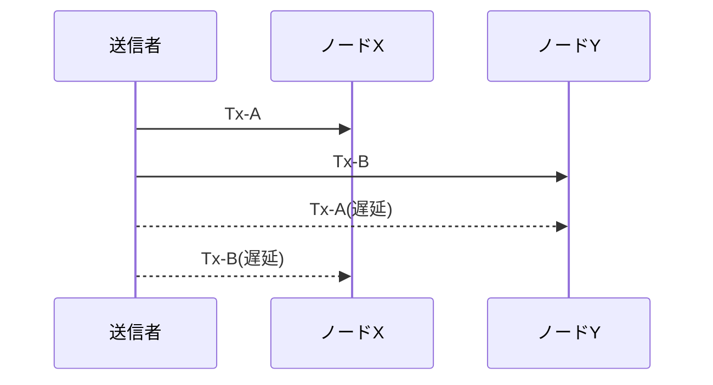
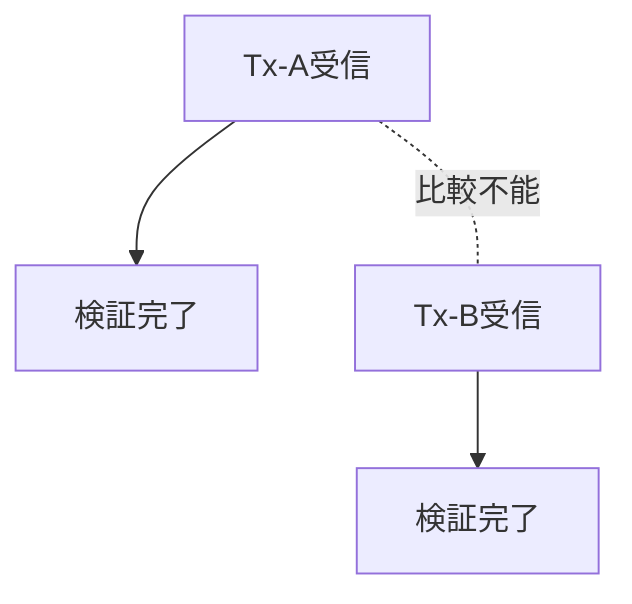

# 第3章: 中央裁定者なしで起きる困難

この章の目的は、中央裁定者がいないときに何が難しくなるかを、感覚ではなく構造で説明することです。結論を先に書くと、難しさの中心は「悪い参加者がいること」だけではありません。「同じ出来事を、参加者が同じ順で観測できないこと」が基礎的な困難です。[^S-CH03-001][^S-CH04-001]

## 03-1 観測の不一致

分散環境では、情報は同時に全員へ届きません。送信者が同時に二つの取引を送っても、経路差、混雑、再送の有無によって、各ノードの受信順は自然にずれます。ここで重要なのは、ずれが例外ではなく通常動作だという点です。[^S-CH04-001]

破綻例A: ノードXは Tx-A を先に見て Tx-B を後に見ます。破綻例B: ノードYは Tx-B を先に見て Tx-A を後に見ます。両者ともローカル観測としては正しいため、どちらかを「誤観測」と切り捨てられません。観測が正しいまま、全体順序だけが一致しない状態が発生します。

中央裁定者ありの世界なら、最後に一者が「こちらを正」と決められます。中央裁定者なしの世界では、その決定も規則として分散的に合意しなければなりません。ここで問題は二段になります。観測差の問題と、観測差をどう吸収して同一判定へ寄せるかという問題です。

この二段構造を意識しないと、議論はすぐ混線します。たとえば「ネットワークを速くすれば解決する」という主張は、観測差を減らす効果はありますが、合意規則の不足を埋める効果はありません。逆に「合意規則が強ければ十分」という主張は、極端な遅延や分断を無視しがちです。問題を分けて扱うことが、設計議論の前提になります。

運用現場では、観測差は連続値として現れます。ある時間帯は差が小さく、別の時間帯は差が大きい、という揺らぎが常にあります。したがって規則設計は「平常時に動くか」ではなく「差が広がった時にも崩れないか」で評価する必要があります。ここを誤ると、検証環境では成功して本番障害で破綻する典型パターンに入ります。

次の図は、同一の二取引でもノードごとの受信順が逆転する状況を示します。

図で確認したい点は、XとYのどちらも局所的には整合していることです。局所整合と全体整合は同じではありません。この差が中央裁定者なしの設計課題を生みます。

## 03-2 部分順序

観測がずれる環境で自然に得られるのは、全順序ではなく部分順序です。部分順序とは、ある事象対では先後を決められるが、別の事象対では先後を決められない状態を含む順序です。Lamport の happened-before 関係は、この構造を明確に示します。[^S-CH03-001]

ここで誤解しやすい点があります。部分順序は「欠陥」ではなく、分散観測の正直な表現です。問題は部分順序そのものではなく、取引成立判定には最終的な全体順序が必要になることです。成立判定を出すには、未比較のまま残る事象対をどこかで解消しなければなりません。

破綻例A: ある取引対が未比較のままだと、ノードAは採用、ノードBは保留という分岐が残ります。破綻例B: 保留状態が長引くと、利用者に対して「いつ確定するか」を説明できず、運用判断が場当たりになります。どちらも、部分順序を全体判定へ接続する規則が不足しているために起きます。

部分順序の扱いで重要なのは、未比較を「失敗」と見なさないことです。未比較は分散観測の自然な帰結であり、失敗は未比較を放置したまま最終判定を要求することです。設計側がやるべきことは、未比較を段階的に解消する手続きを定義することです。たとえば比較窓、候補選別、再評価トリガーなどを規則として公開します。

もう一つの実務論点は、説明文言です。エンジニア向けには「部分順序」と書けば伝わりますが、利用者向けには「まだ比較条件が揃っていないため暫定」といった文言へ翻訳する必要があります。技術語と運用語の変換表を持っていないと、内部で正しい判断をしていても外部では不透明に見えます。

橋渡しとして要件を置きます。必要なのは、部分順序から全体判定へ昇格する公開規則です。さらに、その規則は個々のノードが独立に検証できる形で公開されていなければなりません。非公開裁定を混ぜると、中央裁定者なしという前提が崩れます。

次の図は、比較可能な関係と比較不能な関係が混在する部分順序を単純化したものです。

この図での焦点は、E1とE2が未比較でも局所処理は進められる点です。問題は、最終判定を出す段階で未比較を解消する規則が必要になることです。

## 03-3 合意形成の難しさ

観測差と部分順序がある環境では、「全員が同じ履歴を採択する」こと自体が設計課題になります。単に多数決を導入すれば解決するわけではありません。多数決の前提として、誰が何をいつ観測したか、どの候補履歴を比較しているかを揃える必要があるからです。

破綻例A: ノード群Aとノード群Bが異なる履歴候補を比較していると、同じ投票規則でも結果は一致しません。破綻例B: 一時分断後に接続が回復したとき、双方で「自分が正統履歴」と主張すると履歴再統合が衝突します。比較対象、採択手順、再統合条件のいずれかが未定義だと、衝突解消が人手依存になります。

ここで必要になるのは、候補履歴の比較規則、採択規則、再統合規則を同時に設計することです。比較規則だけ、採択規則だけ、再統合規則だけを個別に最適化しても、全体としては収束しません。設計対象は単一のアルゴリズムではなく、規則群の整合です。

さらに、規則は「運用現場で説明できるか」という条件も満たす必要があります。収束規則がどれだけ厳密でも、障害時に利用者へ説明できなければ実装価値は下がります。中央裁定者なしの設計では、技術的収束と説明可能性を同時に要求されます。

ここで多い誤解は、説明可能性を広報作業だと捉えることです。実際には説明可能性は仕様品質です。障害時に「何が起き、どの規則でどう収束中か」を一貫して説明できるなら、同じ事象に対する社内判断と対外説明が一致します。説明不能な仕様は、運用不能な仕様です。

合意形成を安定させるには、監視指標の設計も必要です。たとえば候補履歴数、再統合回数、再統合に要した時間、暫定表示の継続時間を継続観測すると、どの遅延条件で比較規則や再統合規則が機能不全になるかを検出できます。観測がなければ、改善は印象論になります。

## 03-4 問題定式化

以上を踏まえると、問題の定式化は次のようになります。「観測順が一致しない参加者群に対し、公開検証可能な規則だけで、同一履歴へ収束する仕組みをどう作るか」。この定式化は「誰を信用するか」ではなく、「どの条件で一致を保証するか」を問います。[^S-CH03-001]

要件は四つに整理できます。

1. 観測差を前提にしても候補履歴を比較できること。  
2. 採択規則が公開され、各ノードが独立検証できること。  
3. 分断や遅延後の再統合手順が規則として定義されていること。  
4. 利用者向けに暫定と確定を区別して説明できること。

この四要件を固定すると、第4章以降の技術部品の位置づけが明瞭になります。ネットワークの伝播特性、取引データ構造、ブロック連結、合意規則は、すべてこの要件群を満たすための部品として読めます。

さらに、四要件は分担設計にも使えます。要件1と3は主にネットワーク/合意層、要件2は検証実装層、要件4は運用/プロダクト層が中心責任を持ちます。責任分担を明示すると、障害時に「誰が何を直すか」を早く決められます。中央裁定者なしの設計では、責任の空白を作らないことが特に重要です。

要件4を軽視すると、技術的には正しくても利用者被害が拡大します。たとえば再統合中なのに確定済みと表示すれば、利用者は誤った前提で次の行動を選びます。逆に暫定表示を過剰に続けると、正しく確定している取引まで長く保留されます。技術条件と表示条件の整合は、順序共有の実効性を決める最後の関門です。

この四要件を実際の設計レビューで使うときは、章ごとに「失敗時の挙動」を先に確認すると効果的です。平常時の成功シーケンスはどの方式でも説明しやすい一方で、失敗時の挙動には設計思想の差が出ます。遅延時、分断時、再接続時の各場面で、候補履歴がどう比較され、どの条件で採択が更新されるかを追うと、規則の強度を具体的に評価できます。

また、中央裁定者なしの設計では「局所最適の積み上げ」が全体最適を壊す危険があります。たとえば、あるノード実装が自分の応答速度を優先して比較窓を短くすると、そのノード単体では効率化できても、全体では候補不一致の増加要因になります。したがって設計レビューは、単体性能だけでなく全体収束への寄与で評価しなければなりません。

実務運用では、インシデント対応のテンプレート化も必要です。観測差が閾値を超えたときに、どの順で情報を収集し、どの順で暫定表示へ切り替え、どの条件で通常運用へ戻すかを定義します。テンプレートがないと、同じインシデントでも担当者ごとに判断が変わり、結果として順序共有への信頼が揺らぎます。技術規則と運用手順を分離せず、一体で設計することが要件達成に直結します。

最後に、本章の学習到達を確認する質問を置きます。第一に「観測差はなぜ自然に発生するかを説明できるか」。第二に「部分順序と全順序の違いを、利用者説明可能な言葉で言えるか」。第三に「再統合規則がない場合に何が壊れるかを具体例で示せるか」。この三問に答えられれば、第4章の伝播設計と第5章のデータモデル設計を同じ地図で読む準備が整います。

最後に、問題定式化の位置づけを図で固定します。

この章の結論は、中央裁定者なしの困難が「道徳」ではなく「構造」から生まれることです。次章では、この構造の土台にあるP2P伝播と遅延を具体的に扱います。[^S-CH04-001]

### 補助ケース: 分散環境での判断訓練

中央裁定者なしの運用では、担当者が「どの層の問題を見ているか」を誤ると対応が遅れます。そこで訓練では、事象を三層に分けて記録します。第一層は観測層（誰が何をいつ見たか）、第二層は規則層（どの比較規則が適用されたか）、第三層は表示層（利用者へどう見せたか）です。この三層で記録すると、障害原因が観測差なのか規則不足なのか表示不整合なのかを切り分けやすくなります。

訓練シナリオAとして、短時間分断後に二候補履歴が再接続するケースを使います。観測層では分断区間の受信差を記録し、規則層では再統合トリガーと採択条件を照合し、表示層では暫定表示の切替時刻を確認します。訓練シナリオBとして、高遅延リンクで古い候補が遅着するケースを使い、再評価手順の起動条件を確認します。二つの訓練を回すと、規則の穴が定量的に見えてきます。

また、中央裁定者なしの体制では「正しいが遅い判断」と「速いが説明不能な判断」の間で常にトレードオフが生じます。ここで重要なのは、どちらを選ぶかを都度個人判断にしないことです。事前に優先軸を決め、条件閾値を文書化しておく必要があります。優先軸を公開しておけば、同じデータに対する判断が担当者ごとにぶれるリスクを下げられます。

最後に、章末の自己点検を実務形式で置きます。第一に「観測差をログで再現できるか」。第二に「部分順序を全体判定へ昇格する規則を一文で説明できるか」。第三に「再統合時の利用者表示方針が事前定義されているか」。この三点を満たせば、中央裁定者なしの困難を抽象語ではなく運用可能な問題として扱えていると判断できます。

もう一段踏み込んで、設計レビューの順序を固定します。第一ステップは観測層レビューで、到達遅延と候補分岐の事実を確認します。第二ステップは規則層レビューで、比較条件と採択条件の不足を洗い出します。第三ステップは表示層レビューで、暫定/確定の文言が規則条件と一致しているかを確認します。この順序でレビューすると、原因と結果の逆転を避けられます。

実際の障害対応では、技術チームとサポートチームの同期が鍵になります。技術側が再統合中であることを認識していても、サポート側が確定文言を使ってしまうと、利用者への説明が破綻します。中央裁定者なしの運用では、仕様の正しさだけでなく、仕様状態を横断共有する運用設計が必須です。章内で繰り返し「説明可能性」を要件に入れている理由はここにあります。

最終的に本章が提供する価値は、困難の所在を可視化する地図です。地図がなければ、次章以降の技術説明は断片知識になります。地図があれば、どの技術部品がどの困難を受け持つかを明確に追跡できます。

加えて、分散環境での品質改善は「失敗回数の削減」だけで測ると誤ります。重要なのは、失敗時にどれだけ早く状態を可視化し、どれだけ一貫した手順で復帰できるかです。中央裁定者なしの前提では、失敗ゼロより再現可能な復帰手順の方が実効品質へ効きます。したがってレビュー指標には、候補分岐の件数だけでなく、原因特定時間と復帰判断の一致率を含めるべきです。

もう一点、設計段階で意識すべきなのは「合意規則の説明文」を仕様の一部として扱うことです。規則本体が厳密でも、説明文が抽象的だと運用チームは同じ規則を異なる判断で適用してしまいます。説明文には、入力条件、採択条件、除外条件、再評価条件を短文で固定し、事例付きで更新履歴を残します。これは文章上の配慮ではなく、分散運用で一致判定を維持するための必須条件です。

さらに、分散運用では「状態共有の遅れ」そのものがリスクです。技術的に正しい再統合中でも、状態共有が遅れると関係者は古い前提で行動します。したがって、再統合手順には技術処理だけでなく、状態通知の順序と責任者を含める必要があります。状態通知が設計に組み込まれていれば、観測差が残る場面でも組織判断の分裂を抑えられます。

本章を実務に使うときは、障害後レビューで「規則不備」「監視不備」「通知不備」を分けて採点してください。三つを分離すると、再発防止策が具体化しやすくなり、次章以降で扱う技術部品の改善優先度も決めやすくなります。

補足として、レビュー結果は必ず「次回の判定手順変更」に接続してください。原因分析だけで終えると、次の同型障害で同じ議論を繰り返します。どの条件を追加し、どの通知順を変更し、どの監視閾値を改定したかを明示すると、困難を知識から手順へ変換できます。

この変換ができると、中央裁定者なしの難しさを「避ける対象」ではなく「管理可能な設計対象」として扱えるようになります。
この視点転換が、本章の実務的な到達点です。

## 参考文献

[^S-CH03-001]: Leslie Lamport, "Time, Clocks, and the Ordering of Events in a Distributed System" (1978). https://cacm.acm.org/research/time-clocks-and-the-ordering-of-events-in-a-distributed-system/
[^S-CH04-001]: Christian Decker and Roger Wattenhofer, "Information Propagation in the Bitcoin Network" (2013). https://www.research-collection.ethz.ch/handle/20.500.11850/74095
