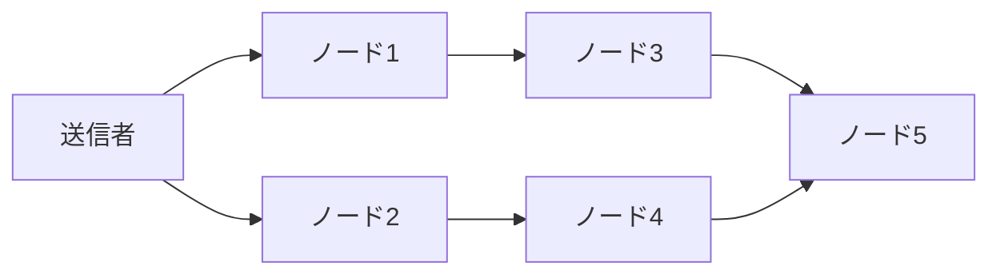
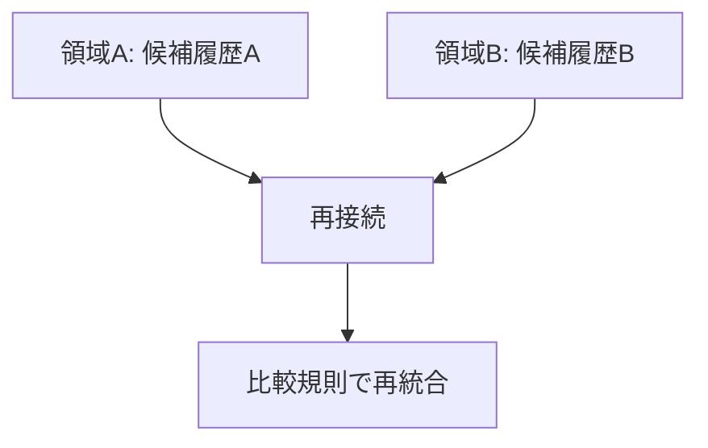
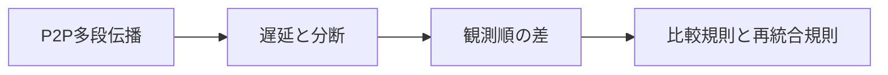

# 第4章: P2Pネットワークと伝播遅延

この章では、順序共有問題の物理的土台であるP2P伝播を扱います。要点は単純です。情報は同時一斉には届かず、多段で広がります。遅延や一時分断は異常ではなく、設計時に最初から織り込むべき前提です。[^S-CH04-001]

## 04-1 伝播の仕組み

P2Pネットワークでは、ノードは受信した情報を隣接ノードへ再送し、全体へ拡散させます。中央サーバーが一斉配信する方式とは異なり、到達経路は複数で、到達順も経路ごとに変わります。この多段伝播の性質が、順序共有の難しさを直接生みます。[^S-CH04-001]

日常語で言えば、同じニュースが友人ネットワークで広がる状況に近いです。Aから先に聞く人、Bから先に聞く人が混在します。どちらが正しい受信順かをニュースそのものからは決められません。P2Pの取引伝播も同型です。

破綻例A: 送信者が同時に二取引を送ると、経路差でノードごとの先着が逆転します。破綻例B: ある中継ノードが一時的に過負荷になると、その先にいるノード群だけ受信が遅れ、局所履歴が別系統になります。どちらも仕様どおりの動作で発生します。

この破綻から橋渡しされる要件は、伝播順そのものを真理とみなさないことです。必要なのは、伝播順が揺れても最終採択が一致する規則です。

ここで補助概念を一つ置きます。P2Pでは「受信順」と「採択順」を分けて考える必要があります。受信順はネットワーク条件で揺れますが、採択順は公開規則で固定できます。両者を混同すると、ネットワーク遅延の議論がそのまま履歴正当性の議論へ流れ、設計が不安定になります。

さらに、ノード実装の差異も受信順に影響します。メモリキューのサイズ、再送間隔、優先度設定が違えば、同一ネットワークでも観測順は変わります。したがって「実装差を無視した理想ノード前提」で設計した規則は、実運用で破綻しやすくなります。規則設計は、実装差を含む現実的な分布を前提にする必要があります。

運用面では、受信順の揺れを観測する指標が必要です。到達遅延の分布、初回受信率、再送回数、候補履歴の同時発生率を継続計測すると、どの条件で分裂リスクが上がるかを早期検知できます。測れないものは改善できないため、伝播段階から監視設計を組み込むことが前提になります。

次の図は、同一取引が多段で広がる様子を単純化したものです。

図の要点は、N5がN3経由とN4経由のどちらを先に受けるかが固定でないことです。経路が複数ある限り、受信順の揺れは構造的に残ります。

## 04-2 遅延と分断

遅延は「たまに起きる事故」ではありません。伝播経路、帯域、キュー滞留、再送制御の差がある限り、遅延分布は常に存在します。さらに短時間の分断が起きると、分断期間中の履歴候補が領域ごとに別々に進みます。[^S-CH04-001]

破綻例A: 領域Aでは Tx-A が先着し、領域Bでは Tx-B が先着します。分断回復後に両領域が接続されると、互いに「自分の履歴が正当」と主張して衝突します。破綻例B: 高遅延リンク上のノードが古い候補履歴を遅れて受信すると、すでに進行した判定と再衝突します。

ここでやってはいけないのは、遅延をノイズとして無視することです。遅延を無視して設計すると、平常時には動いても負荷時に急に判定分裂が顕在化します。遅延を前提に入れた規則設計にしない限り、運用境界が見えません。

遅延を前提に入れるとは、単にタイムアウト値を長くすることではありません。候補比較の窓幅、再評価間隔、再統合時の優先規則を連動させることです。窓幅だけを広げると応答性が悪化し、再評価だけを早めると計算負荷が上がります。遅延対策は単一パラメータ調整ではなく、複数パラメータの整合設計です。

分断時の運用契約も必要です。分断中にどの機能を暫定停止するか、どの機能は継続するか、再接続時にどの条件で確定判定を出すかを事前に定義しておく必要があります。規約がない状態で分断回復を迎えると、技術的再統合が可能でも運用判断が乱れます。

実務上は「停止コスト」と「誤判定コスト」の比較で境界を決めます。停止コストを嫌って無条件継続すると、誤判定の連鎖が後段で大きな手戻りを生みます。逆に停止を厳格にしすぎると可用性が落ち、利用者体験が崩れます。第4章の設計は、このトレードオフを明示化することでもあります。

橋渡しとして要件を明示します。第一に遅延下でも候補比較できること。第二に分断回復後の再統合手順があること。第三に暫定判定と確定判定を明確に分けることです。

次の図は、分断と再接続で候補履歴が衝突する構図を示します。

図で確認したい点は、再接続それ自体は解決ではないことです。再接続後に比較規則が必要で、比較対象や採択手順が規則で固定されていないと衝突は解消しません。

## 04-3 観測順の差

到達順の差は、そのまま取引順の差として現れます。取引Aと取引Bの両立が不可能な場合、どちらを先に見たかで局所判定が変わるためです。ここで「多数のノードが先に見た方を採用すればよい」と単純化すると、比較対象が揃っていない場面で破綻します。[^S-CH04-001][^S-CH03-001]

破綻例A: ノード集合Xは A/B の両方を観測しているが、ノード集合YはAしか観測していない。破綻例B: 集合XとYで観測窓の長さが違い、比較時点で候補集合が一致しない。どちらも「同じデータを見て比較している」前提が崩れているため、単純投票では一致しません。

観測順の差を吸収するには、比較前提を規則で固定する必要があります。たとえば、比較対象となる候補集合、採択に使う評価指標、再計算のトリガー条件を公開手順として定義します。比較前提が固定されると、観測差は残っても最終採択は一致へ向かいます。

ここで押さえるべき点は、観測順そのものを消すことはできないということです。設計目標は「観測順を同一化すること」ではなく、「観測順が違っても同一結論へ収束させること」です。

観測順の差を吸収する規則を運用へ落とすには、判定ログの粒度を揃える必要があります。最低限、候補集合、比較時刻、採択理由、再評価トリガーを記録し、後から追跡可能にします。ログ粒度がノードごとに異なると、障害解析で「何を比べて採択したか」が再現できません。

また、観測窓の設計は利用者表示に影響します。窓を短くすると応答は速くなりますが、再編成リスクが上がります。窓を長くすると安定しますが、体験遅延が増えます。最適点は業務要件で変わるため、単一の正解値はありません。重要なのは、窓幅決定の理由を説明できることです。

ここでの結論を誤ると、「ネットワーク改善だけで順序問題を解ける」という過剰期待が生まれます。ネットワーク改善は必要ですが、採択規則と再統合規則に入力条件・判定手順・再評価条件が明記されていなければ限界があります。逆も同じで、規則が明記されていても極端な遅延条件では運用が破綻します。両輪で設計することが前提です。

## 04-4 設計要求

以上をまとめると、第4章から得られる設計要求は次の四点です。

1. 到達順を真理とみなさず、比較規則を別に持つこと。  
2. 遅延と分断を例外処理ではなく平常前提として扱うこと。  
3. 再接続時の再統合手順を公開規則で定義すること。  
4. 暫定判定と確定判定の境界を運用文言まで含めて定義すること。

この四要求は、次章のデータモデル設計へ直結します。特に「同じ価値の重複利用を機械的に排除する」要件は、取引構造の選び方で大きく変わります。

四要求を実装へ落とすときは、層ごとに責任を分けると進めやすくなります。要求1と2は主に合意層、要求3はネットワーク/運用層、要求4はプロダクト表示層が中心です。層を跨ぐ依存関係を先に図示すると、どの変更がどの層へ波及するかを管理できます。

評価の観点も固定しておきます。候補履歴収束時間、再統合成功率、暫定表示から確定表示までの時間、利用者問い合わせ発生率を同時に追うと、技術品質と説明品質を一緒に評価できます。どちらか一方だけを最適化すると、もう一方で歪みが顕在化します。

最後に、次章への接続を明確にします。第5章で扱うUTXOは、伝播遅延で観測順が揺れる環境でも「同じ出力を二重に使えない」ことを機械的に検証するためのデータモデルです。つまり第4章の要求は、第5章の設計理由そのものです。

ここで、設計要求と監視要求を対で固定します。要求1に対しては「候補比較の入力集合が一致しているか」を監視し、要求2に対しては「遅延分布の尾部」を監視します。要求3に対しては「再統合成功率と再統合時間」を監視し、要求4に対しては「暫定表示継続時間と誤表示率」を監視します。要求だけを定義して監視を置かない設計は、運用で崩れたときに原因が追えません。

また、P2P設計では攻撃だけでなく自然故障も同じ重みで扱う必要があります。帯域圧迫、ルータ故障、時刻同期の乱れ、ソフト更新の不整合は、攻撃がなくても順序判定へ影響します。したがって「脅威モデル=攻撃者モデル」と狭く置くと、平常障害を過小評価します。順序共有の脅威モデルは、攻撃と故障の合成モデルで設計すべきです。

現場導入時には、段階的ロールアウトが有効です。全ノード一斉更新ではなく、観測指標を見ながら一部ノードで規則変更を試し、候補履歴の分布変化を確認したうえで範囲を広げます。これにより、規則変更が遅延条件と衝突するリスクを早期に発見できます。P2Pでの規則変更は、コード配布より挙動検証が主作業であると理解しておくべきです。

最後に、読者向けの実践質問を置きます。第一に「受信順と採択順を別の言葉で説明できるか」。第二に「分断回復時の再統合手順を3ステップで書けるか」。第三に「暫定表示と確定表示の切替条件を一文で言えるか」。この三点を言語化できれば、第4章の設計要求は概念ではなく運用可能な知識になっています。

最後に本章の論理遷移を図で固定します。

この章の結論は、P2Pの伝播特性が順序問題を難しくしているのではなく、順序問題そのものを定義しているという点です。次章では、この前提の上で取引データをどう表現すれば二重利用を排除できるかを扱います。[^S-CH04-001]

### 補助ケース: 遅延前提での運用設計

遅延を設計前提にするには、平常時だけでなく「遅延が増えたときの標準手順」を持つ必要があります。標準手順は、検知、判定、対応、復帰の四段に分けると運用しやすくなります。検知では遅延指標の閾値超過を捕捉し、判定では候補履歴分裂の有無を確認し、対応では暫定表示や再評価間隔を調整し、復帰では通常設定へ戻す条件を確認します。四段を分けると、担当交代時にも手順が維持されます。

この運用で重要なのは、閾値変更の履歴を残すことです。遅延閾値や再評価間隔をその場判断で変えると、後で「なぜその時だけ挙動が違ったか」を説明できません。閾値変更時は理由、変更値、適用時刻、解除条件を同時に記録します。順序共有の品質は、規則の中身だけでなく、規則変更の管理品質で決まります。

また、分断復帰時の再統合では「技術的再接続」と「業務的再接続」を分けて扱うべきです。技術的再接続はノード間通信が回復した状態、業務的再接続は利用者表示と内部判定が通常運用へ戻った状態です。前者だけを達成して後者を放置すると、システムは復旧していても利用者体験は復旧しません。第4章で扱う遅延・分断の議論は、必ず表示運用まで接続して評価します。

もう一つの実践論点は、観測指標の階層化です。ネットワーク指標（到達遅延、再送回数）と判定指標（候補履歴数、再統合時間）と体験指標（暫定表示時間、問い合わせ率）を同時に追うと、どの層がボトルネックかを判断できます。ネットワーク指標だけを見ていると、表示運用の不整合を見逃しやすくなります。順序共有の最終品質は、三層指標の整合で評価すべきです。

最後に、章末で使う確認質問を置きます。第一に「受信順の揺れを前提条件として文書化できているか」。第二に「再接続時の再統合手順が時系列で定義されているか」。第三に「暫定表示から確定表示への遷移条件が指標で定義されているか」。この三問に答えられれば、遅延をノイズではなく設計変数として扱えていると言えます。

補足として、導入初期は「安全側に倒す」運用判断を明示しておくと混乱を減らせます。具体的には、候補履歴の分岐率が閾値を超えた場合に自動で暫定表示へ切り替える、再統合完了前は高額取引の確定表示を遅らせる、といった方針です。安全側運用は短期的に体験速度を下げますが、大規模手戻りを防ぐ効果が高く、結果として全体体験を守ります。

実装レベルでは、ノード間の時刻同期を「前提」ではなく「参照情報」として扱う設計が安全です。同期精度を高める努力は重要ですが、同期誤差がゼロになることを要求すると、現実環境で運用できません。したがって採択規則は、時刻が揺れる条件でも同じ結論へ寄るように作る必要があります。時刻は解析と監視に使い、最終判定の唯一根拠には使わないという分離が有効です。

また、遅延対策の議論では「平均遅延」だけを見るのは不十分です。実務で問題になるのは、遅延分布の裾、つまりまれに発生する大きな遅れです。平均が改善していても裾が重いままだと、候補履歴の分岐は残ります。監視設計では平均値に加えて、パーセンタイル指標や最大遅延の推移を継続観測し、閾値超過時の自動手順へ接続する必要があります。

設計レビューの観点として、再統合手順をテスト可能な形へ落とすことも不可欠です。単に「再接続後に統合する」と書くのではなく、どの入力を比較し、どの条件で採択を更新し、どの時点で利用者表示を切り替えるかを時系列で定義します。さらに、同じシナリオを複数実装で再現し、採択結果が一致するかを確認します。ここまで行って初めて、P2P遅延前提の規則が実運用で機能していると言えます。

最後に、遅延前提設計の到達基準を置きます。第一に、受信順の差があっても候補比較の入力集合を説明できること。第二に、分断回復時の再統合手順を担当横断で同じ順序で実行できること。第三に、暫定表示から確定表示までの遷移条件を指標で示せること。この三基準を満たすと、第4章の内容は概念理解ではなく運用能力に変わります。

加えて、P2P設計では「観測不能時間」を前提にした運用も必要です。監視が一時的に途切れた場合、欠損区間をどう扱い、どの条件で再判定するかを決めておかないと、復旧後に候補履歴の解釈が担当者ごとに割れます。観測不能は異常系ではなく、分散運用の常在リスクとして手順化すべきです。

また、段階的ロールアウト時は旧規則ノードと新規則ノードが混在します。この混在期に比較入力が不一致になると、採択差が一時的に増える可能性があります。したがって、混在期間専用の監視閾値と切替判定を先に定義し、切替後に通常閾値へ戻す計画を持つ必要があります。更新戦略を規則化しておけば、性能改善と整合性維持を両立しやすくなります。

最後に、実務レビューでは「遅延が増えたときに誰が何を判断するか」を役割単位で固定してください。ネットワーク担当は遅延分布、合意担当は候補収束、運用担当は表示遷移を確認する、と責任を分けると初動が速くなります。P2Pの困難は技術だけでなく役割境界の設計問題でもあるため、責任分割の明文化が不可欠です。

加えて、レビュー会では「遅延増加を検知した時点の判断ログ」を時系列で残してください。検知から暫定表示への切替、再統合完了判定、確定表示復帰までを同じ時系列で比較できると、次回の閾値調整と手順改善が具体化します。時系列の欠落は、P2P運用改善で最も大きな阻害要因です。

時系列を残す運用が定着すれば、遅延対策は個人の経験則ではなく、再現可能な改善サイクルとして回せます。
再現可能性は、P2P運用で最も重要な品質指標です。
この基準が、改善判断のぶれを防ぎます。

## 参考文献

[^S-CH04-001]: Christian Decker and Roger Wattenhofer, "Information Propagation in the Bitcoin Network" (2013). https://www.research-collection.ethz.ch/handle/20.500.11850/74095
[^S-CH03-001]: Leslie Lamport, "Time, Clocks, and the Ordering of Events in a Distributed System" (1978). https://cacm.acm.org/research/time-clocks-and-the-ordering-of-events-in-a-distributed-system/
