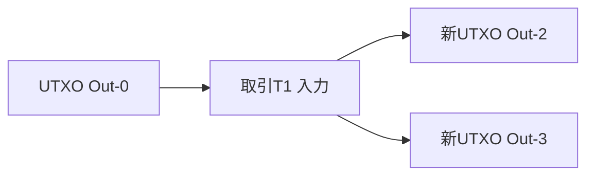
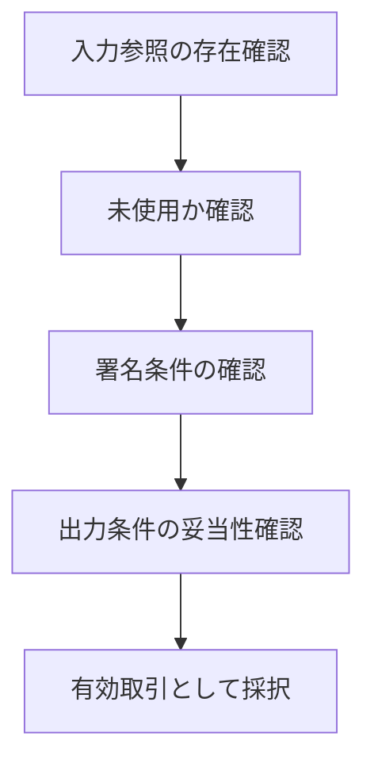
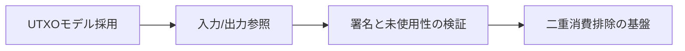

# 第5章: 取引データモデル（UTXO）

この章の目的は、順序問題をデータ構造でどう扱うかを明確にすることです。第4章までで見た「観測順がずれる」という前提は、取引データの表現を誤ると吸収できません。Bitcoinは残高を直接更新するモデルではなく、未使用出力（UTXO）を消費するモデルで所有状態を表現します。ここに、二重消費排除と検証可能性を同時に満たす設計意図があります。[^S-CH05-001]

## 05-1 モデル選択

残高モデルは直感的です。口座に数字を持ち、入金で増やし、出金で減らします。日常の家計簿には向いていますが、分散環境では「どの順で増減を適用したか」が判定に強く影響します。観測順がずれると、同じ取引集合でも中間残高が一致しない場面が生まれます。

UTXOモデルは発想を変えます。所有状態を「未使用の出力集合」として持ち、取引は「過去出力の消費」と「新規出力の生成」で表現します。残高の数値を直接更新するのではなく、出力単位の状態遷移として記録するため、どの出力が使われたかを機械的に追跡できます。[^S-CH05-001]

破綻例A（残高直更新の弱点）: 同じ残高を前提にした二取引が同時観測されると、各ノードの適用順で中間残高が変わります。破綻例B（出力追跡の強み）: UTXOでは同一出力を二度消費しようとすると、二つ目は規則違反として棄却できます。差は「数値更新の順番」ではなく「出力IDの一意消費」で判定する点です。

橋渡しとして要件を置きます。必要なのは、観測順がずれても「同じ出力を二度使えない」ことを局所検証だけで判定できる構造です。UTXOはこの要件に直接対応します。

モデル選択で見落としやすい点は、障害解析のしやすさです。残高直更新モデルでは「どの更新で不整合が入ったか」を追うのに、履歴全体の再解釈が必要になる場合があります。UTXOでは、問題が起きた出力IDを起点に遷移を追えるため、影響範囲を限定しやすくなります。順序問題の世界では、解析可能性そのものが運用品質です。

また、UTXOは権限分離にも向いています。異なる用途の資金を別出力として保持すれば、支出条件を用途ごとに分けられます。これにより、単一残高の一括管理よりも細かい制御が可能になります。分散環境では「どこまで使えるか」を厳密に区切れることが、事故時の被害局所化に効きます。

さらに、モデル選択は利用者体験にも影響します。残高モデルは「いまの合計値」が見やすい一方で、履歴競合時の説明が難しくなりがちです。UTXOモデルは概念理解に初期コストがあるものの、競合時の棄却理由を具体的に説明しやすい利点があります。どちらを採るかは単なる好みではなく、順序共有要件への適合度で判断すべきです。

## 05-2 入出力構造

UTXO取引は、入力（どの未使用出力を使うか）と出力（次に誰が使えるか）で構成されます。入力は過去取引の出力を参照し、出力は新しい利用条件を定義します。取引検証は、入力参照の正当性と出力条件の整合性を確認する処理です。[^S-CH05-001]

単純化した例で見ます。取引T0が `Out-0(500)` と `Out-1(300)` を作ったとします。取引T1は `Out-0` を入力に取り、 `Out-2(200)` と `Out-3(300)` を生成します。このとき `Out-0` は消費済みに遷移し、再利用不可になります。判定対象は「残高値」ではなく「どの出力が未使用か」です。

破綻例A: 入力が存在しない出力を参照している取引は不正です。破綻例B: すでに消費済みの出力を再参照する取引は二重消費です。どちらも取引単体の参照検証で検出できます。グローバルな口座残高再計算を毎回行わなくても、局所規則で判定可能です。

ここで検証順序を固定しておくと混乱を防げます。第一に参照先が存在するかを確認し、第二に未使用かを確認し、第三に権限条件を確認します。順序を逆にすると、無効入力に対して不要な署名検証を走らせるなど、実装コストと解析コストが増えます。検証順序は性能問題であると同時に、説明可能性の問題でもあります。

入力と出力の整合には、量的整合も含まれます。単純化すれば「入力合計が出力合計以上か」を確認し、差分をどのように扱うかを規則で定義します。この定義が曖昧だと、同じ取引に対してノードごとの有効判定がずれる可能性があります。規則の明文化が分散一致を支えます。

実務では、取引構築時のミスも重要です。誤った出力参照、金額桁の取り違え、意図しない条件設定は、ネットワーク障害がなくても無効取引を生みます。UTXOモデルの利点は、こうしたミスを機械的に棄却できる点です。人手レビューに依存しない検証線を持つことが、中央裁定者なしの前提に合致します。

次の図は、入力参照と出力生成の関係を示します。

図から確認したいのは、状態遷移の単位が「口座」ではなく「出力」である点です。この単位化が、二重消費判定を機械化します。

## 05-3 署名検証

入力参照だけでは十分ではありません。参照した出力を「本当に使う権限があるか」を確認する必要があります。その中心が署名検証です。出力に設定された条件を満たす署名を提出できるかで、支出権限を判定します。[^S-CH05-001]

ここでの設計意図は、権限判断を人格信用から条件検証へ置き換えることです。誰が有名か、どの組織に所属しているかではなく、公開鍵対応の署名条件を満たすかだけを見ます。分散環境で必要なのは、参加者属性に依存しない同一検証規則です。

破綻例A: 正しい入力参照でも署名条件を満たさないなら無効です。破綻例B: 署名が正しくても、参照出力が消費済みなら無効です。つまり、入力参照検証と署名検証は直列に必要で、どちらか一方では不十分です。

橋渡しとして要件を明示します。必要なのは、権限確認（署名）と状態確認（未使用出力）を同時に満たすことです。UTXO検証はこの二条件を取引単位で実行し、分散ノード間で同一判定を作ります。

次の図は、検証手順の最小骨格です。

図の要点は、判定が一段ではないことです。参照、未使用性、署名、出力整合の連鎖が成立して初めて採択されます。

署名検証の設計で忘れてはならないのは、検証対象メッセージの固定です。何に署名したかが曖昧だと、同じ署名が別文脈で再利用される危険が出ます。したがって、署名対象の形式とエンコードを仕様として厳密に固定する必要があります。ここを緩くすると、権限検証の前提が崩れます。

さらに、署名検証は「通れば安全」という単純図式でもありません。秘密情報管理が崩れれば、正しい署名形式で不正支出が成立します。つまり、プロトコル検証と運用管理は分離不能です。第10章で扱う鍵管理問題が、ここで既に前提になっていることを意識しておく必要があります。

橋渡しとして要件を補足します。必要なのは、署名規則が公開され、すべてのノードが同じ検証結果を出せることです。特定実装だけが通す条件が存在すると、分散一致は壊れます。署名方式そのものより、検証条件の共有可能性が一致判定の核心です。

## 05-4 順序との関係

UTXOは順序問題を消しません。ですが、順序問題を「どの出力が先に消費されたか」という検証可能な形へ変換します。これにより、観測差が残る環境でも、最終的な採択規則と組み合わせて二重消費排除を実効化できます。[^S-CH05-001][^S-CH01-001]

破綻例A: 同じ出力を使う二取引が同時伝播すると、局所ノードでは一時的に両方が候補になります。破綻例B: 遅延で後着した取引が、先に採択済みの出力を再利用しようとします。UTXO規則では、最終的に採択された方が出力を消費し、もう一方は入力不正として棄却されます。

ここで重要なのは、棄却理由を第三者が追跡できることです。どの出力を参照し、どの時点で消費済みになったかを辿れるため、判定の説明可能性が高いです。説明可能性は、中央裁定者なしの運用で不可欠です。

橋渡しとして次章への要件を置きます。UTXOは取引単位の検証を整えますが、ネットワーク全体でどの候補履歴を正とするかは別問題です。第6章では、取引集合をブロック化し、連結履歴として検証する仕組みへ進みます。

ここで「UTXOがあるなら順序規則は不要」という誤解を明確に否定します。UTXOは二重消費を検出する単位を与えますが、競合候補が同時に存在する期間をなくすわけではありません。競合候補のどちらを正統履歴へ採択するかは、依然として順序規則の仕事です。つまりUTXOは必要条件の一部であり、十分条件ではありません。

運用上は、競合検知後の処理手順も必要です。候補を保留するか、優先規則で採択するか、利用者表示を暫定に切り替えるかを規定しないと、同じ競合でも対応がぶれます。対応のぶれは、技術的不一致より早く信頼を損ないます。UTXOを導入しただけで安心せず、競合時手順まで規則化することが重要です。

最後に、章全体の視点を固定します。本章で獲得したのは、順序問題をデータ検証可能な形へ落とす視点です。第6章以降では、この視点を履歴構造へ拡張し、取引単位の整合を履歴単位の整合へ接続していきます。

ここで補助的な実務観点を追加します。UTXO運用では、未使用出力集合の管理品質が性能と安全性の両方へ効きます。集合の更新遅延が大きいと、正しい取引でも検証待ちが増え、利用者体験が悪化します。反対に、更新を急ぎすぎて整合性検査を省くと、誤判定リスクが上がります。性能最適化は整合性検査とセットで設計する必要があります。

また、ウォレット設計では出力の粒度戦略が重要です。大きな出力を少数持つ設計は管理は簡単ですが、支出時に大きな残余出力が発生し、後続取引の構築が複雑化する場合があります。小さな出力を多数持つ設計は柔軟ですが、検証対象が増え、手数料や処理負荷へ影響します。UTXOは単なる理論ではなく、運用方針によって振る舞いが変わる実務モデルです。

さらに、監査の観点では「どの出力がどの取引で消費されたか」を追えることが決定的に重要です。問題発生時に、対象出力を起点に履歴を辿れるため、影響範囲を局所化できます。残高差分だけを追う設計よりも、原因の特定と再発防止が速くなります。中央裁定者なしの環境で説明責任を維持するうえで、この追跡可能性は強い利点です。

実務シナリオを置きます。システムAとシステムBが同じユーザーの支払いを別経路で受け付ける場面では、同一出力参照の競合が起きます。UTXO規則がなければ、双方が一時的に成立したように見え、後段で大きな手戻りが発生します。UTXO規則がある場合は、採択後に片方を機械的に棄却し、棄却理由を出力参照で説明できます。ここで差が出るのは、正誤判定の速さだけでなく、説明の再現性です。

運用ルールとしては、競合検知時の通知設計も必要です。単に「失敗」と表示するのではなく、「参照出力がすでに消費済みのため不成立」と示せば、利用者は次行動を選びやすくなります。技術的には同じ棄却でも、理由の可視化があるかないかでサポート負荷は大きく変わります。データモデル設計は、利用者コミュニケーション設計まで含めて初めて完成します。

最後に第5章の到達点を確認します。第一に、UTXOが残高の代替表現ではなく順序問題への設計回答だと説明できること。第二に、入力参照検証と署名検証が直列関係だと説明できること。第三に、UTXO単体では最終採択が決まらず、合意規則と組み合わせて初めて二重消費排除が完結すること。この三点を言語化できれば、第6章のブロック構造へ自然に接続できます。

最後に本章の論理を図で固定します。

本章の結論は、UTXOが「順序問題をなくす道具」ではなく、「順序問題を検証可能なデータ問題へ変換する道具」だという点です。ここまでで、順序共有の前半設計が揃いました。[^S-CH05-001]

### 補助ケース: UTXO運用で起きる典型課題

UTXOを実運用へ載せると、理論説明だけでは見えない課題が出ます。第一は「どの出力を優先消費するか」という選択問題です。選択方針が揃っていないと、同じ支払い要求でもノードごとに構築される候補取引が変わり、結果として競合率が増える場合があります。したがって、出力選択方針は実装詳細ではなく合意品質の一部として扱うべきです。

第二は、変更出力（change output）の扱いです。入力合計と支払い額の差分をどのように出力へ戻すかを明文化しないと、利用者表示の残高感覚と内部状態がずれます。内部では正しくても、利用者が「減り方がおかしい」と感じれば運用負荷は増えます。UTXOモデルでは、内部整合と表示整合を分けて設計し、両方で説明可能性を確保する必要があります。

第三は、競合検知後の再試行設計です。同じ出力を参照した取引が棄却された場合、どの条件で再構築して再送するかを規定しないと、無限再試行や過剰再送が起きます。再試行は「即時再送」ではなく、最新UTXO集合を再取得し、入力再選択と手数料再計算を経て送る手順が必要です。ここを明示すると、競合時の運用が安定します。

第四は、監査ログの粒度です。少なくとも「参照入力」「検証結果」「棄却理由」「再試行有無」を記録しておくと、後から棄却の妥当性を再検証できます。棄却理由が「無効」だけだと、署名不一致なのか消費済み入力なのかが判別できず、改善が止まります。UTXO運用では、棄却理由の構造化が品質改善の起点です。

最後に、章末で使う運用質問を置きます。第一に「出力選択方針は全実装で一致しているか」。第二に「競合棄却時の再試行手順が文書化されているか」。第三に「棄却理由を出力ID単位で追跡できるか」。この三問に答えられる状態が、UTXOを“理論理解”から“運用可能設計”へ引き上げる基準になります。

加えて、UTXO設計では「どこで不変条件を守るか」を明示することが重要です。不変条件とは、同一出力は一度しか消費できないこと、入力参照は存在し未使用であること、署名条件が一致することです。これらを実装の暗黙知にせず、仕様・テスト・監視で同じ語彙で管理すると、ノード実装差による判定揺れを減らせます。

性能改善を進める際にも、この不変条件を先に固定します。検証キャッシュや並列化を導入すると処理速度は上がりますが、不変条件の確認順序が崩れると判定の再現性が落ちます。したがって最適化の評価指標は、スループットだけでなく「同一入力に対する判定一致率」を必ず含めるべきです。中央裁定者なしの環境で最も避けるべき失敗は、速いが一致しない実装です。

実務運用では、競合棄却後の案内文テンプレートも整備しておくと効果があります。たとえば「参照出力が既に消費済みのため不成立」「最新状態を再取得して再作成が必要」といった文言を標準化すると、利用者とサポートの認識差が小さくなります。棄却理由を曖昧にすると、再送を繰り返して負荷を上げる行動を誘発しやすくなります。UTXOの強みは、棄却理由を構造化して提示できる点にあります。

最後に、第5章の実務到達基準を四点で固定します。第一に、入力参照検証と署名検証の直列関係を時系列で説明できること。第二に、競合時の採択と棄却を出力IDで追跡できること。第三に、再試行手順が「状態取得→再構築→再送」で定義されていること。第四に、棄却理由が運用ログと利用者表示で同じ意味を保つこと。この四点を満たせば、UTXOは単なる概念理解ではなく、順序共有の運用基盤として機能します。

さらに、UTXOモデルを安定運用するには、入力選択ポリシーの一貫性を保つ必要があります。実装ごとに選択基準が違うと、同じ支払い要求から異なる候補取引が生成され、競合率が上がります。したがって、入力選択の優先規則、変更出力の扱い、再構築時の手順は仕様として固定し、実装差を許容しない範囲を明示すべきです。

監視の観点では、棄却率だけでなく棄却理由の内訳を追うことが重要です。署名不一致、入力未存在、入力消費済み、形式不正を分けて集計すると、問題が鍵管理にあるのか、取引構築にあるのか、同期遅延にあるのかを切り分けやすくなります。理由内訳がない監視は、対策の優先順位を誤らせます。

最後に、UTXO章の知識を次章へ接続する確認質問を置きます。第一に「同一出力の二重消費がどの検証段階で弾かれるか」を説明できるか。第二に「競合候補が同時に存在する期間をどう運用表示するか」を説明できるか。第三に「採択規則とデータ規則の役割分担」を一文で説明できるか。この三問に答えられれば、UTXOを単体機能ではなく、順序共有システムの構成要素として理解できています。

実務では、ここに「再試行上限」の設計も加えてください。棄却後に無制限で再送すると、同じ入力競合を増幅してネットワーク負荷を上げます。再試行回数、待機間隔、再構築条件を固定し、上限超過時は利用者へ明示的に再操作を促す方針を置くと、競合時の連鎖障害を抑えやすくなります。

この上限設計は、UTXOの検証可能性を保ちながら運用負荷を制御するための最終ガードレールです。
あわせて、上限到達時の利用者通知文を事前定義しておくと、再試行停止時の混乱を最小化できます。
通知文が統一されると、競合時の問い合わせ対応も安定します。
運用手順と通知文を対で更新する運用が、再発防止の効果を高めます。
ここまでで前半の土台は完成です。

## 参考文献

[^S-CH05-001]: Bitcoin.org, "Transactions — Bitcoin Developer Guide". https://developer.bitcoin.org/devguide/transactions.html
[^S-CH01-001]: Satoshi Nakamoto, "Bitcoin: A Peer-to-Peer Electronic Cash System" (2008). https://bitcoin.org/bitcoin.pdf
