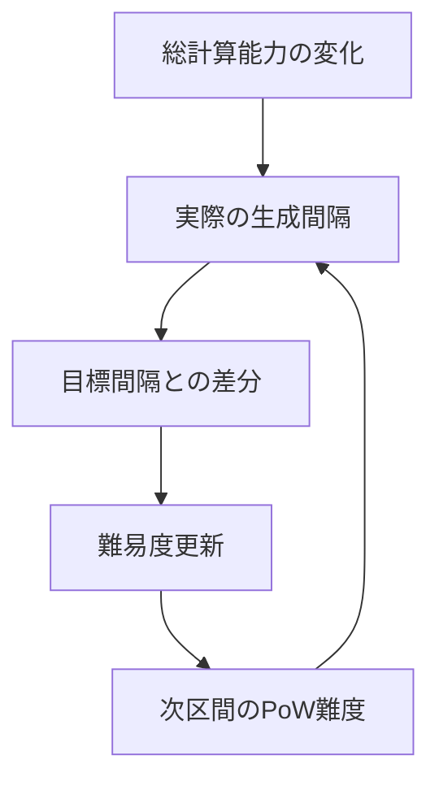

# 第7章: Proof of Work と難易度調整

第6章までで、取引を検証可能な履歴として記録する骨格を作りました。本章の問いは、その履歴をどのように改ざんしにくくするかです。ここで扱う中心要素は、Proof of Work（PoW, 計算コスト証明）と難易度調整です。PoWは履歴を書き換える行為に計算コストを埋め込み、難易度調整はそのコスト水準を時間変化の中で維持する制御機構として働きます。[^S-CH07-001]

この章で重要なのは「PoWがあるかないか」の二値ではありません。重要なのは、どの条件で攻撃コストが上がり、どの条件で安全余裕が縮むかを説明できることです。したがって本章は、PoWの仕組み説明だけでなく、難易度制御、攻撃評価、運用監視までを一つの連鎖として整理します。[^S-CH07-001][^S-CH09-001]

## 07-1 PoWの目的

最初に、PoWの目的を一文で固定します。PoWの目的は「計算を無駄に増やすこと」ではなく、「履歴改ざんの総コストを継続的に押し上げること」です。順序共有システムで怖いのは、過去の履歴を後から差し替えて正当性を作り変える行為です。PoWは、正しい履歴を1つ追加するにも計算労力を要求し、さらに過去改ざんには後続履歴分の再計算まで要求します。[^S-CH07-001]

この設計が有効なのは、計算課題が「解くのは重いが検証は軽い」という非対称を持つからです。提案者は重い計算を払い、検証者は比較的軽い処理で正否を確認できます。全ノードが同じ重い計算を背負う設計だと検証参加コストが上がり過ぎるため、分散検証の裾野が狭くなります。PoWは提案コストと検証コストの役割分離を作る仕組みでもあります。[^S-CH07-001]

ここで誤解されやすい点を整理します。署名検証があるなら改ざん耐性も十分だ、という説明は不十分です。署名検証が保証するのは「誰に支出権限があるか」であり、「過去履歴を差し替えるコスト」ではありません。履歴差し替えのコストは、ブロック提案に紐づいたPoWが支えます。したがって、署名とPoWは代替関係ではなく補完関係です。[^S-CH07-001]

次の図は、PoWがどこでコストを増やすかを示します。

図の確認点は明確です。攻撃者は1ブロックだけを直せばよいのではなく、後続を含む連鎖コストを払う必要があります。この連鎖構造が、履歴改ざんを実務上不利にします。[^S-CH07-001]

破綻例も二つ置きます。破綻例AはPoWがない履歴で、攻撃者が過去から高速に履歴を再生成するケースです。破綻例BはPoWがあっても難易度が極端に低く、再計算コストが十分に積み上がらないケースです。どちらも「改ざんを不利にする」という目的に対して未達です。ここから導く要件は、提案コストの存在だけでなく、遡及改変でコストが累積する構造を保つことです。[^S-CH07-001]

## 07-2 難易度

PoWを導入しても、ネットワーク全体の計算能力は一定ではありません。参加者数、設備更新、運用停止、電力事情などで総計算能力は常に揺れます。難易度（difficulty）は、この揺れに対してブロック生成ペースを目標帯へ戻すための制御変数です。難易度は強さの宣言ではなく、生成間隔を安定化するための運用パラメータです。[^S-CH07-001]

難易度を固定値にした場合の問題は直感的です。総計算能力が上がればブロックが速く出すぎ、分岐の同時発生が増えます。総計算能力が下がればブロックが遅れ、確定待ちが長くなります。どちらも順序共有の体感品質を悪化させます。したがって難易度は、静的安全値ではなく、変動環境に追随する制御量として扱う必要があります。[^S-CH07-001][^S-CH08-001]

ここで素朴案を二つ退けます。素朴案Aは「最初から高難易度に固定すれば安全」という案です。これは能力低下局面で可用性を大きく下げます。素朴案Bは「低難易度で高速化すれば使いやすい」という案です。これは改ざんコストを下げ、分岐頻度を増やします。どちらも単一目標の最適化で、全体要件を壊します。[^S-CH07-001]

この節の橋渡し要件は四つです。第一に目標生成間隔の明示、第二に調整窓の明示、第三に調整幅の制約、第四に更新規則の公開です。公開されない調整は検証不能であり、検証不能な調整は中央裁定者なしの設計原理と矛盾します。難易度の説明は数式だけでなく、公開規則としての再現可能性まで含める必要があります。[^S-CH07-001]

## 07-3 調整ルール

難易度調整ルールは「短期ノイズへ過敏に反応しない」ことが要点です。毎回の観測値へ大幅補正をかけると、制御は振動しやすくなります。逆に補正が弱すぎると、外乱後の逸脱が長期化します。したがって調整ルールは、追随性と安定性のトレードオフ設計として読む必要があります。[^S-CH07-001]

このトレードオフを可視化するため、制御ループを図で固定します。

図の確認点は、難易度調整が単発処理ではなく閉ループ制御だという点です。観測、差分計算、更新、再観測が連続して回るため、運用では「更新後にどう戻るか」を評価する必要があります。[^S-CH07-001]

破綻例Aは、調整窓が短すぎてノイズ追従が過剰になり、間隔が上下振動するケースです。破綻例Bは、調整窓が長すぎて大きな外乱へ追随できず、逸脱期間が長引くケースです。どちらも平均だけ見ると見逃されるため、実務では偏差の継続時間と回復時間を同時に監視する必要があります。[^S-CH07-001]

さらに、実装差も注意点です。規則文面は同じでも、観測区間の解釈や丸め処理が実装ごとに異なると、更新値がずれる可能性があります。更新値の差は短期では微小でも、長期では分岐頻度や収束速度に影響します。したがって調整ルールの品質は、仕様記述の厳密さと実装互換試験の両方で担保する必要があります。[^S-CH07-001]

この節の橋渡しは次の一文です。難易度調整は「理論上戻る」だけでは不十分で、「異常後にどの速度で戻り、戻るまでの間にどの運用方針を採るか」を含めて初めて実効設計になります。ここが次節の攻撃耐性評価と直接つながります。[^S-CH07-001]

## 07-4 攻撃耐性

攻撃耐性は「攻撃不能」を宣言する概念ではありません。ここでの耐性は、攻撃者に必要な資源・時間・成功確率・便益回収条件を不利に保つことです。したがって評価は、技術軸（再計算量）と経済軸（費用対便益）を同時に扱う必要があります。どちらか一方だけでは、実際の危険域を正しく捉えられません。[^S-CH07-001][^S-CH09-001]

技術軸だけで議論すると「可能/不可能」の二値に寄りやすくなります。しかし実運用では、理論上可能でも経済的に非合理なら継続的脅威にはなりにくい一方、理論的ハードルが高くても便益が急騰すれば危険域へ近づく場合があります。経済軸だけで議論すると今度は実装制約を見落とします。両軸の同時管理が必要です。[^S-CH09-001]

この節の実務要件を四つに固定します。要件1は評価時点の明示、要件2は前提値の出典明示、要件3は更新周期の固定、要件4は閾値超過時の行動手順です。評価値は変化する前提なので、単発の「安全宣言」ではなく、更新可能な評価台帳として管理するべきです。[^S-CH07-001][^S-CH09-001]

破綻例Aは、評価を年1回だけ行い、市場変化に追随できないケースです。破綻例Bは、評価は頻繁でも閾値超過時の行動手順がなく、観測が行動へ接続しないケースです。前者は見逃し、後者は麻痺を生みます。どちらも「評価はあるのに防御が機能しない」状態です。[^S-CH09-001]

本章の結論を固定します。PoWは改ざんコストの地盤を作り、難易度調整はその地盤を維持する制御を担います。攻撃耐性は、この二つを前提に技術軸と経済軸を継続監視して初めて実効化されます。つまり第7章の到達点は、PoWを知ることではなく、PoWを条件付きで運用できることです。[^S-CH07-001][^S-CH09-001]

### 補助ケース: PoW運用を改善サイクルへ接続する

最後に、現場で使える最小サイクルを置きます。第一段は観測です。生成間隔分布、分岐頻度、再編成の深さ、主体集中度を定点観測します。第二段は判定です。観測値を閾値と照合し、どの前提が崩れたかを特定します。第三段は対応です。内部設定変更、利用者向け待機方針更新、監視強化を実行します。第四段は検証です。対応後に同じ指標で回復傾向を確認します。[^S-CH07-001][^S-CH08-001]

この四段を回すときに重要なのは、技術対応と説明対応を分離しないことです。内部では安全側へ切り替えていても、外部表示が旧前提のままだと利用者は誤った期待で行動します。逆に表示だけ更新して内部閾値を据え置くと、過剰警戒が長引きます。PoW安全性を実務で機能させるには、検知・判断・切替・説明を同じ時系列で設計する必要があります。[^S-CH07-001]

次章への橋渡しを一文で置きます。第8章では、この章で用意したコスト地盤の上で、分岐がどう収束するかを扱います。第7章は「改ざんしにくさ」の章であり、第8章は「分岐からの戻し方」の章です。[^S-CH08-001]

### 補助ケース2: 指標で見るPoW運用の健全性

PoW運用を実務で維持するには、単一の難易度値だけを見ても不十分です。少なくとも、生成間隔分布、分岐頻度、再編成深さ、提案主体の集中度を同時に観測する必要があります。生成間隔が目標に近くても、分岐深さが増えていれば収束品質は悪化している可能性があります。逆に、分岐は少なくても主体集中度が高まり続ければ、将来の耐性低下につながります。[^S-CH07-001][^S-CH08-001]
導入初期は、まず「生成間隔偏差」と「分岐頻度」の2指標から始め、運用が安定してから他指標を追加するのが実装しやすいです。[^S-CH07-001]

ここで大事なのは、指標の絶対値より「変化方向」です。ある週の値が許容範囲内でも、連続して悪化傾向なら早期対策が必要です。反対に一時的逸脱でも回復速度が速ければ、恒常的な制度変更は不要な場合があります。PoW監視は、静止画ではなく時系列で判断する設計へ寄せるべきです。[^S-CH07-001]

実務では、指標ごとに責任担当を分けると改善が速くなります。生成間隔と難易度追随はプロトコル運用担当、分岐と再編成はノード運用担当、主体集中度はガバナンス担当、利用者待機方針はプロダクト担当が持つ、といった分担です。責任担当が曖昧なままでは、異常が見えても「誰が最初に動くか」が決まらず、初動が遅れます。[^S-CH07-001]

また、指標の更新周期は同じでなくて構いません。高頻度で揺れる指標は短周期、構造変化を見る指標は長周期で確認するほうが効率的です。ただし、周期を分ける場合でも、月次レビューなどで統合判断を必ず行ってください。統合判断がないと、個別最適が全体最適を壊します。[^S-CH07-001]

この補助ケースの結論は、PoW安全性を数式だけで判断しないことです。数式は必要条件ですが、十分条件ではありません。運用では、観測・判断・対応・再検証のサイクルを回し、異常後の回復過程まで含めて評価する必要があります。これが「改ざんコスト設計を維持する」という実務意味です。[^S-CH07-001]

### 補助ケース3: 異常時プレイブックの最小構成

難易度や分岐指標が悪化したとき、現場が迷わないためのプレイブックを事前に作っておく必要があります。最小構成は五項目です。1) 発火条件、2) 一次切替手順、3) 利用者案内文、4) 再評価時刻、5) 復帰条件。この五項目がない運用は、検知はできても行動が遅れます。[^S-CH07-001]

発火条件には、単一閾値だけでなく複合条件を置くと誤検知を減らせます。例えば「生成間隔逸脱が一定時間継続し、かつ分岐頻度が上昇している」ような条件です。単一閾値だと一時ノイズで過剰反応しやすく、利用者体験を不必要に悪化させます。複合条件は反応を遅らせるためではなく、反応の精度を上げるために使います。[^S-CH07-001][^S-CH08-001]

一次切替手順では、内部と外部を同時に更新します。内部では監視強化と待機方針の切替、外部では確定見込み時間と再確認推奨を案内します。どちらか一方だけの更新は、利用者と運用者の前提不一致を広げます。前提不一致は、技術障害そのものより長く尾を引く問題になりやすいです。[^S-CH07-001]

再評価時刻の明示も重要です。異常対応へ入ったあとに再評価時刻がないと、暫定運用が惰性で続き、通常復帰が遅れます。復帰条件を先に置いておけば、担当交代があっても同じ基準で戻せます。PoW運用では、入る条件と戻る条件を対で定義することが基本です。[^S-CH07-001]

最後に、プレイブックは作成して終わりではありません。四半期ごとに演習し、手順の詰まりを更新してください。演習で詰まった箇所は、仕様不足ではなく運用記述不足であることが多いです。記述を改めるだけで、同じ指標悪化に対する復旧速度が大きく変わります。[^S-CH07-001]

### 補助ケース4: 監視会議を設計して判断を早める

PoW運用の改善が遅れる最大要因は、指標がないことより会議設計がないことです。数値は収集していても、誰が、どの順で、どの基準で判断するかが決まっていないと、会議のたびに議論が初期化されます。初期化を防ぐには、会議の入力と出力を固定してください。入力は前回からの変化量、出力は次回までの行動項目です。[^S-CH07-001]

会議入力の最小セットは四つで足ります。1) 生成間隔の偏差推移、2) 分岐発生率、3) 再編成深さ分布、4) 主体集中度です。四つを同じ時系列で並べると、どの層で変化が起きているかを素早く把握できます。入力項目を増やし過ぎると、議論は詳細化しても意思決定が遅れるため、まずは四つへ絞ることが有効です。[^S-CH07-001][^S-CH08-001]

会議出力も四つへ固定します。A) 継続監視、B) 閾値調整、C) 運用切替、D) 利用者案内更新です。各項目に責任者と期限を付けると、会議が報告会で終わらず実装へ接続します。責任者不在の出力は、次回会議で同じ議論を再生産するだけです。[^S-CH07-001]

さらに、会議では「現時点の最適」だけでなく「最悪条件での戻し方」を毎回確認してください。平常時に最適な設定でも、異常時に復帰できなければ安全余裕は維持できません。戻し方の確認とは、復帰条件、復帰順序、復帰後検証の三点を明示することです。三点を毎回確認する習慣があると、外乱時の判断速度が上がります。[^S-CH07-001]

この補助ケースの最終結論を置きます。PoW安全性は、難易度式だけでなく判断運用の品質で実効性が決まります。監視会議を設計し、入力と出力を固定し、戻し方まで確認する運用を持てば、同じ外乱でも被害を小さくできます。第7章の学習目標は、PoWを説明することではなく、PoW運用を再現可能に回せることです。[^S-CH07-001]

### 補助ケース5: 章末の実践チェック

第7章を実務で使うときは、章末に三つの確認を置いてください。第一に「改ざんコスト」を一文で説明できるか。第二に「難易度調整」を制御問題として説明できるか。第三に「異常時の戻し方」を時系列で説明できるか。この三点が揃うと、PoW理解は概念でなく運用能力になります。[^S-CH07-001]

確認を行う際は、平常時の成功例だけでなく異常時の失敗例も必ず含めてください。成功例だけの確認は、障害時に最も必要な判断力を育てません。失敗例を明示してこそ、閾値設定と切替条件の妥当性を点検できます。[^S-CH07-001]

また、説明対象を技術者に限定しないことも重要です。運用担当やサポート担当が同じ言葉で説明できると、障害時の連携が速くなります。PoW章の内容は実装者専用知識ではなく、関係者が共有すべき判断基盤です。[^S-CH07-001]

最後に、定期点検の周期を固定してください。点検周期が曖昧だと、繁忙期ほど確認が後回しになり、結果として外乱時に準備不足が顕在化します。準備不足を防ぐ最も簡単な方法は、短くても固定周期で点検を続けることです。[^S-CH07-001]

補足として、章末に「今回の外乱でどの前提が崩れたか」を一文で残す運用を推奨します。この一文があると、次回の同型外乱で初動判断が速くなります。外乱の内容は毎回違っても、崩れる前提の型は繰り返されることが多いためです。前提の型を記録する習慣は、PoW運用の学習速度を大きく上げます。[^S-CH07-001]

さらに、前提記録は技術チームだけで閉じず、運用チームと共有してください。共有されない前提は、問い合わせ対応や案内更新に反映されません。PoW安全性を実務で維持するには、前提認識を部署横断で同期することが必要です。[^S-CH07-001]

最後の実務メモとして、章の指標レビューに「戻せるか」の観点を必ず入れてください。改善策が有効でも、戻し条件が不明だと暫定運用が恒常化し、平常時の効率を下げます。入る条件と戻る条件を対で管理する運用は、PoW安全性の維持だけでなく、運用疲弊の抑制にも効きます。[^S-CH07-001]
加えて、戻し条件の確認は技術指標だけでなく説明指標でも行ってください。内部が正常化しても説明遅延が続くなら、実務上はまだ異常局面です。技術復帰と説明復帰の両方を満たして初めて通常運用へ戻す、という基準を固定すると判断のぶれを抑えられます。[^S-CH07-001]
この基準を章末チェックへ組み込めば、PoW運用は「計算が正しい」から一歩進んで「運用が再現できる」状態になります。[^S-CH07-001]
再現できる運用を持つことこそが、PoWを理論ではなく実務の防御線として機能させる条件です。[^S-CH07-001]
この防御線を維持するために、章の点検結果を次回の初期設定へ必ず反映してください。[^S-CH07-001]
反映されない点検は、実務上は未実施と同義です。[^S-CH07-001]
未実施を減らすことが、PoW運用の安定化に直結します。[^S-CH07-001]
安定化の積み上げが、最終的に改ざんコスト維持へつながります。[^S-CH07-001]
ここを運用で守ることが重要です。[^S-CH07-001]
継続監視を止めないでください。[^S-CH07-001]

## 参考文献

[^S-CH07-001]: Satoshi Nakamoto, "Bitcoin: A Peer-to-Peer Electronic Cash System" (2008). https://bitcoin.org/bitcoin.pdf
[^S-CH08-001]: Bitcoin.org, "Block Chain — Bitcoin Developer Guide". https://developer.bitcoin.org/devguide/block_chain.html
[^S-CH09-001]: Satoshi Nakamoto, "Bitcoin: A Peer-to-Peer Electronic Cash System" (2008). https://bitcoin.org/bitcoin.pdf
