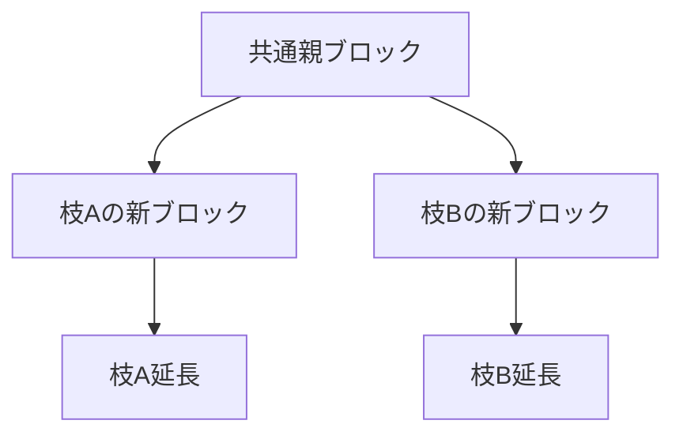
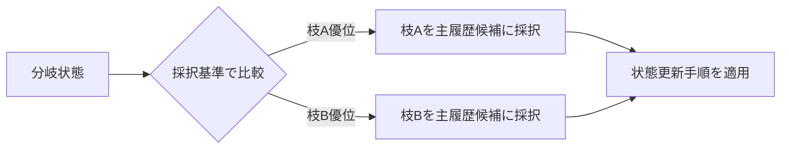

# 第8章: 合意の収束とフォーク

第7章で、履歴改ざんへコストを課す地盤としてPoWと難易度調整を整理しました。本章の問いは、観測差が残る状況で一時的に複数履歴が生まれたとき、どうやって全体を一本へ収束させるかです。ここで扱う中心要素は、フォーク発生、収束規則、再編成、実用確定性です。結論を先に置くと、フォークは異常ではなく中間状態であり、品質を決めるのは「分岐の有無」より「分岐後の戻し方」です。[^S-CH08-001][^S-CH04-001]

本章は「フォークをなくす方法」を説明する章ではありません。分散環境でフォークが発生し得ることを前提に、どうすれば再現可能な手順で戻せるかを説明する章です。フォークを失敗として隠す設計は、短期的に見栄えが良くても、長期的には説明不能な不整合を増やします。[^S-CH08-001]

## 08-1 フォークの発生

フォーク（fork）は、同じ親ブロックから複数の子ブロック候補が同時近傍に発生し、履歴候補が一時的に分岐する現象です。分岐の根本原因は、悪意の有無ではなく、観測時点のずれと伝播遅延です。善意ノードだけの環境でも、複数候補が同時に見つかれば分岐は起きます。[^S-CH08-001][^S-CH04-001]

この点を日常例で置き換えます。共同編集中の文書で、同じ時刻帯に別端末から保存が走ると、短時間だけ版が分かれます。版分岐が起きたこと自体は失敗ではありません。失敗は、どの規則で統合するかが決まっていないことです。フォークも同じです。問題は発生そのものではなく、発生後手順の欠落です。[^S-CH08-001]

素朴案Aは「最初に見えた枝を固定する」です。これは局所観測依存が強く、ノードごとに先着枝が違えば全体収束しません。素朴案Bは「運用者判断で都度決める」です。短期収束しても再現性がなく、後追い監査で説明不能になります。どちらも分散前提に対して弱い設計です。[^S-CH08-001]

次の図は、フォークが自然に発生する構図を示します。

図の確認点は、AとBの同時存在が仕様上起こり得ることです。ここで必要なのは「どちらが悪いか」の判定ではなく、どちらを最終採択するかの公開規則です。[^S-CH08-001]

この節の橋渡し要件は三つです。第一に分岐発生を許容すること、第二に採択基準を公開すること、第三に採択変更時の状態遷移を機械的に再現できることです。第三要件が欠けると、規則はあっても実装差で結果が割れます。[^S-CH08-001]

## 08-2 収束規則

収束規則の目的は、分岐時に全ノードが同じ枝へ向かう意思決定条件を提供することです。Bitcoinの説明では、より大きな作業量が積まれた側を追う考え方が採られます。ここで大事なのは名称ではなく、規則が公開され、全ノードが同じ入力から同じ判断を再現できることです。[^S-CH08-001]

「多数派が選んだ側を正とする」という説明だけでは不足です。多数の定義は観測範囲と時点に依存し、遅延中には別多数が同時成立します。したがって収束規則は、感覚的な多数論でなく、検証可能な計算手順として記述する必要があります。[^S-CH08-001]

実装で見落とされやすいのは、採択基準と適用手順の混同です。採択基準が一致していても、状態更新の順序が実装ごとに違えば一時不整合が発生します。たとえば旧枝の巻き戻しと新枝の適用順が逆転すると、照会タイミングによって中間状態の見え方がずれます。したがって収束規則は、基準だけでなく遷移順序まで含めて定義する必要があります。[^S-CH08-001]

次の図は、収束規則の意思決定点を示します。

図で確認するポイントは、比較と更新が分かれていることです。比較基準が正しくても更新手順が曖昧なら、運用上の整合は崩れます。[^S-CH08-001]

この節の橋渡しは明確です。採択変更が起きる以上、再編成を例外障害として扱うのではなく、標準業務として扱う必要があります。次節で再編成を手順として固定します。[^S-CH08-001]

## 08-3 再編成

再編成（reorganization, reorg）は、暫定採択していた枝から別枝へ主履歴候補を切り替える処理です。再編成を「起きてはいけない事故」と定義すると、現場は情報隠蔽へ寄りやすくなります。再編成は収束過程の一部として定義し、検知・切替・通知を手順化するほうが実務品質は上がります。[^S-CH08-001]

再編成手順の最小構成は四段です。第一段は再編成候補の検知。第二段は旧枝状態の巻き戻し。第三段は新枝状態の再適用。第四段は利用者表示と監査ログの更新です。第二段と第三段だけ実装して第四段を省くと、内部整合は取れても利用者説明が壊れます。[^S-CH08-001]

破綻例Aは、内部再編成は成功したが対外表示が旧状態のまま残り、利用者が誤前提で次行動を取るケースです。破綻例Bは、通知は出したが影響範囲を示さず、問い合わせごとに回答が揺れるケースです。どちらも技術故障ではなく、再編成を標準業務として設計していないことが原因です。[^S-CH08-001]

この節の要件を固定します。要件1は状態語彙の統一（受信、候補、暫定採択、運用上確定）。要件2は巻き戻しと再適用の順序固定。要件3は通知テンプレートの標準化。要件4は再編成後監査ログの保存です。四要件が揃うと、再編成は「混乱イベント」ではなく「再現可能な更新手続き」になります。[^S-CH08-001]

## 08-4 実用確定性

分散環境での確定性は、絶対不変の宣言ではありません。実務では、再編成可能性が十分小さいと判断した時点を運用上の確定とみなします。この「確率を管理する確定」が実用確定性です。ここで重要なのは、閾値そのものより、閾値をどう決め、どう更新し、どう説明するかです。[^S-CH08-001]

誤解を二つ除きます。誤解Aは「確率的確定=不正確」という見方です。実際には、不確実性を明示的に扱う運用設計です。誤解Bは「同じ確認回数がすべての業務に最適」という見方です。取引規模、許容損失、再試行コストで適切閾値は変わります。閾値は万能定数でなく、業務条件付きの運用パラメータです。[^S-CH08-001]

実務要件を四つ置きます。第一に閾値決定理由の記録。第二に未確定状態の明確表示。第三に再編成時の再確認手順。第四に閾値更新時の移行計画です。第四要件がないと、環境変化で閾値を変えるたびに利用者説明が揺れます。[^S-CH08-001]

この章の結論を固定します。フォークは避けがたい。再編成も起き得る。品質を決めるのは、それらを隠すことではなく、収束規則と実用確定性の運用で一貫処理できることです。第9章では、この運用を支える誘因設計を扱います。[^S-CH08-001][^S-CH09-001]

### 補助ケース: 収束品質を継続監視する

収束運用を安定させるには、単発指標ではなく時系列監視が必要です。最小セットとして、分岐の同時存在時間、再編成の深さ分布、再編成後の復旧時間を継続観測してください。分岐件数だけでは、浅い揺れが増えたのか深い再編成が増えたのかを区別できません。[^S-CH08-001]

また、監視結果は必ず行動手順へ接続します。たとえば深い再編成が増えた局面では、確定閾値の見直し、通知文言の更新、監査範囲の拡大を同時に検討します。観測と行動が分離すると、報告書は増えても事故予防にはつながりません。[^S-CH08-001]

最後に終章への橋渡しを置きます。第8章で得たのは「収束を管理する語彙と手順」です。終章ではこの手順を、他の方式を読むときの評価軸へ変換します。分岐を恐れるのではなく、分岐後を再現可能に扱えるかで技術を評価する姿勢が次の学習土台になります。[^S-CH08-001][^S-OUTRO-001]

### 補助ケース2: 状態語彙を統一して説明負債を減らす

フォーク運用で実務差が出るのは、アルゴリズム本体より状態語彙の整備です。同じ状態を部署Aが「確定」と呼び、部署Bが「暫定」と呼ぶと、内部では同じ処理でも外部説明が矛盾します。矛盾が続くと、利用者は技術的な揺れより先に説明不一致へ不信を持ちます。したがって収束規則の設計には、状態語彙の標準化を必ず含めるべきです。[^S-CH08-001]

状態語彙の最小セットとして、`受信`、`候補`、`暫定採択`、`運用上確定` を固定する方法が有効です。`受信` は局所観測の段階、`候補` は有効性確認中、`暫定採択` は枝選択中、`運用上確定` は閾値到達後の段階です。語彙が固定されると、通知文と監査ログの対応が取りやすくなり、障害時の照合速度が上がります。[^S-CH08-001]
導入順は「語彙統一→再編成手順→問い合わせ手順→閾値更新」の順で進めると、依存関係を崩しにくくなります。[^S-CH08-001]

ここで重要なのは、語彙固定を文書作業で終わらせないことです。APIの状態コード、管理画面表示、サポート台本、監査帳票を同じ語彙へ揃える必要があります。どれか一つだけ旧語彙のままだと、再編成時に部署間で翻訳コストが発生し、対応遅延を招きます。収束品質は、技術速度だけでなく翻訳不要性でも決まります。[^S-CH08-001]

この補助ケースの結論は、収束規則の実効性を高める最短経路は状態語彙の統一である、という点です。フォークは避けにくくても、説明不一致は設計で減らせます。説明不一致が減ると、再編成そのものの心理負荷も下がり、利用者行動の予測可能性が上がります。[^S-CH08-001]

### 補助ケース3: 確定閾値の変更手順を先に定義する

実用確定性の運用で頻繁に起きる失敗は、閾値変更を場当たりで行うことです。環境変化に応じて閾値を変えること自体は必要ですが、変更手順がないまま値だけ変えると、利用者は「なぜ昨日と今日で基準が違うのか」を理解できません。閾値変更は数値調整ではなく、説明責任を伴う運用変更として設計する必要があります。[^S-CH08-001]

変更手順の最小構成は五つです。1) 変更理由、2) 適用時刻、3) 対象範囲、4) 旧閾値との移行手順、5) 変更後の見直し時刻。特に4)を欠く運用では、境界時刻付近の取引説明が揺れます。境界説明の揺れは、再編成件数よりも利用者不信へ直結しやすい点に注意が必要です。[^S-CH08-001]

また、閾値変更の評価は「事故が減ったか」だけで判断しないでください。確認すべきは、再確認コスト、待機時間、問い合わせ再発率、説明文改定頻度の総合です。事故件数が減っても待機負担が過大になれば、別の運用問題へ置き換わっている可能性があります。実用確定性は単一最適でなく、複数負担のバランス最適です。[^S-CH08-001]

最後に、閾値変更後は必ず事後レビューを行い、変更理由と結果を対で記録してください。この記録があると、次回変更で前提差を比較でき、説明の一貫性を保ちやすくなります。記録がない変更は、短期的に有効でも長期運用では再現不能になります。[^S-CH08-001]

### 補助ケース4: 再編成時の問い合わせ対応を設計する

再編成が発生したとき、技術処理が正しくても問い合わせ対応が不統一だと運用品質は下がります。利用者は内部状態を直接見られないため、問い合わせ窓口の説明が事実上のシステム状態として受け取られます。したがって再編成対応では、技術手順と同じ優先度で問い合わせ手順を設計する必要があります。[^S-CH08-001]

問い合わせ手順の最小構成は、1) 事象識別、2) 状態説明、3) 利用者の次行動、4) 次回更新時刻です。1)では対象取引が再編成影響範囲に入っているかを確認し、2)では固定語彙で現状態を説明し、3)では再送や待機の判断基準を示し、4)で再確認タイミングを約束します。この四点を同じ順で案内すると、担当者による説明差を減らせます。[^S-CH08-001]

また、問い合わせ対応の品質は「正しいか」だけでなく「揃っているか」で評価してください。正しい回答でも担当者ごとに表現が異なると、利用者は矛盾を感じます。したがってテンプレート文を作るだけでなく、実際の応答ログで語彙逸脱を点検する運用が必要です。語彙逸脱の是正は地味ですが、再編成時の不信連鎖を抑える効果が高いです。[^S-CH08-001]

さらに、問い合わせログは再編成後レビューへ戻してください。どの説明が誤解を生んだか、どの用語が理解されにくかったかを分析し、次回テンプレートへ反映します。技術側の再発防止だけでなく説明側の再発防止を回すと、同じ再編成でも混乱量を段階的に減らせます。[^S-CH08-001]

この補助ケースの結論は、収束品質はノード間合意だけでなく、利用者との合意でも測るべきだという点です。再編成を標準業務として扱うなら、問い合わせを例外業務にしないことが重要です。再編成手順と問い合わせ手順を同じ設計図で管理できれば、分岐後収束は技術的にも運用的にも一貫したものになります。[^S-CH08-001]

### 補助ケース5: 収束レビューの実施手順

第8章の内容を定着させるには、定期的な収束レビューが有効です。レビューでは、最新期間の分岐発生、再編成深さ、復旧時間、説明更新時間を同じ時系列で確認します。指標を別々に見ると、どの遅れが原因で混乱が拡大したかを特定しにくくなります。[^S-CH08-001]

レビュー結果は三段で整理してください。第一段は事実整理で、何が起きたかを時系列で固定します。第二段は規則整理で、どの規則が働いたかを確認します。第三段は運用整理で、説明と手順のどこが詰まったかを確認します。三段を分けると、感想ベースの議論を減らせます。[^S-CH08-001]

また、レビューには必ず次回改善項目を残します。改善項目は「規則変更」「手順変更」「説明変更」の三分類で管理すると追跡しやすくなります。分類しない改善項目は、次回レビューで再び同じ論点として現れやすく、改善が循環しません。[^S-CH08-001]

最後に、収束レビューの目的を固定します。目的は「分岐をゼロにすること」ではなく、「分岐後の戻し方を毎回速くすること」です。この目的を共有できると、フォーク発生そのものへの過剰反応が減り、実務上の改善速度が上がります。[^S-CH08-001]

補足として、レビューでは毎回「説明遅延」を確認してください。再編成そのものより、説明更新が遅れた時間が長いと、利用者体験の損失が大きくなります。説明遅延を指標化すると、技術改善と説明改善の優先順位を同じ土俵で決められます。[^S-CH08-001]

また、再編成が小規模でも必ず簡易振り返りを残してください。小規模事象を記録しない運用では、大規模事象のときに比較対象がなく、改善が遅れます。小規模の反復記録こそが、収束運用の再現性を支える基盤です。[^S-CH08-001]

加えて、簡易振り返りでは「技術上の原因」と「説明上の原因」を分けて記録してください。二つを混ぜると、技術対策で説明問題を解こうとして効果が出ない、または説明改善で技術問題を覆い隠す、といった誤対応が起きます。原因分類を固定するだけで、再編成後の改善速度は大きく上がります。[^S-CH08-001]
さらに、原因分類ごとに次回検証項目を一つずつ残してください。技術原因なら再現テスト項目、説明原因なら案内文テスト項目を置く、といった形です。検証項目まで定義されると、振り返りが反省で終わらず改善実装へ接続します。分岐後収束の品質は、この接続の有無で大きく変わります。[^S-CH08-001]
加えて、検証項目には完了条件を必ず添えてください。完了条件がないと、改善の進捗を客観的に判断できません。完了条件を明示したレビュー運用は、フォーク対応を属人判断から標準業務へ移すための最短経路です。[^S-CH08-001]
標準業務へ移せれば、分岐発生時に「誰が」「何を」「いつまでに」行うかが即時に決まり、収束までの時間と説明のぶれを同時に減らせます。[^S-CH08-001]
この即時性を保つには、役割表と連絡順序を定期的に更新し、実際の担当体制とずれないように維持することが必要です。[^S-CH08-001]
体制更新が追いついていれば、フォーク発生時の初動遅延を安定して抑えられます。[^S-CH08-001]
初動遅延の抑制は、そのまま再編成後の説明負債の抑制にもつながります。[^S-CH08-001]
説明負債を抑える運用は、確定性への信頼を長期で支える基盤です。[^S-CH08-001]
この基盤があると、同規模の分岐でも体験上の混乱を小さくできます。[^S-CH08-001]
継続的な記録が、その改善を支えます。[^S-CH08-001]
記録があるほど復旧は速くなります。[^S-CH08-001]
速い復旧が信頼を守ります。[^S-CH08-001]
記録は継続してください。[^S-CH08-001]

## 参考文献

[^S-CH08-001]: Bitcoin.org, "Block Chain — Bitcoin Developer Guide". https://developer.bitcoin.org/devguide/block_chain.html
[^S-CH04-001]: Christian Decker and Roger Wattenhofer, "Information Propagation in the Bitcoin Network" (2013). https://www.research-collection.ethz.ch/handle/20.500.11850/74095
[^S-CH09-001]: Satoshi Nakamoto, "Bitcoin: A Peer-to-Peer Electronic Cash System" (2008). https://bitcoin.org/bitcoin.pdf
[^S-OUTRO-001]: IETF, "RFC 9293: Transmission Control Protocol (TCP)" (2022). https://www.rfc-editor.org/rfc/rfc9293
