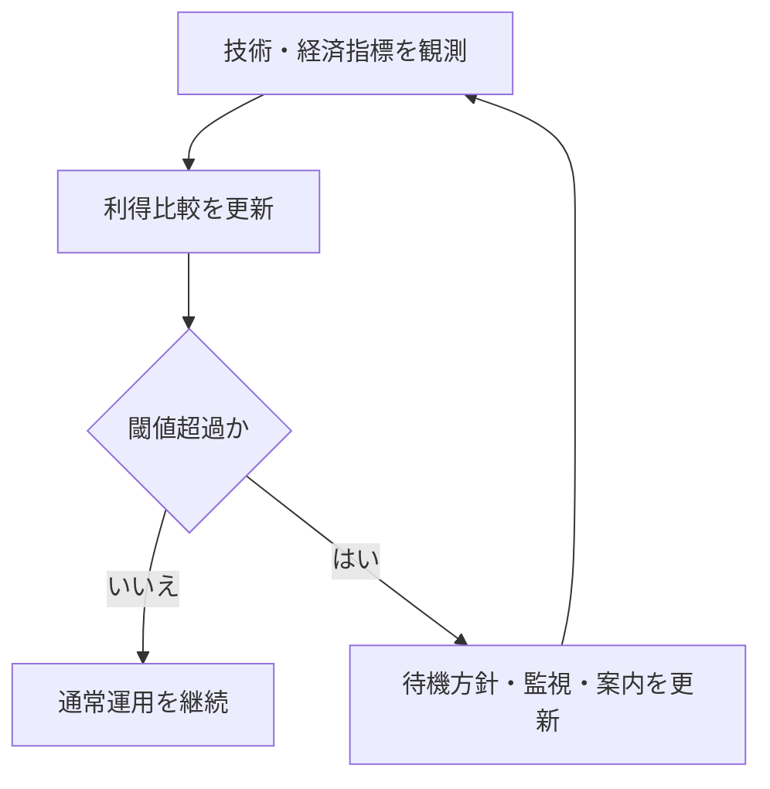

# 第9章: インセンティブと攻撃コスト

第8章で、分岐が起きる前提でも収束規則で履歴を一本化できることを確認しました。本章の問いは、その規則を参加者がなぜ守り続けるかです。技術仕様が正しくても、規則準拠行動が合理的でなければ長期運用は崩れます。したがって本章は、報酬設計、手数料市場、利得比較、攻撃コスト評価を一体として扱います。[^S-CH09-001]

ここでの中心命題は明確です。順序共有の持続性は、アルゴリズムだけでなく行動設計で決まります。仕様層が「何が正しいか」を定義し、インセンティブ層が「なぜそれを選ぶか」を支えます。この二層を分離して評価すると、短期稼働はしても長期の参加継続条件を満たさない設計を見抜きやすくなります。[^S-CH09-001][^S-CH08-001]

## 09-1 報酬設計

報酬設計の目的は、規則準拠行動を偶然ではなく継続的な合理性として成立させることです。Bitcoin文脈では、規則を満たしたブロック提案に報酬が紐づきます。ここで重要なのは、報酬を「成功者へのボーナス」としてではなく、「望ましい行動を再生産する制御信号」として扱う視点です。[^S-CH09-001]

日常例として、交通ルールを考えます。標識だけでは秩序は維持されません。違反コストと遵守メリットが設計されることで、行動の安定が生まれます。ブロックチェーンでも同じく、規則準拠が期待利得で優位になる条件を用意しなければ、逸脱行動は消えません。[^S-CH09-001]

素朴案Aは「技術的に正しい規則なら自然に守られる」です。これは行動主体の利得構造を無視しています。素朴案Bは「報酬を増やせば必ず安定する」です。報酬総量だけ増やしても、分配構造が偏り、長期持続性の条件（参加継続率と報酬予見可能性）を満たさなければ、参加主体の偏りと退出リスクが増えます。報酬設計は金額最適化ではなく行動安定化の設計です。[^S-CH09-001]

この節の橋渡し要件は三つです。第一に規則準拠行動の観測可能化。第二に報酬算定ルールの公開。第三に長期持続性の点検です。第三が欠けると、短期は安定しても中長期で準拠主体が減り、結果として収束規則の実効性が落ちます。[^S-CH09-001]

## 09-2 手数料

手数料市場は、限られた処理容量の中で取引順序を選別する信号です。したがって手数料は単なる利用コストではなく、順序形成そのものに影響する設計変数です。提案者は手数料だけでなく取引条件も見て集合を構成するため、手数料設計は公平性、予測可能性、耐混雑性の均衡問題になります。[^S-CH09-001]

日常例で言えば、通常便と速達便の関係に近いです。優先サービスは利便を与えますが、全体が優先化すると通常サービスの予測性が崩れます。ブロック空間も同様で、高手数料取引だけが常態的に先行すると、小額利用者の待ち時間が読めなくなります。反対に手数料差が小さすぎると、混雑時の選別が機能せず滞留が慢性化します。[^S-CH09-001]

ここで誤解を整理します。誤解Aは「高手数料優先は常に市場効率的で問題がない」。誤解Bは「低手数料を徹底すれば公平で安全」。前者はアクセス格差を、後者は混雑耐性低下を招く場合があります。重要なのは、どの業務要件でどの程度の優先度設計を許容するかを明示することです。[^S-CH09-001]

この節の橋渡し要件を固定します。要件1は優先順位規則の公開。要件2は混雑時挙動の説明可能性。要件3は利用者が予測できる指標提供です。要件2と3がない運用では、処理結果が恣意に見えやすく、規則準拠への協力行動が減ります。[^S-CH09-001]

## 09-3 利得比較

利得比較の目的は、正直行動と逸脱行動のどちらが合理的かを条件付きで評価することです。ここでの期待利得は単発利益ではありません。成功確率、必要資源、失敗時損失、機会費用、再参加可能性まで含めた評価が必要です。単純な「成功したら得」という計算では、現実の行動予測として精度が不足します。[^S-CH09-001]

利得比較を実務で使うときは、主体を分けて評価します。提案主体、利用主体、運用主体で利得関数は異なります。ある主体に合理的な変更が別主体に過大負担を与える場合、全体安定性は下がります。したがって「誰の合理性か」を明示せずに均衡を語ると、現場での反発と回避行動を見落とします。[^S-CH09-001]

破綻例Aは、提案主体最適化だけを進め、利用主体の予測可能性が低下するケースです。破綻例Bは、短期収益を優先した設定変更で、長期参加主体の退出が増えるケースです。どちらも局所最適が全体最適を壊す典型です。利得比較は数式の精緻化だけでなく、主体間連鎖の観察まで含める必要があります。[^S-CH09-001]

この節の橋渡しを置きます。利得比較は一回計算で終わりません。外部条件で優劣は反転し得るため、次節で扱う攻撃コスト評価に接続し、時系列で更新する必要があります。[^S-CH09-001]

## 09-4 攻撃コスト評価

攻撃コスト評価は、計算資源価格だけでなく、調達可能性、実行時間、成功確率、便益回収可能性を合わせた動的評価です。ここでの目的は「恐怖を増やす」ことではなく、安全余裕の縮小兆候を早期に検出し、対策優先度を決めることです。[^S-CH09-001]

この評価で避けるべき誤解は二つあります。第一に「コストが高いから恒久安全」という誤解。第二に「単一指標の改善で安全性全体が改善する」という誤解です。実際には指標間の連鎖があり、一つが良化しても他が悪化すれば総合危険度は上がり得ます。したがって、評価は複合指標で管理する必要があります。[^S-CH09-001]

実務要件を四つ置きます。要件1は評価時点の固定。要件2は前提値の出典固定。要件3は更新周期の固定。要件4は閾値超過時の行動計画です。要件4がない評価は「分かった」で終わり、予防行動へ接続しません。評価手順は必ず運用手順とセットで設計するべきです。[^S-CH09-001]

次の図は、攻撃コスト評価を運用へ接続する最小ループです。

図の要点は、評価と行動を切り離さないことです。観測だけ、更新だけ、通知だけの運用では、異常局面で判断が遅れます。[^S-CH09-001]

この章の結論を固定します。インセンティブ設計の品質は、派手な数式より、規則準拠行動を長期に維持できるかで測るべきです。報酬、手数料、利得比較、攻撃コスト評価を同じ改善ループで運用できれば、順序共有は仕様上の正しさから実務上の安定へ接続できます。[^S-CH09-001]

### 補助ケース: 指標改善と説明改善を同時に回す

最後に、実務で抜けやすい観点を置きます。多くの運用では指標改善に集中し、説明改善が後回しになります。しかし順序共有システムでは、利用者が処理結果を予測できること自体が準拠行動を支える条件です。したがって、内部指標が改善していても、説明が不透明なら長期信頼は下がります。[^S-CH09-001]

運用会議では、技術指標と説明指標を同時に扱ってください。技術指標の例は滞留時間分布、分岐頻度、復旧時間。説明指標の例は案内文更新遅延、問い合わせ再発率、誤解起因の再送率です。両者を同周期で見ると、どこがボトルネックかを切り分けやすくなります。[^S-CH09-001]

第10章への橋渡しを置きます。第9章が示したのは「守りたくなる条件」を作る設計でした。第10章では、その設計があっても残る限界を扱います。つまり次章は、誘因設計の外側にある責任境界を固定する章です。[^S-CH10-001]

### 補助ケース2: 主体別の利得を同じ表で比較する

利得比較を実務へ落とすとき、最初に行うべき作業は主体分割です。提案主体、利用主体、運用主体、監査主体で「得」と「損」の定義は異なります。主体分割なしに総合指標だけを見ると、誰かの改善が別の誰かの悪化を覆い隠します。順序共有の長期安定には、この見えない転嫁を早めに検知する必要があります。[^S-CH09-001]

例えば、提案主体の収益性だけを最適化すると、利用主体の待機負担や予測困難が増える場合があります。短期的には提案効率が上がっても、長期的には利用離脱で参加主体数と多様性が下がる可能性があります。逆に、利用主体の即時性だけを最適化すると、提案主体の持続参加が難しくなり、全体可用性が落ちます。したがって利得比較は、主体ごとの均衡点を探る作業です。[^S-CH09-001]

主体別比較を実装する最小方法は、同じ時点のデータを主体別KPIへ分解して並べることです。重要なのはKPIの数を増やすことではなく、意思決定に直結する組み合わせを固定することです。固定されていないKPIは、会議ごとに評価軸が変わり、改善の再現性を失います。[^S-CH09-001]

この補助ケースの結論は、均衡とは単一最適値でなく「主体間で壊れにくい配置」であるという点です。壊れにくい配置を持つと、外乱が来ても小さな調整で回復できます。壊れやすい配置しか持たない運用は、外乱のたびに大幅改修が必要になり、結果として手戻りが増えます。[^S-CH09-001]

### 補助ケース3: 攻撃コスト評価をプレイブック化する

攻撃コスト評価は、評価値を出して終わると機能しません。評価値を行動へ接続するプレイブックが必要です。プレイブックの最小要素は、1) 指標取得元、2) 更新周期、3) 閾値区分、4) 区分別行動、5) 事後レビュー項目です。この五要素が揃うと、担当者が変わっても同じ条件で同じ対応を選びやすくなります。[^S-CH09-001]

特に重要なのは、閾値区分を二値で終わらせないことです。実務では「通常」「注意」「警戒」の三段以上に分けるほうが有効です。二値区分は切替が急で、過剰反応か反応遅れのどちらかになりやすいです。段階区分を持つと、利用者案内も段階的に更新でき、運用ショックを抑えられます。[^S-CH09-001]

また、プレイブックには「更新しない判断」の記録欄を置いてください。閾値近傍で更新を見送った理由が残っていないと、次回同条件で逆判断をしやすくなります。判断理由の蓄積は、指標精度より先に運用品質を上げる場合があります。順序共有の安定は、数値精度だけでなく判断一貫性で決まるからです。[^S-CH09-001]

最後に、この章の補助ケースを一文でまとめます。インセンティブ設計は、数学的に美しいことより、同じ条件で同じ行動を選べることが重要です。主体分割とプレイブック化を同時に進めると、規則準拠は理論上の均衡から実務上の習慣へ移ります。[^S-CH09-001]

### 補助ケース4: 料金と順序の説明責任を設計する

手数料と順序は、利用者にとって最も体感しやすいインセンティブ要素です。ここで判定理由・適用時刻・変更履歴を公開しないと、技術的には妥当な処理でも不公平感が増え、結果として規則準拠行動の実行率が下がります。したがって第9章の運用では、料金算定と順序形成を「内部ロジック」で終わらせず、「外部説明可能なルール」として設計する必要があります。[^S-CH09-001]

実務で有効なのは、説明の三層分離です。第一層は原理説明で「なぜ優先度が必要か」を示します。第二層は現在説明で「いまの混雑で何が起きているか」を示します。第三層は行動説明で「利用者は何を選べるか」を示します。三層を分けない説明は、原理だけで行動が分からない、または行動だけで原理が伝わらない状態を生みます。[^S-CH09-001]

さらに、説明責任は文言だけでなく更新速度でも決まります。内部で方針変更したあと、外部説明の更新が遅れると、古い前提での判断を利用者へ強いることになります。更新遅延を防ぐには、方針変更フローに説明更新タスクを必須工程として組み込む必要があります。説明更新を任意タスクにすると、忙しい局面ほど後回しになります。[^S-CH09-001]

ここで重要なのは、説明品質を定量化することです。例えば、説明更新のリードタイム、問い合わせ再発率、誤解起因の再送率を継続計測すると、説明改善の効果を評価できます。測らない説明は改善できません。インセンティブ設計は経済指標だけでなく、説明指標も同じ会議で扱うべきです。[^S-CH09-001]

この補助ケースの結論を固定します。第9章で守るべき均衡は「収益均衡」だけではありません。「行動理解の均衡」も同時に必要です。料金と順序の理由を利用者が理解できる運用は、短期の不満を減らすだけでなく、長期の規則準拠を支える基盤になります。[^S-CH09-001]

### 補助ケース5: 章末運用テンプレート

第9章を実務へ接続するため、章末テンプレートを固定します。テンプレートは「観測」「判断」「対応」「説明」「検証」の五欄で構成します。観測欄に指標を記録し、判断欄で閾値判定を記録し、対応欄で実施行動を記録し、説明欄で外部案内を記録し、検証欄で効果を記録します。五欄を毎回埋めるだけで、改善の抜け漏れを減らせます。[^S-CH09-001]
導入順は「指標固定→テンプレート導入→再評価条件設定」の三段で進めると、現場の混乱を抑えられます。[^S-CH09-001]

このテンプレートの利点は、担当者交代に強いことです。前任者の判断理由が記録されていれば、後任者は同じ前提で判断できます。理由が記録されていない運用は、同じ指標でも結論が揺れ、長期的に方針が不安定になります。安定したインセンティブ運用には、判断履歴の継続が不可欠です。[^S-CH09-001]

また、テンプレート運用では「やらない判断」も明示してください。対応見送りを明記すると、次回に同じ状況が来たとき比較ができます。見送り理由がないと、判断が遅れたのか意図的に待ったのかを後から区別できません。区別できない運用は改善速度が上がりません。[^S-CH09-001]

この補助ケースの結論は、インセンティブ設計の実効性は判断履歴の品質で決まるという点です。数式モデルが優れていても、現場判断が再現できなければ準拠行動は持続しません。第9章の到達点は、利得比較を意思決定手順として回せることです。[^S-CH09-001]

補足として、章末に「今週の最重要トレードオフ」を一つだけ選んで記録してください。例えば、待機時間短縮を優先したのか、確定性を優先したのか、説明安定性を優先したのかを明示します。最重要トレードオフを明文化すると、次週の判断差を比較しやすくなります。[^S-CH09-001]

さらに、その選択が利用者行動へどう影響したかを翌週に確認してください。設計意図と利用者行動が一致していれば、誘因設計は機能しています。一致しなければ、数値が改善していても設計意図は未達です。行動確認を定例化することで、インセンティブ設計を机上最適化から運用最適化へ移せます。[^S-CH09-001]

最後の補足として、判断テンプレートには「今回見送った施策」を必ず残してください。見送り施策を記録すると、後日の再評価で比較対象が増え、意思決定の一貫性を保ちやすくなります。見送り記録がない運用は、同じ状況で毎回同じ議論を繰り返しやすく、改善が停滞します。[^S-CH09-001]
加えて、見送り施策には再評価条件を併記してください。例えば「分岐頻度が一定値を超えたら再評価」のように条件があると、見送り判断が固定化せず、環境変化へ追随できます。再評価条件まで記録する運用は、誘因設計の劣化を早期に検知するうえで有効です。[^S-CH09-001]
この運用が定着すると、インセンティブ設計は場当たりの微調整ではなく、検証可能な改善サイクルとして機能します。[^S-CH09-001]
改善サイクルが回れば、規則準拠は短期の偶然ではなく、長期の習慣として維持しやすくなります。[^S-CH09-001]
長期の習慣化こそが、順序共有を安定運用へ接続する最終条件です。[^S-CH09-001]
その習慣化を測るために、判断履歴の欠損率も監視対象へ入れてください。[^S-CH09-001]
欠損率の低下は、意思決定品質の安定化を示す有効な先行指標です。[^S-CH09-001]
先行指標を追う運用が、劣化の早期検知を可能にします。[^S-CH09-001]
早期検知は手戻りを減らします。[^S-CH09-001]
その効果は長期で大きく出ます。[^S-CH09-001]

## 参考文献

[^S-CH09-001]: Satoshi Nakamoto, "Bitcoin: A Peer-to-Peer Electronic Cash System" (2008). https://bitcoin.org/bitcoin.pdf
[^S-CH08-001]: Bitcoin.org, "Block Chain — Bitcoin Developer Guide". https://developer.bitcoin.org/devguide/block_chain.html
[^S-CH10-001]: Pieter Wuille, "BIP 32: Hierarchical Deterministic Wallets" (2012). https://bips.dev/32/
