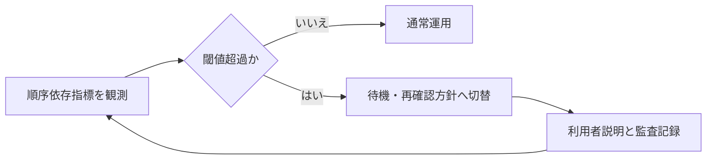

# 第10章: 限界と運用上の注意

第9章で、規則準拠を維持するためのインセンティブ設計を確認しました。本章の問いは、誘因設計が整っていても残る限界をどう扱うかです。ここでの結論は単純です。安全性主張は脅威モデル内でのみ有効であり、鍵管理や順序依存リスクはプロトコル健全性と別層で管理しなければなりません。したがって運用では、できることとできないことを先に境界化する必要があります。[^S-CH10-001][^S-CH10-002]

本章は悲観を述べる章ではありません。限界を明示して責任配分を正しく設計する章です。境界が曖昧なままでは、障害時に「誰が何を直すか」が決まらず、技術的に修復可能な事象でも復旧が遅れます。境界条件の明示は、弱気の宣言ではなく、復旧速度を上げるための設計行為です。[^S-CH10-001]

## 10-1 脅威モデル

脅威モデルは、安全性主張の有効範囲を定義する枠組みです。最低でも「何を守るか」「何から守るか」「どこまで守らないか」を明示する必要があります。これを曖昧にすると、同じシステムでも担当者ごとに安全性の意味が変わり、障害時の判断が分裂します。[^S-CH10-001]

日常例として、防災計画を考えます。防災計画は「すべての災害を防ぐ」宣言ではなく、「特定条件で被害をどこまで抑えるか」を定義する計画です。ブロックチェーン運用でも同じで、脅威モデルは万能宣言ではなく、条件付き保証の設計図です。[^S-CH10-001]

素朴案Aは「分散しているから安全」というラベル化です。分散の度合い、通信条件、実装差、更新手順を分解しなければ、どの条件で主張が崩れるかを説明できません。素朴案Bは「脅威モデル文書を作ったから十分」という満足です。更新条件がない文書は、現実変化に追随できず実務では陳腐化します。[^S-CH10-001]

この節の要件を固定します。要件1は対象脅威と非対象脅威の明示。要件2は更新トリガーの明示。要件3は更新責任者と影響手順の明示。要件4は利用者向け説明範囲の明示です。要件3と4がない運用では、内部更新があっても外部認識が追随せず、信頼低下を招きます。[^S-CH10-001]

## 10-2 鍵管理

鍵管理は、プロトコル安全性とは独立した損失要因です。ネットワークが健全でも、秘密情報の漏えいや喪失が起きれば資産は失われます。この分離を理解しないと、「仕様は安全なのに被害が出た」事象を正しく説明できません。[^S-CH10-001]

BIP32のような階層的鍵管理は、運用分離の道具を提供しますが、道具があることと運用が成立していることは別です。実務で必要なのは、保管分散、復旧手順、権限分割、監査記録を同時に回すことです。どれか一つだけ強化しても、他が未実装または運用不徹底だと単一点障害が残ります。[^S-CH10-001]

誤解を二つ整理します。誤解Aは「複雑に分散すれば安全」。過剰複雑化は手順ミスと復旧失敗を増やします。誤解Bは「簡単運用なら安全」。単純化し過ぎると漏えい時の被害範囲が広がります。鍵管理は単純化と分散化の均衡設計であり、環境ごとに適正点が変わります。[^S-CH10-001]

この節の要件は四つです。要件1は秘密情報の分散保管。要件2は復旧演習の定期実施。要件3は演習失敗時の是正期限。要件4は権限変更の監査証跡です。特に要件2と3が欠ける運用では、平常時に問題が見えず、障害時に初めて失敗が露呈します。[^S-CH10-001]

## 10-3 順序依存リスク

順序共有システムでは、順序そのものが価値になるため、順序操作の誘因が生まれます。代表例が Maximal Extractable Value（MEV）で、取引の含有・除外・並べ替えにより追加利得が発生する現象です。重要なのは、存在を否認することではなく、観測・抑制・説明の対象として定義することです。[^S-CH10-002]

誤解Aは「順序で利得が出るのは自然だから問題ではない」です。自然であることと受容可能であることは別です。誤解Bは「すべての順序操作を禁止できる」です。完全禁止が難しいなら、影響範囲を測り、許容境界を公開し、閾値超過時の対応を決めるほうが実務的です。[^S-CH10-002]

この節の要件を固定します。要件1は順序依存指標の継続観測。要件2は閾値超過時の待機・再確認手順。要件3は利用者向け説明テンプレート。要件4は再発分析ログです。要件3がないと、内部対応があっても外部には恣意的な処理に見えます。[^S-CH10-002]

次の図は、順序依存リスクの運用連鎖を示します。

図の要点は、検知と説明を同じループで回すことです。検知だけ、説明だけでは運用品質は上がりません。[^S-CH10-002]

## 10-4 限界整理

ここまでを境界条件として統合します。技術でできることは、公開規則にもとづく順序共有、改ざんコストの上昇、追試可能な履歴保持です。技術だけではできないことは、鍵運用ミスの自動吸収、脅威モデル外事象の完全防止、順序依存副作用のゼロ化です。[^S-CH10-001][^S-CH10-002]

この境界を明示する理由は、責任配分を固定するためです。プロトコル層、運用層、利用者層で責任を分けると、障害時の初動が速くなります。逆に境界が曖昧だと、全員が他層の対応を期待し、実際には誰も動かない時間が生まれます。限界整理は、改善速度を上げるための前提です。[^S-CH10-001]

実務で有効な最小チェックを置きます。第一に境界条件の更新履歴があるか。第二に更新内容が手順へ反映されたか。第三に利用者説明も同時更新されたか。この三点を同時に満たすと、境界条件が文書だけでなく運用に着地していると判断できます。[^S-CH10-001][^S-CH10-002]

本章の結論を固定します。限界を示すことは弱気ではなく、責任と手順を誤配分しないための設計です。脅威モデル、鍵管理、順序依存リスクを別層で管理し、境界更新を継続運用できる体制を持つことが、実務上の安全性を支えます。終章ではこの境界を評価軸へ変換します。[^S-CH10-001]

### 補助ケース: 境界更新を失敗させない運用

最後に、境界更新で起きやすい失敗を置きます。失敗Aは、内部文書だけ更新して実運用手順を据え置くことです。失敗Bは、運用手順は更新したが利用者説明を据え置くことです。前者は現場混乱を、後者は信頼低下を招きます。境界更新は必ず「文書」「手順」「説明」の三点同時更新で実施する必要があります。[^S-CH10-001]

さらに、更新しない判断をした場合も理由を残してください。前提条件が変わっていないのか、変更コストが高過ぎるのか、代替策で吸収するのかを記録すると、次回更新で判断一貫性を保てます。更新履歴だけでなく非更新履歴を持つ運用は、後追い検証の品質を上げます。[^S-CH10-001]

終章への橋渡しを一文で置きます。第10章で定義した境界条件は、次の主張を評価するときの「比較しない範囲」を決める道具です。境界を持つと、強みの比較と弱みの比較を同じ土俵で行えるようになります。[^S-OUTRO-001]

### 補助ケース2: 鍵管理を手順化して属人化を外す

鍵管理で最も頻出する失敗は、方針はあるが手順がない状態です。「分散保管する」「復旧できるようにする」といった方針だけでは、担当者交代時に解釈が割れます。手順化では、保管場所の種類、アクセス条件、復旧演習の頻度、演習記録の保存先を具体化する必要があります。[^S-CH10-001]

ここで重要なのは、手順の簡潔さです。過剰に複雑な手順は守られません。守られない手順は存在しないのと同じです。したがって鍵管理手順は「最小構成で必ず実行できる」ことを優先し、必要に応じて段階的に強化する設計が現実的です。[^S-CH10-001]

また、復旧演習は成功率だけでなく所要時間も記録してください。復旧できるが時間がかかり過ぎる手順は、実障害時に業務停止を長引かせます。時間記録があると、どの工程がボトルネックかを切り分けやすく、改善効果も測定できます。[^S-CH10-001]

### 補助ケース3: 順序依存リスクの説明を定型化する

順序依存リスクは技術側で観測していても、利用者説明が自由文だと品質が揺れます。そこで、説明テンプレートを固定します。最小テンプレートは「何が起きたか」「利用者へ何の影響があるか」「今どう対処しているか」「次の更新時刻はいつか」の四文です。四文で統一すると、問い合わせ対応の再現性が上がります。[^S-CH10-002]

さらに、テンプレートには「確定情報」と「暫定情報」を分けて記載する欄を置いてください。暫定情報を確定口調で出すと、後から修正したときに信頼を損ないます。逆に確定情報まで曖昧にすると、利用者は行動を決められません。情報種別を分けるだけで、説明品質は大きく改善します。[^S-CH10-002]

この補助ケースの結論を置きます。第10章の限界管理は、技術制約の列挙ではなく、制約下での行動を安定化させる設計です。鍵管理手順の実行性と順序依存リスク説明の再現性を同時に上げることで、境界条件は実務上の防御線として機能します。[^S-CH10-001][^S-CH10-002]

### 補助ケース4: 境界条件レビューの定例化

限界管理を継続するには、境界条件レビューを定例化する必要があります。レビューの目的は、境界条件の正しさを一度証明することではなく、環境変化に対して境界がまだ妥当かを継続確認することです。定例化されていないレビューは、重大障害後だけ実施され、平常時の小さな劣化を見逃しやすくなります。[^S-CH10-001]

定例レビューの最小議題は四つです。1) 前回以降の前提変化、2) 境界条件への影響、3) 手順更新の要否、4) 利用者説明更新の要否です。議題を固定すると、会議が抽象論に流れにくくなり、更新判断の速度が上がります。議題が固定されていない会議は、論点が毎回変わり、結論の比較ができません。[^S-CH10-001][^S-CH10-002]
初期運用では月次レビューを基本にし、重大事象発生時は臨時レビューを追加する形が実装しやすいです。[^S-CH10-001]

また、レビュー結果には必ず「採用」「保留」「却下」の区分を付けてください。保留の理由を残すことで、次回レビュー時に前提差を比較できます。理由がない保留は、実務上は未処理と同じ扱いになります。限界管理の品質は、結論の多さではなく判断履歴の透明性で決まります。[^S-CH10-001]

この補助ケースの最終結論を置きます。境界条件は作るより回すほうが難しく、回せる体制こそが安全性主張の実効性を支えます。定例レビューを通じて、境界・手順・説明を同時更新できる運用を維持することが、第10章の実装到達点です。[^S-CH10-001]

### 補助ケース5: 境界条件を現場へ浸透させる

境界条件は文書化しただけでは定着しません。現場へ浸透させるには、短い教育単位で繰り返す必要があります。例えば月次で15分の境界確認を行い、前月の変更点を一枚資料で共有します。長時間研修より短時間反復のほうが、運用現場では定着しやすいです。[^S-CH10-001]

浸透確認では、知識テストより行動テストを優先してください。具体的には「この事象は脅威モデル内か外か」「誰が最初に対応するか」「利用者へ何を案内するか」を三問で確認します。三問へ即答できる状態なら、境界条件は行動へ変換されています。[^S-CH10-001][^S-CH10-002]

この補助ケースの結論は、限界管理の成熟度は文書の出来栄えでなく、現場の即応性で測るべきだという点です。境界条件が即応性へつながっているなら、技術変更や外乱があっても運用は大崩れしません。[^S-CH10-001]

補足として、境界条件レビューの最後に「今月の境界逸脱予兆」を一項目だけ選んでください。項目を一つに絞ると、関係者が同じ注意点を共有しやすくなります。予兆を共有した状態で月次運用を回すと、重大化前に小さく修正できる確率が上がります。[^S-CH10-001]

また、予兆項目には必ず観測方法と連絡先を添えてください。予兆を知っていても観測責任が曖昧なら、実際には誰も監視しません。限界管理の実効性は、知識量より責任配置で決まることを忘れないでください。[^S-CH10-001]

補足として、境界条件の変更履歴には「変更しなかった理由」も残してください。変更理由だけ残す運用では、見送り判断の妥当性を後から検証できません。見送り理由まで残ると、次回レビューで前提差を比較でき、意思決定の再現性が上がります。[^S-CH10-001]
さらに、変更履歴には「次回の確認時刻」を必ず付けてください。確認時刻がない履歴は、実務上は先送りと区別できません。時刻を固定するだけで、境界条件レビューの継続性が上がり、限界管理が形式的な作業で終わりにくくなります。[^S-CH10-001]
この最小ルールを守るだけで、限界管理は「読む文書」から「使う手順」へ変わります。[^S-CH10-001]
使う手順へ変わった時点で、境界条件は説明責任と復旧速度の両方を支える実務資産になります。[^S-CH10-001]
この実務資産を維持するには、定例レビューを止めないことが最も重要です。[^S-CH10-001]
止めない運用こそが、境界条件の劣化を最小化します。[^S-CH10-001]
継続性が、そのまま限界管理の実効性です。[^S-CH10-001]
実効性を維持できれば、境界条件は事故予防に直結します。[^S-CH10-001]
ここが運用要点です。[^S-CH10-001]
継続が品質を決めます。[^S-CH10-001]

## 参考文献

[^S-CH10-001]: Pieter Wuille, "BIP 32: Hierarchical Deterministic Wallets" (2012). https://bips.dev/32/
[^S-CH10-002]: Ethereum.org, "Maximal extractable value (MEV)". https://ethereum.org/developers/docs/mev
[^S-OUTRO-001]: IETF, "RFC 9293: Transmission Control Protocol (TCP)" (2022). https://www.rfc-editor.org/rfc/rfc9293
