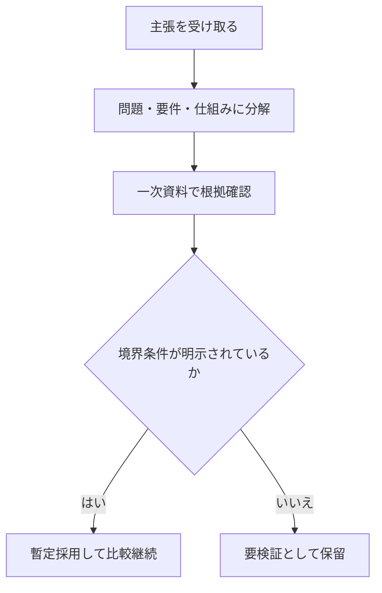

# 終章: 何を理解したか

本書の目的は、ブロックチェーンを「暗号資産を発行する技術」として覚えることではなく、「中央裁定者がいない条件で取引順序を共有する技術」として理解することでした。序章から第10章までの議論は、すべてこの中心命題に接続しています。終章では、到達点を再確認し、次に新しい方式を読むときの評価軸を固定します。[^S-INTRO-001][^S-OUTRO-001]

ここで大事なのは、章の内容を暗記したかどうかではありません。大事なのは、未知の主張を読んだときに「何の問題を解く提案か」「どの要件を満たすか」「どこが限界か」を自分の言葉で再構成できるかです。再構成できるなら、自走学習が可能です。再構成できないなら、情報を増やす前に評価軸を整える必要があります。[^S-OUTRO-001]

## 11-1 中心命題の再確認

中心命題をもう一度固定します。ブロックチェーンの核心は、中央裁定者がいない環境で、取引順序を検証可能な形で共有することです。コイン発行はこの仕組みの一部であって中心ではありません。この順序共有という軸を失うと、方式比較は名称比較に落ちます。[^S-INTRO-001]

本書で追った流れは一貫しています。第1章で順序不在の破綻を確認し、第2章で中央裁定者ありの比較軸を作り、第3章と第4章で観測差と伝播遅延を前提化し、第5章から第8章でデータ構造と収束規則を組み立てました。第9章と第10章は、その仕組みを持続させる誘因と限界を明示しました。この構造が理解できていれば、章番号を忘れても論理は再現できます。[^S-INTRO-001]

## 11-2 評価軸

新しい方式や新しい記事を読むときは、次の五軸で評価してください。

1. 問題軸: どの破綻を防ぐ提案か。  
2. 要件軸: 比較可能性、重複利用排除、収束性、追試可能性をどう満たすか。  
3. 記録軸: 履歴固定と改ざんコストをどの層で担保するか。  
4. 行動軸: 参加者が規則準拠を選び続ける誘因があるか。  
5. 境界軸: 何を保証し、何を保証しないかを明示しているか。

この五軸の利点は、流行語の違いに引きずられないことです。実装言語、ブランド名、宣伝文句が変わっても、同じ物差しで比較できます。評価軸を持たないと、速さや話題性が判断を支配し、要件未達を見落としやすくなります。[^S-OUTRO-001]

次の図は、五軸評価を運用手順へ落とした最小フローです。

図の要点は、保留判断を弱さではなく検証手順として扱うことです。確認できない主張を保留できる能力は、情報過多環境で誤判断を減らします。[^S-OUTRO-001]

## 11-3 誤解の除去

終章で外しておきたい誤解を三つに絞ります。誤解Aは「ブロックチェーン=コイン発行技術」。これは中心命題を外します。誤解Bは「仕様が強ければ運用問題は消える」。鍵管理や順序依存リスクは別層です。誤解Cは「確定は絶対不変」。実務では確率的確定を管理します。[^S-INTRO-001][^S-OUTRO-001]

これらの誤解に共通する原因は、層の混同です。問題設定層、仕組み層、運用層、説明層を混ぜると、主張は強く見えても再現性が下がります。層を分けて読む習慣を持つと、断定的な文章に出会っても「どの層の話か」を切り分けられます。切り分けができれば、必要以上に信じることも、必要以上に否定することも減ります。[^S-OUTRO-001]

## 11-4 次の学習

ここから先の学習は、一次資料へ戻る習慣で進めてください。二次解説は理解の入口として有効ですが、保証境界や前提条件は一次資料でしか確定できない場合が多いです。したがって、主張を見たら一次資料の対応箇所を探し、対応しない点は保留する、という順序を固定するのが有効です。[^S-OUTRO-001]

実務で使える最小チェックを置きます。第一に、この主張は何の破綻を扱っているか。第二に、根拠は一次資料で確認できるか。第三に、境界条件は明示されているか。第四に、失敗時手順は書かれているか。第五に、代替案との比較軸は明示されているか。五つのうち二つ以上が欠ける場合は、採用前に要検証として保留するのが妥当です。[^S-OUTRO-001]

本書全体の結論を最後に一文で置きます。ブロックチェーン理解とは、方式名を覚えることではなく、順序共有という問いに対して、仕組み・誘因・限界を分けて説明できることです。この説明ができる状態が、終章で目指した到達点です。[^S-INTRO-001][^S-OUTRO-001]

### 補助ケース: 読了後30分で行う再構成

読了後の確認として、30分で次の作業を行ってください。最初の10分で中心命題を三文に要約します。次の10分で、五軸評価を使って任意の技術記事を1本採点します。最後の10分で、採点結果のうち保留項目を一次資料へ引き戻します。この短い演習を繰り返すと、要約力と検証力が同時に上がります。[^S-OUTRO-001]

終章の本当のゴールは、ここで学習を止めることではありません。評価軸を持ったまま、新しい情報を自力で整理し続けることです。中心命題へ戻る習慣と、根拠を一次資料で確認する習慣を維持できれば、どの方式を読むときも判断の再現性を保てます。[^S-INTRO-001][^S-OUTRO-001]

### 補助ケース2: 90日で評価軸を定着させる

終章で学んだ評価軸を実際に使える形へ定着させるには、短期で反復する計画が有効です。目安として90日を三期に分けます。第1期（1〜30日）は要約訓練です。毎週1本、技術記事を五軸で200字要約します。第2期（31〜60日）は照合訓練です。要約した主張を一次資料の対応箇所へ紐づけます。第3期（61〜90日）は比較訓練です。異なる2方式を同じ五軸で比較し、強みと限界を並べます。[^S-OUTRO-001]

この計画で重要なのは、完璧な正解を狙わないことです。狙うべきは、同じ手順で評価できる再現性です。再現性があれば、誤りがあっても次回修正できます。再現性がない評価は、当たっていても次に使えません。終章の目的は知識量より判断品質の継続改善です。[^S-OUTRO-001]

また、90日計画には「保留ログ」を必ず含めてください。確認できなかった主張を保留として記録し、後日一次資料で再判定します。保留ログを持つと、断定したくなる心理を抑え、判断を根拠へ戻しやすくなります。保留は弱さではなく、検証を継続するための技術です。[^S-OUTRO-001]

最後に、終章全体の到達点を再度固定します。中心命題を言えること、五軸で評価できること、根拠不十分な主張を保留できること。この三点が揃えば、本書の学習目標は達成です。ここから先は、同じ手順を新しい主張へ適用し続けるだけです。[^S-INTRO-001][^S-OUTRO-001]

### 補助ケース3: 学習記録を残して判断再現性を高める

評価軸を定着させるには、読書履歴ではなく判断履歴を残してください。具体的には「読んだ主張」「採用した根拠」「保留した理由」「次回確認先」を1件ずつ記録します。判断履歴があると、数週間後に見直したときでも同じ前提へ戻れます。前提へ戻れることが、終章で重視した再現性です。[^S-OUTRO-001]

また、判断履歴は短文で十分です。長い感想より、判断理由を1〜2文で固定するほうが再利用しやすくなります。終章のゴールは文章量を増やすことではなく、判断品質を安定させることです。記録形式を簡潔に保つと、継続率が上がり、結果として評価軸が定着します。[^S-OUTRO-001]

最後に、記録は必ず週次で見直してください。見直しを入れると、判断の癖や前提の漏れが早く見つかります。見直しのない記録は蓄積しても活用されません。終章で目指した自走学習は、記録と見直しを対で回すことで実現します。[^S-OUTRO-001]
週次メモは「主張」「根拠」「保留理由」の3列で記録すると、比較と更新がしやすくなります。[^S-OUTRO-001]

加えて、週次見直しでは「最も迷った主張」を一つ選び、保留理由を更新してください。迷いを可視化すると、次回の学習優先度を決めやすくなります。[^S-OUTRO-001]
この更新習慣を続けることが、終章で定義した自走学習の実装です。[^S-OUTRO-001]
迷いを記録し続ける姿勢そのものが、判断品質を長期で押し上げます。[^S-OUTRO-001]

## 参考文献

[^S-INTRO-001]: Satoshi Nakamoto, "Bitcoin: A Peer-to-Peer Electronic Cash System" (2008). https://bitcoin.org/bitcoin.pdf
[^S-OUTRO-001]: IETF, "RFC 9293: Transmission Control Protocol (TCP)" (2022). https://www.rfc-editor.org/rfc/rfc9293
