# 序章: この本の問い

この本の中心命題は、ブロックチェーンを「暗号資産を発行する仕組み」としてではなく、「中央裁定者がいない環境で取引順序を共有する仕組み」として理解することです。ここを先に固定しないと、後続章で方式名だけを覚えてしまい、何の問題を解いている技術なのかが見えなくなります。[^S-INTRO-001]

序章の役割は四つです。問いを置くこと、日常の状況と結びつけること、対象範囲を切ること、読み方を与えることです。第1章以降を読むための座標軸を先に作ります。

## 00-1 問いの設定

中央裁定者がいる世界では、競合する取引が出ても最後は一つの判定へ集約できます。銀行や決済ネットワークの運営者が「この順序を正とする」と決めるからです。中央裁定者がいない世界では、この集約機能を人物の判断ではなく公開規則で代替しなければなりません。[^S-INTRO-001][^S-CH02-001]

ここでの問いは一文で書けます。中央裁定者なしで、どうやって全員が同じ取引順序を共有するか。この問いは「誰を信用するか」という性格論ではなく、「観測がずれても同じ判定に収束する規則を設計できるか」という工学的問いです。[^S-CH03-001]

素朴案として「時刻で並べればよい」という案が出ます。ですが、送信時刻・受信時刻・検証時刻は観測者ごとに一致しません。店Aに近いノード群が Tx-A を先に見て、店Bに近いノード群が Tx-B を先に見る状況は自然に起きます。時刻だけで順序を決めると、正当履歴が複数立ってしまいます。[^S-CH03-001][^S-CH04-001]

この破綻から橋渡しされる要件は明確です。必要なのは「もっと正確な時計」ではなく、「観測差を前提にしても判定が収束する公開規則」です。第1章以降は、この要件を満たす部品を順に確認します。

## 00-2 日常との接続

日常の支払いでは、利用者には「通った/通らない」しか見えません。しかし裏側では、同時刻付近に届いた要求の順序付け、競合要求の棄却、記録更新の優先順位が常に処理されています。順序管理は、暗号資産特有の話ではなく、決済全般の土台です。[^S-CH02-001]

序章から第3章で使うIT基礎語を先に定義します。

- サーバー（Server）: 要求に応答する側の計算機。
- クライアント（Client）: 要求を送る側の計算機。
- ノード（Node）: 検証と中継に参加する計算機。
- レイテンシ（Latency）: 情報到達までの遅延。
- プロトコル（Protocol）: 参加者が共有する公開手順。

この5語は次章以降で繰り返し出ます。意味が曖昧なまま進むと、読者は用語の復元に認知資源を使い、肝心の因果を追えません。だから序章で先に定義します。

日常例Aとして、同じ残高を使う二つの支払い要求がほぼ同時に送られる場面を考えてください。ノード群AにはA要求が先に届き、ノード群BにはB要求が先に届くと、局所判定はどちらも正しく見えます。日常例Bとして、共有クーポンを二店舗で同時利用すると、各端末は先に受けた要求を有効と判定しやすく、全体判定は割れます。どちらも「誰かが悪い」からではなく、「観測順が一致しない」から起きる問題です。[^S-CH01-001][^S-CH04-001]

## 00-3 境界条件

本書が扱うのは、順序共有問題の定式化、必要条件の抽出、仕組みへの対応付けです。投資助言、価格予測、銘柄推奨は扱いません。税務や法務の個別判断も中心対象にしません。対象を先に切るのは、議論を狭めるためではなく、主線を壊さないためです。

また、本書は実装手順の列挙本でもありません。実装が不要という意味ではなく、実装の前に「問題→要件→仕組み」の対応を理解するという順序を採ります。要件が見えていれば、新しい方式が出ても比較軸を失いません。

到達点の上限も明記します。本書は暗号理論の厳密証明や最適化コードまでは踏み込みません。到達点は、ある方式がどの要件を満たし、どの要件を満たさないかを説明できる状態です。

出典運用もここで固定します。事実主張はMarkdown脚注やリンクで根拠を示し、未確証は断定を避けます。必要な場合のみ「要検証」を明示し、保留理由を残します。

この方針には実務上の意味があります。読者が本文を読んだあとに「どこまでが確定情報で、どこからが解釈か」を再点検できるからです。順序共有の議論は、制度、ネットワーク、実装の層が混ざりやすく、根拠の境界が曖昧だと誤解が連鎖します。序章で根拠の書き方を固定するのは、後続章の検証可能性を守るためです。

## 00-4 読み方

読み方は三問で固定できます。第一に「この章はどの破綻を扱うか」。第二に「その破綻からどの要件を引き出したか」。第三に「その要件をどの仕組みで満たしたか」。章ごとにこの三問を回せば、情報量が増えても主線は散りません。

第1章は順序が必要になる理由を二重支払いで固定します。第2章は中央裁定者ありの世界を比較軸として整理します。第3章は観測差と部分順序を使って困難を定式化します。第4章以降は、ネットワーク、データ構造、合意規則という技術部品で解を組み立てます。[^S-CH01-001][^S-CH02-001][^S-CH03-001]

読前と読後に一文要約を置くと効果的です。読前は「この章はどの破綻を扱うか」、読後は「どの要件を固定できたか」を一文で言い直します。詰まったときは、問い・破綻・要件・仕組みのどこで止まったかを明示してください。復習範囲をすぐ限定できます。

さらに、章間の接続を追うときは「前章で固定した要件が、次章でどの部品へ割り当てられるか」を一行メモにして残すと有効です。このメモを作る習慣があると、章をまたいだときに論理が飛んだように感じる箇所を早期に検知できます。第1章から第5章までは、この対応メモを作りながら読むと理解速度が上がります。

次の図は、序章から後続章までの評価軸を一本にそろえるための地図です。


序章の結論は一つです。ブロックチェーン理解の入口は「何を発行するか」ではなく「どう順序を共有するか」です。この軸を保持して第1章へ進みます。[^S-INTRO-001]

# 第1章: なぜ順序が必要か

この章の目的は、順序がないと何が壊れるかを先に固定することです。ブロックチェーンの説明では、しばしば署名やハッシュの仕組みから始まりますが、順序の必要性を先に押さえないと、技術部品の意味が結びつきません。ここでは二重支払いを中心に、順序不在の破綻を日常例で確認し、最後に必要条件を抽出します。[^S-CH01-001]

## 01-1 二重支払いの具体例

同じ価値を二人へ同時に渡そうとする行為を二重支払いと呼びます。紙幣なら物理的に一枚しか渡せませんが、デジタルデータは複製が容易です。だから「誰が先に正当な受け取りを得たか」を全員で一致させる仕組みが必要になります。[^S-CH01-001]

日常の場面で見てみます。あなたが1,000円相当を店Aと店Bへ同時に送ったとします。店Aは「Aへの送金が先」と主張し、店Bは「Bへの送金が先」と主張できます。双方の端末画面だけを見れば、どちらも成立したように見えるかもしれません。問題は、同じ価値を二度使ってしまっている点です。

中央裁定者がいれば、どちらを有効にするかを後から一つに決められます。中央裁定者がいない場合は、後付けの人手裁定は使えません。最初から「同時に見えても最終的に同じ結論へ寄る規則」が必要です。

ここで重要なのは、攻撃者だけを想定しないことです。悪意がなくても、遅延や再送の差で受信順はずれます。順序問題は不正者の存在だけでなく、分散環境そのものから生じる基礎問題です。[^S-CH04-001]

もう一つ、読者が誤解しやすい点を補います。二重支払い問題は「同じ人が二回送る」場面だけに限定されません。実運用では、アプリ再送、通信途切れ後の再実行、端末の二重送信など、意図しない重複要求でも同型の競合が発生します。したがって設計要件は「不正者対策」ではなく「競合要求全般の順序確定」です。ここを広く捉えると、後続章で扱う規則の意味が明確になります。

実務観点では、順序不一致は利用者説明にも直結します。店Aには「完了」、店Bには「失敗」と表示されると、利用者はどちらを信じるべきか判断できません。表示不一致は単なるUI問題ではなく、背後の順序判定が不一致であるサインです。順序共有を設計課題として先に固定する理由は、技術整合と利用者整合を同時に守るためです。

## 01-2 順序なしの破綻

順序を共有しないと、同じ取引集合を見ても正当履歴の判定が分裂します。これは理論上の細かな差ではなく、実務上の整合性を壊します。会計上の残高、在庫の引当、サービス提供可否の判定が、観測者ごとに食い違うからです。

破綻例A: ノード群Aは `Tx-1 -> Tx-2` の順で受信し、ノード群Bは `Tx-2 -> Tx-1` の順で受信します。両群が「先に見た方を採用する」規則だけで動くと、最終履歴は分岐したまま残ります。破綻例B: 一部ノードで一時的な通信遅延が起きると、遅延復旧後に古い取引が遅れて届き、履歴更新順が逆転します。どちらの破綻でも、局所的に正しい処理が全体整合を壊します。[^S-CH03-001][^S-CH04-001]

この状態では、資産の所有判定を一意に定義できません。所有判定が一意に定義できなければ、支払い完了の判定も一意に定義できません。つまり、順序不在は「便利さの低下」ではなく「取引成立条件の欠落」です。

ここで「後で照合すればよい」という素朴案もよく出ます。しかし後照合は、照合基準が共有されていなければ機能しません。照合時点で「どの履歴を正とするか」が再び争点になるためです。順序共有の問題を後段へ先送りしても、問題が消えるわけではなく、運用コストを後ろへ移しているだけです。

また、順序不在は監査可能性を損ないます。監査で必要なのは、最終残高だけでなく、どの遷移でそこへ到達したかを再現できることです。順序が分裂したままでは、同じ最終値でも遷移経路が複数残り、責任帰属が曖昧になります。したがって順序共有は会計整合だけでなく、責任整合の条件でもあります。

橋渡しとして要件を明確にします。必要なのは、観測順がずれても全員が同じ履歴を採択する規則です。さらに、その規則は第三者が後から検証できる必要があります。検証可能性がない規則は、成立していても共有できません。

## 01-3 時刻基準の限界

「時刻で並べればよい」という素朴案は直感的ですが、分散環境では破綻します。理由は三つあります。第一に、端末時計は完全には一致しません。第二に、送信時刻と受信時刻は別物です。第三に、再送や経路差で到達順が入れ替わります。[^S-CH03-001][^S-CH04-001]

時系列の具体例で確認します。

- 時点 `t0`: 送信者が Tx-A と Tx-B をほぼ同時に送る。
- 時点 `t1`: ノードXは Tx-A を先に受信する。
- 時点 `t2`: ノードYは Tx-B を先に受信する。
- 時点 `t3`: ノードXの時計では Tx-A が先、ノードYの時計では Tx-B が先。

このとき「ローカル時刻の早い方を採用」という規則を使うと、ノードXとノードYは別の履歴を正と判定します。時刻は観測を補助できますが、共有順序を単独で保証できません。

Lamport の議論が示すのも同じ要点です。分散系で自然に得られるのは部分順序であり、すべてのイベント対に対して全順序が自明に決まるわけではありません。したがって、時刻値の大小だけで順序共有問題を解くことはできません。[^S-CH03-001]

時刻を使う設計そのものが無意味だと言いたいわけではありません。時刻は運用監視、遅延分析、トラブル解析には有効です。ただし、時刻は「補助情報」であり「最終採択規則」ではありません。この役割分離を守ると、設計議論が整理されます。時刻は観測の説明に使い、採択は別の公開規則で行う、という分担が必要です。

さらに、時計同期が強い環境でも限界は残ります。同期誤差を小さくしても、同時到達近傍の競合や通信再試行による順序逆転は消えません。つまり「同期精度を上げれば本質問題が解ける」という期待は過大です。ここで求めるべきは高精度時計ではなく、時計誤差が残る前提で一致判定を作る規則です。

次の図は、同じ二取引でも観測者によって先後が逆転する状況を示します。

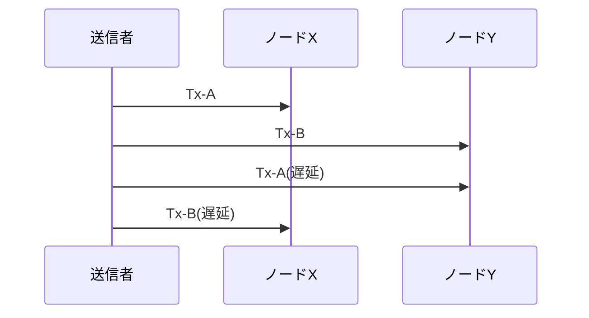

図から読み取るべき点は、どちらのノードも「間違った処理」をしたわけではないことです。それでも先後判定は割れます。だから必要なのは、観測者の善悪判定ではなく、観測差を吸収する規則設計です。

## 01-4 必要条件の抽出

ここまでの破綻から、順序共有の必要条件を四つに整理できます。

1. 観測差があっても最終判定が収束すること。  
2. 採択規則が公開され、第三者が検証できること。  
3. 同じ価値の重複利用を機械的に排除できること。  
4. 運用時に「暫定」と「確定」を区別して扱えること。

この四条件は、方式比較の共通物差しになります。たとえば新しいチェーンを評価するときも、最初にこの四条件で点検すれば、宣伝文句ではなく設計要件で比較できます。

比較を実践するときは、四条件をチェックリスト化すると効果的です。条件1では「どの故障条件で収束が壊れるか」を確認し、条件2では「第三者が同じ入力から同じ判定を再現できるか」を確認します。条件3では「重複利用の検出単位」を明示し、条件4では「暫定から確定へ移る運用条件」を明示します。各条件に未記載があれば、方式説明としては不十分です。

このチェックリストは、学習にも運用にも使えます。学習段階では章理解の自己点検に使い、運用段階では障害時の切り分けに使います。どの条件が崩れたかを先に特定できれば、対応策の優先順位を短時間で決められます。順序問題を抽象論で終わらせず、運用可能な問いへ落とすことが本章の狙いです。

実務シナリオをもう一段具体化します。EC事業者が同一在庫1点を複数チャネルで販売している状況を考えます。チャネルAの決済通知が先に見えたノード群と、チャネルBの通知が先に見えたノード群で順序判定が割れると、在庫引当と返金判断が分岐します。ここで順序共有規則が弱いと、返金処理が遅れ、利用者説明と会計処理が同時に破綻します。順序問題は資産移転だけでなく、在庫・配送・返金の連鎖処理全体へ波及します。

別シナリオとして、ウォレット事業者の内部帳簿を考えます。入金通知が複数経路から届く構成では、通知重複と通知順逆転が同時に起きます。重複通知を除外する規則だけでは不足で、逆転通知に対してどの履歴候補を採択するかを定義しなければなりません。つまり重複排除規則と順序採択規則は別物であり、両方が揃って初めて「同じ価値を一度だけ使う」条件が成立します。

ここまでの議論を読むと「では常に厳格な確定待ちをすればよい」と考えがちです。しかし確定待ちを増やすと体験遅延が増え、少額高頻度の利用では実用性が下がります。逆に待ち時間を短くすると誤判定リスクが上がります。したがって運用は、金額、再実行コスト、利用者期待時間を踏まえた閾値設計が必要です。本章の四条件は、この閾値設計を場当たりにしないための土台でもあります。

最後に、章末で使える自己点検質問を置きます。第一に「自分の説明は受信順と採択順を区別しているか」。第二に「破綻例を観測者・時点・結果で書けているか」。第三に「必要条件を第三者検証可能な文で言えているか」。この三問に答えられれば、第2章以降の比較議論へ無理なく接続できます。答えられない場合は、用語不足ではなく因果不足が原因であることが多いため、破綻例と橋渡し文を先に見直すと改善が速くなります。

次の図は、本章での論理遷移を圧縮したものです。


本章の結論は明確です。順序は「あれば便利」な要素ではなく、取引の正当性を成立させる前提条件です。次章では比較のために、中央裁定者ありの世界がこの前提をどう処理しているかを整理します。[^S-CH01-001][^S-CH03-001]

### 補助ケース: 失敗を先に設計する

順序設計を現場へ導入するときは、成功ケースより失敗ケースを先に定義すると品質が上がります。たとえば「同時送信」「再送遅延」「部分分断」「再接続直後」の四場面を標準シナリオとして準備し、各場面でどの規則が働くかを事前に書き下します。書き下しの形式は、観測者、時点、候補履歴、採択結果、利用者表示の五項目です。この五項目が一貫していれば、運用担当と開発担当の認識を揃えやすくなります。

現場で頻出する失敗は、規則がないことより、規則があるのに参照されないことです。原因は、規則が文章として長く、運用時に素早く参照できないことにあります。対策として、章の四条件をそのまま運用チェックカードに変換します。カードには「収束」「検証可能」「重複排除」「暫定/確定」の四欄を置き、インシデント時に必ず四欄を埋める手順を定義します。これだけで、場当たり対応から条件ベース対応へ移行できます。

もう一つの実践ポイントは、章末レビューです。週次レビューで、実際に起きた競合事例を一つ選び、四条件で再評価します。再評価の目的は担当者の反省ではなく、規則の穴の発見です。もし「どの条件が崩れたか」を一意に答えられないなら、規則の記述粒度が粗すぎる可能性があります。規則を改定するときは、必ず破綻例と橋渡し文をセットで更新し、読み手が因果を再現できる形を守ります。

この補助ケースで強調したいのは、順序問題を理論知識のまま閉じないことです。順序共有は運用の瞬間に評価されます。障害時に三分以内で「いま何が起き、どの条件が崩れ、どの手順で戻すか」を説明できる状態まで落として初めて、設計として成立したと言えます。本章の四条件は、その説明を可能にする最小単位です。

運用教育の観点では、四条件を新人研修の演習へ組み込むと効果があります。単に用語定義を覚えるのではなく、実際の競合ログを使って「どの条件が未達か」を判定する訓練を行うと、障害対応の初動品質が上がります。順序問題は理論理解だけでは運用に落ちないため、章内の概念を必ず実務手順へ接続することが重要です。

この章で扱った内容は、後続章の評価基準として再利用します。第2章で中央型を見るときも、第3章で分散困難を定式化するときも、「順序不在がどの業務破綻を生むか」を起点に読むと論点がぶれません。つまり第1章は入門章であると同時に、全章共通の検証テンプレートを定義する章です。

補足として、章を読み終えた時点で「時刻を使う範囲」と「時刻に依存しない採択範囲」を分けて書き出してください。この切り分けができると、時刻同期改善をどこまで投資対象にするべきかを現実的に判断できます。

最後に、実務での確認観点を一つ加えます。インシデント報告を書く際は、必ず「競合を検知した時刻」「採択規則を適用した時刻」「利用者へ確定を通知した時刻」を分けて記録してください。この三時刻が分離されるだけで、順序問題を説明するときの因果が崩れにくくなります。

この三時刻を分ける習慣は、第2章以降の比較でも効きます。中央型では時刻差を制度で吸収し、分散型では規則で吸収するため、どの層で差を処理したかを明確に書けるからです。

# 第2章: 中央裁定者ありの世界

この章は、中央裁定者がいる決済世界を比較軸として整理します。目的は「中央型が良い/悪い」を決めることではなく、順序共有をどの機能で実現しているかを分解することです。分解せずに比較すると、ブロックチェーン側の説明も抽象論で終わります。[^S-CH02-001]

## 02-1 裁定者の役割

中央裁定者ありの世界では、順序決定、記録更新、異議処理を同じ制度主体が統括します。利用者視点では一つの支払い体験でも、内部では複数の判断点が連鎖しています。具体的には「要求を受ける」「可否を判定する」「記録を更新する」「後で争いが出たときに裁定する」という流れです。[^S-CH02-001]

ここで重要なのは、最終的に誰が正当判定を決めるかが制度として明示されている点です。観測差があっても、最後に判定を集約する窓口があるため、履歴は一本化しやすくなります。第1章で見た順序分裂を、組織的裁定で吸収していると理解できます。

日常例として、同一口座から短時間に複数の支払い要求が出る場面を考えます。利用者端末では両方が送信済みに見えても、中央側の規則はどちらを先に受理するかを内部順序で決めます。利用者は最終結果だけを受け取りますが、裏側では順序争いが制度内で処理されています。

素朴案として「中央型は単に速いだけ」と説明すると誤解が残ります。実際には速さより、責任主体と裁定手順が固定されていることが本質です。速さは運用設計の結果であって、成立条件そのものではありません。

この点をもう一段具体化します。中央型の設計文書には、業務時間外の処理方針、障害時の代替フロー、異議申立ての期限など、順序判定を支える運用契約が含まれます。順序共有はアルゴリズム単体で成立するのではなく、制度契約と処理系の結合で成立します。比較を行うときは、技術仕様と運用契約を同じ層で語らないことが重要です。

また、中央裁定者は単に判断を下すだけではなく、判断の履歴を管理します。いつ、どの入力に基づき、どの規則で判断したかを残すことで、再発防止と監査が可能になります。この履歴管理機能があるから、利用者への説明も再現可能になります。

## 02-2 承認と確定

中央型決済で混同されやすいのが、承認・清算・最終確定の違いです。利用者画面の「承認済み」は、直ちに最終確定を意味しない場合があります。ここを曖昧にすると、順序共有の議論が体験文言に引きずられます。[^S-CH02-001]

日常語で言い換えると、承認は「いま通してよいか」の判定、清算は「勘定を整理する処理」、最終確定は「後から覆さない記録化」です。中央裁定者はこの三段階を同一制度下で管理し、段階ごとの責任分担を明示します。

破綻例A: 承認を最終確定と誤解すると、後段の調整が必要なケースで利用者説明が破綻します。破綻例B: 清算時点の記録を最終値と誤認すると、異議処理フェーズで履歴修正が生じた際に「矛盾」と感じやすくなります。どちらも技術故障ではなく、段階区別の不足が原因です。

現場では、文言設計も重要です。たとえば「受付済み」「処理中」「確定済み」のように段階を分けて表示すると、利用者の期待値管理がしやすくなります。反対に、すべてを「完了」と表示すると、後段調整が発生したときに不信感が増えます。順序共有の品質は、内部ロジックだけでなく表示語彙の設計にも依存します。

さらに、段階区別は不正対策にも寄与します。承認段階で検知できる異常と、清算段階で見える異常は異なります。最終確定まで同一チェックを繰り返すのではなく、段階ごとに検知対象を定義することで、誤検知と見逃しを同時に減らせます。

橋渡しとして要件を置きます。必要なのは、各段階の意味を明文化し、利用者向け文言と内部手続を整合させることです。中央型はこの整合を制度側で一括管理できるため、説明責任の所在が明確です。

次の図は、中央型での処理段階を単純化したものです。


図から確認したいのは、段階が一つではない点です。中央裁定者は複数段階を束ね、段階ごとのルールを定義することで順序整合を維持します。

## 02-3 中央型の利点

中央型の第一の利点は、運用統制を一つの規則体系で実行しやすいことです。監視、障害対応、説明文言、異議処理手順を同じ制度設計の中で更新できます。これにより、技術変更と運用変更を同期しやすくなります。[^S-CH02-001]

第二の利点は、責任境界が明瞭なことです。誤処理や障害時に、誰が判定をやり直し、どの窓口が利用者説明を担うかが明示されます。分散型で必要になる「全参加者が同じ規則で自己検証する負担」を、制度主体が代替しているとも言えます。

第三の利点は、例外処理を制度的に吸収しやすいことです。通信障害、端末不具合、重複要求などが発生しても、中央裁定者は「どの時点の記録を正とするか」を定義し直せます。第1章で見た分裂を、裁定機能で閉じ込める構造です。

ここで誤解を避けます。中央型の利点は「中央だから常に安全」という意味ではありません。正確には、責任主体を固定し、順序問題を運用で統合しやすい、という利点です。利点の正体を機能として言語化すると、後で分散型と公平に比較できます。

加えて、中央型は改善サイクルを回しやすいという利点があります。障害や苦情から得た学びを、規則更新と運用変更として比較的短い経路で反映できます。分散型では参加者全体で更新合意が必要になるため、改善の速度と範囲に制約が出ます。この差は優劣ではなく、設計上のトレードオフです。

利点を正しく理解するために、評価観点を固定しておくと有効です。具体的には「判定の一貫性」「説明責任の明確性」「障害時復旧の速度」「運用更新の容易性」の四軸で評価すると、中央型の強みと限界を同じ物差しで確認できます。

## 02-4 中央型の限界

中央型には明確な限界もあります。第一は信頼集中です。最終判定が単一主体に集中するため、制度への信頼が損なわれると全体の正当性認識が揺らぎます。第二は単一障害点です。重要機能が特定組織に集まるほど、障害や不正の影響範囲が広がります。[^S-CH02-001]

破綻例A: 中央裁定者の障害で判定遅延が発生すると、利用者側では「正しい順序が決まらない」状態が長引きます。破綻例B: 規則変更の告知が不十分だと、内部運用は更新済みでも外部利用者の期待が旧規則に留まり、同じ結果に対する納得度が割れます。どちらも、裁定機能が集中しているがゆえのリスクです。

橋渡しとして要件を整理します。中央型の限界管理には、制度監査、説明責任、障害時の代替手順、規則更新の透明化が必要です。これらが弱いと、順序問題の技術的解決が利用者信頼へ接続しません。

限界管理の実務をもう一歩具体化します。第一に、障害時は「判定停止基準」と「再開条件」を事前定義しておく必要があります。第二に、規則更新時は適用時刻と対象範囲を公開し、旧規則との差分を利用者向けに説明します。第三に、異議処理の結果を匿名化した形で公開すると、裁定の一貫性を外部から点検できます。

これらの要件が満たされない場合、中央型は短期的には動いても長期的に信頼を維持しにくくなります。順序共有の設計では、正しい判定を出すことと、正しい判定だと理解されることの両方が必要です。中央型の限界は、しばしば後者の不足として現れます。

実務シナリオを置きます。大型キャンペーン日に取引量が急増すると、承認系は通っても清算系の遅延が増える場合があります。このとき、利用者表示を承認段階のまま確定語彙で出してしまうと、後段での調整時に「取り消し」と受け取られやすくなります。中央型で順序共有を維持するには、処理系の能力計画だけでなく、段階に応じた表示語彙の運用計画が必要です。

別シナリオとして、規則改定直後の運用を考えます。内部では新規則に切り替わっていても、加盟店や利用者向け文書が旧規則のままだと、同一事象に対する期待値が分裂します。この分裂は技術障害ではありませんが、順序判定への不信として観測されます。中央型では「規則更新の一貫配布」が順序共有品質の一部であることを明示しておくべきです。

中央型の比較軸をもう一つ補います。それは「裁定可能性の持続性」です。平常時に裁定できることは当然として、障害時や制度変更時にも同じ水準で裁定できるかを評価します。持続性が低いと、平常時の高品質運用が非常時に再現できず、結果として順序共有の信頼が崩れます。中央型の強みを活かすには、非常時運用を平常時と同じ契約体系で設計する必要があります。

この章を閉じる前に、中央型の理解を一文で固定します。中央型は「中央が正しいから成り立つ」のではなく、「中央に責任・規則・説明を集中させることで成り立つ」方式です。この一文で理解できると、次章で中央裁定者なしの困難を読むときに、何が代替対象なのかを見失いません。

この章の結論は、中央型が順序共有を「制度統合」で実現していることです。次章では、同じ問題を中央裁定者なしで解くと何が難しくなるかを、観測差と部分順序の視点で定式化します。[^S-CH02-001]

### 補助ケース: 制度運用の詰まりどころ

中央型の導入現場で詰まりやすいのは、技術処理そのものより、制度境界の曖昧さです。たとえば承認系の運用チームと清算系の運用チームで、同じ語を別意味で使っていると、障害時の判断が割れます。対策として、語彙定義表を作り、承認・清算・確定の各語を「入力」「判定主体」「更新対象」「外部表示」の四列で固定します。語彙が揃うだけで、手順書の解釈差は大幅に減ります。

次に重要なのは、規則更新の反映順です。内部システム、加盟店向け仕様、利用者向け表示文言、サポートFAQを同時に更新できない場合、どの順で更新し、その間の暫定運用をどう説明するかを事前に決めます。ここを決めないと、同じ判定結果に対して窓口ごとに説明が変わり、制度全体の信頼を落とします。中央型の強みである説明責任は、更新手順の整合があって初めて維持されます。

監査観点では、裁定ログの最小項目を固定することが有効です。最低でも「規則版」「入力識別子」「判定時刻」「判定結果」「再判定有無」を残します。この五項目があれば、後から「なぜその判定になったか」を追えます。逆に、結果だけを保存して理由を残さない運用は、短期的には軽量でも長期的には再発防止が効きません。

最後に、中央型を評価する実践質問を置きます。第一に「段階語彙は統一されているか」。第二に「規則更新時の暫定運用が文書化されているか」。第三に「裁定ログから判定理由を再現できるか」。この三問に明確に答えられれば、中央型は順序共有を制度として維持できる状態に近づきます。答えられない場合は、技術不足より運用契約不足を疑うべきです。

補足として、中央型比較で使う観測軸を固定します。判定一貫性、説明一貫性、障害復旧時間、規則更新整合の四軸です。この四軸で見ると、中央型の強みと弱みを同じ座標で評価できます。単に「速い」「遅い」で評価すると、順序共有の本質である判定責任と説明責任が見えなくなります。

この四軸は次章以降にも効きます。中央裁定者なしの方式は、責任集中を使わずに同等の一貫性をどう作るかが課題になります。したがって第2章は比較対象であると同時に、代替設計の要件定義でもあります。

加えて、中央型の評価では「異常時にどこまで自動で裁定できるか」も確認してください。手動裁定への依存割合が高い設計は、平常時の効率が高くても、負荷集中時に処理遅延を招きやすくなります。

この章を運用設計へ落とすときは、窓口文言の標準化も必須です。具体的には、サポート、加盟店向け管理画面、利用者アプリで「承認」「保留」「確定」「取消」の語を同じ定義で使います。語義がずれると、同一判定でも別結論に見えてしまい、順序共有の品質そのものが損なわれます。

さらに、中央型の強みを維持するには、規則更新の検証手順を固定しておく必要があります。更新前に過去障害ケースへ再適用し、更新後に判定差分が意図どおりかを確認し、差分理由を文書化します。この手順があると、更新速度を上げても説明責任を失いにくくなります。

制度運用では、非常時の優先順位も明文化しておくべきです。たとえば「判定一貫性を優先して処理速度を一時的に落とす条件」と「可用性を優先して暫定判定を増やす条件」を切り分けます。優先順位が未定義だと、同じ障害でも判断が担当者依存になり、中央型の利点である統制性が失われます。

この章の実践的な読み方は、機能一覧ではなく責任連鎖として追うことです。どの入力がどの部門で判定され、どの文言で利用者へ返され、どのログで監査されるかを一本の線で追跡できれば、中央裁定者ありの世界の強みと限界を同時に説明できます。

# 第3章: 中央裁定者なしで起きる困難

この章の目的は、中央裁定者がいないときに何が難しくなるかを、感覚ではなく構造で説明することです。結論を先に書くと、難しさの中心は「悪い参加者がいること」だけではありません。「同じ出来事を、参加者が同じ順で観測できないこと」が基礎的な困難です。[^S-CH03-001][^S-CH04-001]

## 03-1 観測の不一致

分散環境では、情報は同時に全員へ届きません。送信者が同時に二つの取引を送っても、経路差、混雑、再送の有無によって、各ノードの受信順は自然にずれます。ここで重要なのは、ずれが例外ではなく通常動作だという点です。[^S-CH04-001]

破綻例A: ノードXは Tx-A を先に見て Tx-B を後に見ます。破綻例B: ノードYは Tx-B を先に見て Tx-A を後に見ます。両者ともローカル観測としては正しいため、どちらかを「誤観測」と切り捨てられません。観測が正しいまま、全体順序だけが一致しない状態が発生します。

中央裁定者ありの世界なら、最後に一者が「こちらを正」と決められます。中央裁定者なしの世界では、その決定も規則として分散的に合意しなければなりません。ここで問題は二段になります。観測差の問題と、観測差をどう吸収して同一判定へ寄せるかという問題です。

この二段構造を意識しないと、議論はすぐ混線します。たとえば「ネットワークを速くすれば解決する」という主張は、観測差を減らす効果はありますが、合意規則の不足を埋める効果はありません。逆に「合意規則が強ければ十分」という主張は、極端な遅延や分断を無視しがちです。問題を分けて扱うことが、設計議論の前提になります。

運用現場では、観測差は連続値として現れます。ある時間帯は差が小さく、別の時間帯は差が大きい、という揺らぎが常にあります。したがって規則設計は「平常時に動くか」ではなく「差が広がった時にも崩れないか」で評価する必要があります。ここを誤ると、検証環境では成功して本番障害で破綻する典型パターンに入ります。

次の図は、同一の二取引でもノードごとの受信順が逆転する状況を示します。

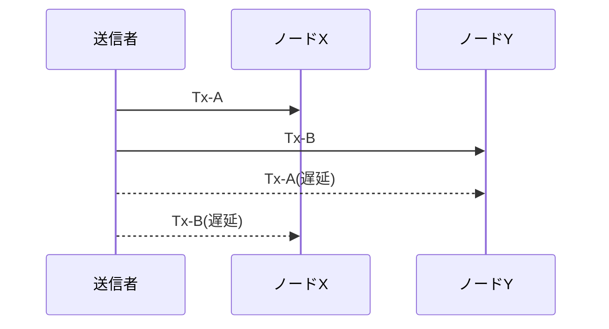

図で確認したい点は、XとYのどちらも局所的には整合していることです。局所整合と全体整合は同じではありません。この差が中央裁定者なしの設計課題を生みます。

## 03-2 部分順序

観測がずれる環境で自然に得られるのは、全順序ではなく部分順序です。部分順序とは、ある事象対では先後を決められるが、別の事象対では先後を決められない状態を含む順序です。Lamport の happened-before 関係は、この構造を明確に示します。[^S-CH03-001]

ここで誤解しやすい点があります。部分順序は「欠陥」ではなく、分散観測の正直な表現です。問題は部分順序そのものではなく、取引成立判定には最終的な全体順序が必要になることです。成立判定を出すには、未比較のまま残る事象対をどこかで解消しなければなりません。

破綻例A: ある取引対が未比較のままだと、ノードAは採用、ノードBは保留という分岐が残ります。破綻例B: 保留状態が長引くと、利用者に対して「いつ確定するか」を説明できず、運用判断が場当たりになります。どちらも、部分順序を全体判定へ接続する規則が不足しているために起きます。

部分順序の扱いで重要なのは、未比較を「失敗」と見なさないことです。未比較は分散観測の自然な帰結であり、失敗は未比較を放置したまま最終判定を要求することです。設計側がやるべきことは、未比較を段階的に解消する手続きを定義することです。たとえば比較窓、候補選別、再評価トリガーなどを規則として公開します。

もう一つの実務論点は、説明文言です。エンジニア向けには「部分順序」と書けば伝わりますが、利用者向けには「まだ比較条件が揃っていないため暫定」といった文言へ翻訳する必要があります。技術語と運用語の変換表を持っていないと、内部で正しい判断をしていても外部では不透明に見えます。

橋渡しとして要件を置きます。必要なのは、部分順序から全体判定へ昇格する公開規則です。さらに、その規則は個々のノードが独立に検証できる形で公開されていなければなりません。非公開裁定を混ぜると、中央裁定者なしという前提が崩れます。

次の図は、比較可能な関係と比較不能な関係が混在する部分順序を単純化したものです。

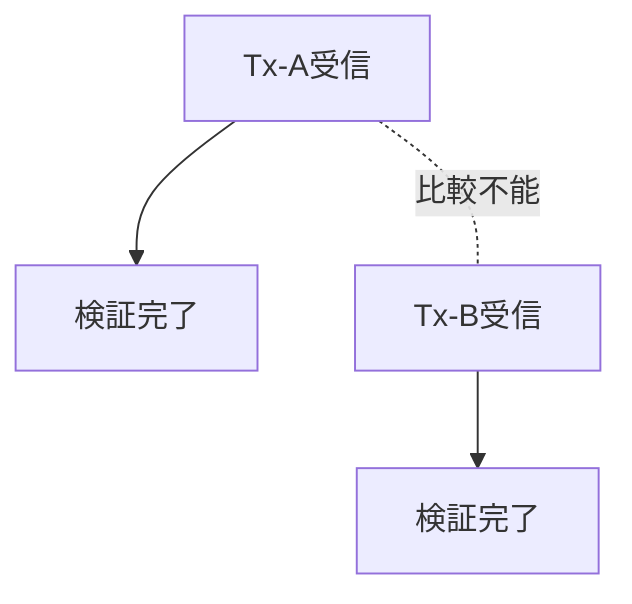

この図での焦点は、E1とE2が未比較でも局所処理は進められる点です。問題は、最終判定を出す段階で未比較を解消する規則が必要になることです。

## 03-3 合意形成の難しさ

観測差と部分順序がある環境では、「全員が同じ履歴を採択する」こと自体が設計課題になります。単に多数決を導入すれば解決するわけではありません。多数決の前提として、誰が何をいつ観測したか、どの候補履歴を比較しているかを揃える必要があるからです。

破綻例A: ノード群Aとノード群Bが異なる履歴候補を比較していると、同じ投票規則でも結果は一致しません。破綻例B: 一時分断後に接続が回復したとき、双方で「自分が正統履歴」と主張すると履歴再統合が衝突します。規則が弱いと、衝突解消が人手依存になります。

ここで必要になるのは、候補履歴の比較規則、採択規則、再統合規則を同時に設計することです。比較規則だけ、採択規則だけ、再統合規則だけを個別に最適化しても、全体としては収束しません。設計対象は単一のアルゴリズムではなく、規則群の整合です。

さらに、規則は「運用現場で説明できるか」という条件も満たす必要があります。収束規則がどれだけ厳密でも、障害時に利用者へ説明できなければ実装価値は下がります。中央裁定者なしの設計では、技術的収束と説明可能性を同時に要求されます。

ここで多い誤解は、説明可能性を広報作業だと捉えることです。実際には説明可能性は仕様品質です。障害時に「何が起き、どの規則でどう収束中か」を一貫して説明できるなら、同じ事象に対する社内判断と対外説明が一致します。説明不能な仕様は、運用不能な仕様です。

合意形成を安定させるには、監視指標の設計も必要です。たとえば候補履歴数、再統合回数、再統合に要した時間、暫定表示の継続時間を継続観測すると、どの条件で規則が弱くなるかを検出できます。観測がなければ、改善は印象論になります。

## 03-4 問題定式化

以上を踏まえると、問題の定式化は次のようになります。「観測順が一致しない参加者群に対し、公開検証可能な規則だけで、同一履歴へ収束する仕組みをどう作るか」。この定式化は「誰を信用するか」ではなく、「どの条件で一致を保証するか」を問います。[^S-CH03-001]

要件は四つに整理できます。

1. 観測差を前提にしても候補履歴を比較できること。  
2. 採択規則が公開され、各ノードが独立検証できること。  
3. 分断や遅延後の再統合手順が規則として定義されていること。  
4. 利用者向けに暫定と確定を区別して説明できること。

この四要件を固定すると、第4章以降の技術部品の位置づけが明瞭になります。ネットワークの伝播特性、取引データ構造、ブロック連結、合意規則は、すべてこの要件群を満たすための部品として読めます。

さらに、四要件は分担設計にも使えます。要件1と3は主にネットワーク/合意層、要件2は検証実装層、要件4は運用/プロダクト層が中心責任を持ちます。責任分担を明示すると、障害時に「誰が何を直すか」を早く決められます。中央裁定者なしの設計では、責任の空白を作らないことが特に重要です。

要件4を軽視すると、技術的には正しくても利用者被害が拡大します。たとえば再統合中なのに確定済みと表示すれば、利用者は誤った前提で次の行動を選びます。逆に暫定表示を過剰に続けると、正しく確定している取引まで長く保留されます。技術条件と表示条件の整合は、順序共有の実効性を決める最後の関門です。

この四要件を実際の設計レビューで使うときは、章ごとに「失敗時の挙動」を先に確認すると効果的です。平常時の成功シーケンスはどの方式でも説明しやすい一方で、失敗時の挙動には設計思想の差が出ます。遅延時、分断時、再接続時の各場面で、候補履歴がどう比較され、どの条件で採択が更新されるかを追うと、規則の強度を具体的に評価できます。

また、中央裁定者なしの設計では「局所最適の積み上げ」が全体最適を壊す危険があります。たとえば、あるノード実装が自分の応答速度を優先して比較窓を短くすると、そのノード単体では効率化できても、全体では候補不一致の増加要因になります。したがって設計レビューは、単体性能だけでなく全体収束への寄与で評価しなければなりません。

実務運用では、インシデント対応のテンプレート化も必要です。観測差が閾値を超えたときに、どの順で情報を収集し、どの順で暫定表示へ切り替え、どの条件で通常運用へ戻すかを定義します。テンプレートがないと、同じインシデントでも担当者ごとに判断が変わり、結果として順序共有への信頼が揺らぎます。技術規則と運用手順を分離せず、一体で設計することが要件達成に直結します。

最後に、本章の学習到達を確認する質問を置きます。第一に「観測差はなぜ自然に発生するかを説明できるか」。第二に「部分順序と全順序の違いを、利用者説明可能な言葉で言えるか」。第三に「再統合規則がない場合に何が壊れるかを具体例で示せるか」。この三問に答えられれば、第4章の伝播設計と第5章のデータモデル設計を同じ地図で読む準備が整います。

最後に、問題定式化の位置づけを図で固定します。


この章の結論は、中央裁定者なしの困難が「道徳」ではなく「構造」から生まれることです。次章では、この構造の土台にあるP2P伝播と遅延を具体的に扱います。[^S-CH04-001]

### 補助ケース: 分散環境での判断訓練

中央裁定者なしの運用では、担当者が「どの層の問題を見ているか」を誤ると対応が遅れます。そこで訓練では、事象を三層に分けて記録します。第一層は観測層（誰が何をいつ見たか）、第二層は規則層（どの比較規則が適用されたか）、第三層は表示層（利用者へどう見せたか）です。この三層で記録すると、障害原因が観測差なのか規則不足なのか表示不整合なのかを切り分けやすくなります。

訓練シナリオAとして、短時間分断後に二候補履歴が再接続するケースを使います。観測層では分断区間の受信差を記録し、規則層では再統合トリガーと採択条件を照合し、表示層では暫定表示の切替時刻を確認します。訓練シナリオBとして、高遅延リンクで古い候補が遅着するケースを使い、再評価手順の起動条件を確認します。二つの訓練を回すと、規則の穴が定量的に見えてきます。

また、中央裁定者なしの体制では「正しいが遅い判断」と「速いが説明不能な判断」の間で常にトレードオフが生じます。ここで重要なのは、どちらを選ぶかを都度個人判断にしないことです。事前に優先軸を決め、条件閾値を文書化しておく必要があります。優先軸を公開しておけば、同じデータに対する判断が担当者ごとにぶれるリスクを下げられます。

最後に、章末の自己点検を実務形式で置きます。第一に「観測差をログで再現できるか」。第二に「部分順序を全体判定へ昇格する規則を一文で説明できるか」。第三に「再統合時の利用者表示方針が事前定義されているか」。この三点を満たせば、中央裁定者なしの困難を抽象語ではなく運用可能な問題として扱えていると判断できます。

もう一段踏み込んで、設計レビューの順序を固定します。第一ステップは観測層レビューで、到達遅延と候補分岐の事実を確認します。第二ステップは規則層レビューで、比較条件と採択条件の不足を洗い出します。第三ステップは表示層レビューで、暫定/確定の文言が規則条件と一致しているかを確認します。この順序でレビューすると、原因と結果の逆転を避けられます。

実際の障害対応では、技術チームとサポートチームの同期が鍵になります。技術側が再統合中であることを認識していても、サポート側が確定文言を使ってしまうと、利用者への説明が破綻します。中央裁定者なしの運用では、仕様の正しさだけでなく、仕様状態を横断共有する運用設計が必須です。章内で繰り返し「説明可能性」を要件に入れている理由はここにあります。

最終的に本章が提供する価値は、困難の所在を可視化する地図です。地図がなければ、次章以降の技術説明は断片知識になります。地図があれば、どの技術部品がどの困難を受け持つかを明確に追跡できます。

加えて、分散環境での品質改善は「失敗回数の削減」だけで測ると誤ります。重要なのは、失敗時にどれだけ早く状態を可視化し、どれだけ一貫した手順で復帰できるかです。中央裁定者なしの前提では、失敗ゼロより再現可能な復帰手順の方が実効品質へ効きます。したがってレビュー指標には、候補分岐の件数だけでなく、原因特定時間と復帰判断の一致率を含めるべきです。

もう一点、設計段階で意識すべきなのは「合意規則の説明文」を仕様の一部として扱うことです。規則本体が厳密でも、説明文が抽象的だと運用チームは同じ規則を異なる判断で適用してしまいます。説明文には、入力条件、採択条件、除外条件、再評価条件を短文で固定し、事例付きで更新履歴を残します。これは文章上の配慮ではなく、分散運用で一致判定を維持するための必須条件です。

さらに、分散運用では「状態共有の遅れ」そのものがリスクです。技術的に正しい再統合中でも、状態共有が遅れると関係者は古い前提で行動します。したがって、再統合手順には技術処理だけでなく、状態通知の順序と責任者を含める必要があります。状態通知が設計に組み込まれていれば、観測差が残る場面でも組織判断の分裂を抑えられます。

本章を実務に使うときは、障害後レビューで「規則不備」「監視不備」「通知不備」を分けて採点してください。三つを分離すると、再発防止策が具体化しやすくなり、次章以降で扱う技術部品の改善優先度も決めやすくなります。

補足として、レビュー結果は必ず「次回の判定手順変更」に接続してください。原因分析だけで終えると、次の同型障害で同じ議論を繰り返します。どの条件を追加し、どの通知順を変更し、どの監視閾値を改定したかを明示すると、困難を知識から手順へ変換できます。

この変換ができると、中央裁定者なしの難しさを「避ける対象」ではなく「管理可能な設計対象」として扱えるようになります。
この視点転換が、本章の実務的な到達点です。

# 第4章: P2Pネットワークと伝播遅延

この章では、順序共有問題の物理的土台であるP2P伝播を扱います。主張は単純です。情報は同時一斉には届かず、多段で広がります。遅延や一時分断は異常ではなく、設計時に最初から織り込むべき前提です。[^S-CH04-001]

## 04-1 伝播の仕組み

P2Pネットワークでは、ノードは受信した情報を隣接ノードへ再送し、全体へ拡散させます。中央サーバーが一斉配信する方式とは異なり、到達経路は複数で、到達順も経路ごとに変わります。この多段伝播の性質が、順序共有の難しさを直接生みます。[^S-CH04-001]

日常語で言えば、同じニュースが友人ネットワークで広がる状況に近いです。Aから先に聞く人、Bから先に聞く人が混在します。どちらが正しい受信順かをニュースそのものからは決められません。P2Pの取引伝播も同型です。

破綻例A: 送信者が同時に二取引を送ると、経路差でノードごとの先着が逆転します。破綻例B: ある中継ノードが一時的に過負荷になると、その先にいるノード群だけ受信が遅れ、局所履歴が別系統になります。どちらも仕様どおりの動作で発生します。

この破綻から橋渡しされる要件は、伝播順そのものを真理とみなさないことです。必要なのは、伝播順が揺れても最終採択が一致する規則です。

ここで補助概念を一つ置きます。P2Pでは「受信順」と「採択順」を分けて考える必要があります。受信順はネットワーク条件で揺れますが、採択順は公開規則で固定できます。両者を混同すると、ネットワーク遅延の議論がそのまま履歴正当性の議論へ流れ、設計が不安定になります。

さらに、ノード実装の差異も受信順に影響します。メモリキューのサイズ、再送間隔、優先度設定が違えば、同一ネットワークでも観測順は変わります。したがって「実装差を無視した理想ノード前提」で設計した規則は、実運用で破綻しやすくなります。規則設計は、実装差を含む現実的な分布を前提にする必要があります。

運用面では、受信順の揺れを観測する指標が必要です。到達遅延の分布、初回受信率、再送回数、候補履歴の同時発生率を継続計測すると、どの条件で分裂リスクが上がるかを早期検知できます。測れないものは改善できないため、伝播段階から監視設計を組み込むことが前提になります。

次の図は、同一取引が多段で広がる様子を単純化したものです。

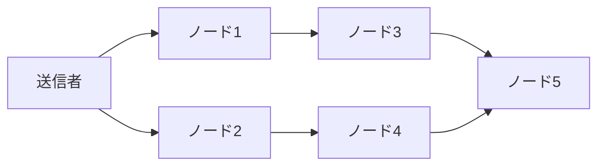

図の要点は、N5がN3経由とN4経由のどちらを先に受けるかが固定でないことです。経路が複数ある限り、受信順の揺れは構造的に残ります。

## 04-2 遅延と分断

遅延は「たまに起きる事故」ではありません。伝播経路、帯域、キュー滞留、再送制御の差がある限り、遅延分布は常に存在します。さらに短時間の分断が起きると、分断期間中の履歴候補が領域ごとに別々に進みます。[^S-CH04-001]

破綻例A: 領域Aでは Tx-A が先着し、領域Bでは Tx-B が先着します。分断回復後に両領域が接続されると、互いに「自分の履歴が正当」と主張して衝突します。破綻例B: 高遅延リンク上のノードが古い候補履歴を遅れて受信すると、すでに進行した判定と再衝突します。

ここでやってはいけないのは、遅延をノイズとして無視することです。遅延を無視して設計すると、平常時には動いても負荷時に急に判定分裂が顕在化します。遅延を前提に入れた規則設計にしない限り、運用境界が見えません。

遅延を前提に入れるとは、単にタイムアウト値を長くすることではありません。候補比較の窓幅、再評価間隔、再統合時の優先規則を連動させることです。窓幅だけを広げると応答性が悪化し、再評価だけを早めると計算負荷が上がります。遅延対策は単一パラメータ調整ではなく、複数パラメータの整合設計です。

分断時の運用契約も必要です。分断中にどの機能を暫定停止するか、どの機能は継続するか、再接続時にどの条件で確定判定を出すかを事前に定義しておく必要があります。規約がない状態で分断回復を迎えると、技術的再統合が可能でも運用判断が乱れます。

実務上は「停止コスト」と「誤判定コスト」の比較で境界を決めます。停止コストを嫌って無条件継続すると、誤判定の連鎖が後段で大きな手戻りを生みます。逆に停止を厳格にしすぎると可用性が落ち、利用者体験が崩れます。第4章の設計は、このトレードオフを明示化することでもあります。

橋渡しとして要件を明示します。第一に遅延下でも候補比較できること。第二に分断回復後の再統合手順があること。第三に暫定判定と確定判定を明確に分けることです。

次の図は、分断と再接続で候補履歴が衝突する構図を示します。

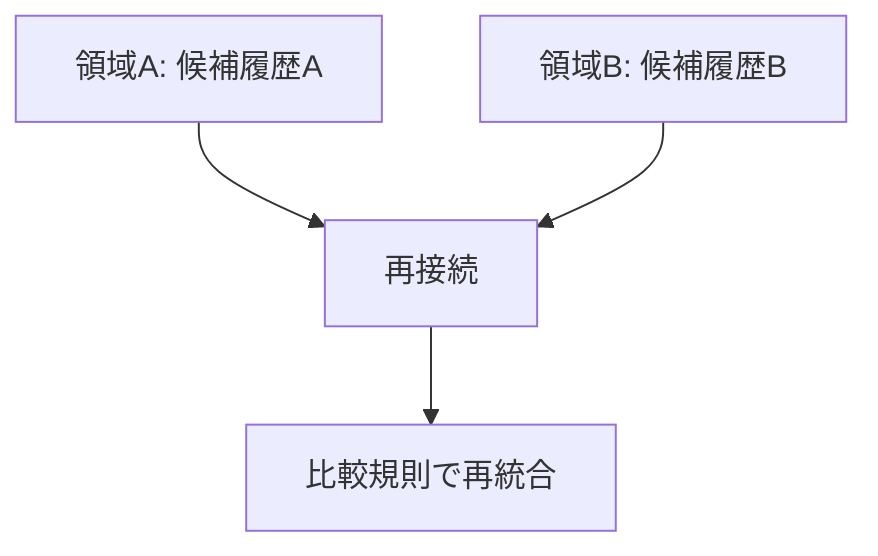

図で確認したい点は、再接続それ自体は解決ではないことです。再接続後に比較規則が必要で、その規則が弱いと衝突は解消しません。

## 04-3 観測順の差

到達順の差は、そのまま取引順の差として現れます。取引Aと取引Bの両立が不可能な場合、どちらを先に見たかで局所判定が変わるためです。ここで「多数のノードが先に見た方を採用すればよい」と単純化すると、比較対象が揃っていない場面で破綻します。[^S-CH04-001][^S-CH03-001]

破綻例A: ノード集合Xは A/B の両方を観測しているが、ノード集合YはAしか観測していない。破綻例B: 集合XとYで観測窓の長さが違い、比較時点で候補集合が一致しない。どちらも「同じデータを見て比較している」前提が崩れているため、単純投票では一致しません。

観測順の差を吸収するには、比較前提を規則で固定する必要があります。たとえば、比較対象となる候補集合、採択に使う評価指標、再計算のトリガー条件を公開手順として定義します。比較前提が固定されると、観測差は残っても最終採択は一致へ向かいます。

ここで押さえるべき点は、観測順そのものを消すことはできないということです。設計目標は「観測順を同一化すること」ではなく、「観測順が違っても同一結論へ収束させること」です。

観測順の差を吸収する規則を運用へ落とすには、判定ログの粒度を揃える必要があります。最低限、候補集合、比較時刻、採択理由、再評価トリガーを記録し、後から追跡可能にします。ログ粒度がノードごとに異なると、障害解析で「何を比べて採択したか」が再現できません。

また、観測窓の設計は利用者表示に影響します。窓を短くすると応答は速くなりますが、再編成リスクが上がります。窓を長くすると安定しますが、体験遅延が増えます。最適点は業務要件で変わるため、単一の正解値はありません。重要なのは、窓幅決定の理由を説明できることです。

ここでの結論を誤ると、「ネットワーク改善だけで順序問題を解ける」という過剰期待が生まれます。ネットワーク改善は必要ですが、採択規則と再統合規則が弱ければ限界があります。逆も同じで、規則が強くても極端な遅延条件では運用が破綻します。両輪で設計することが前提です。

## 04-4 設計要求

以上をまとめると、第4章から得られる設計要求は次の四点です。

1. 到達順を真理とみなさず、比較規則を別に持つこと。  
2. 遅延と分断を例外処理ではなく平常前提として扱うこと。  
3. 再接続時の再統合手順を公開規則で定義すること。  
4. 暫定判定と確定判定の境界を運用文言まで含めて定義すること。

この四要求は、次章のデータモデル設計へ直結します。特に「同じ価値の重複利用を機械的に排除する」要件は、取引構造の選び方で大きく変わります。

四要求を実装へ落とすときは、層ごとに責任を分けると進めやすくなります。要求1と2は主に合意層、要求3はネットワーク/運用層、要求4はプロダクト表示層が中心です。層を跨ぐ依存関係を先に図示すると、どの変更がどの層へ波及するかを管理できます。

評価の観点も固定しておきます。候補履歴収束時間、再統合成功率、暫定表示から確定表示までの時間、利用者問い合わせ発生率を同時に追うと、技術品質と説明品質を一緒に評価できます。どちらか一方だけを最適化すると、もう一方で歪みが顕在化します。

最後に、次章への接続を明確にします。第5章で扱うUTXOは、伝播遅延で観測順が揺れる環境でも「同じ出力を二重に使えない」ことを機械的に検証するためのデータモデルです。つまり第4章の要求は、第5章の設計理由そのものです。

ここで、設計要求と監視要求を対で固定します。要求1に対しては「候補比較の入力集合が一致しているか」を監視し、要求2に対しては「遅延分布の尾部」を監視します。要求3に対しては「再統合成功率と再統合時間」を監視し、要求4に対しては「暫定表示継続時間と誤表示率」を監視します。要求だけを定義して監視を置かない設計は、運用で崩れたときに原因が追えません。

また、P2P設計では攻撃だけでなく自然故障も同じ重みで扱う必要があります。帯域圧迫、ルータ故障、時刻同期の乱れ、ソフト更新の不整合は、攻撃がなくても順序判定へ影響します。したがって「脅威モデル=攻撃者モデル」と狭く置くと、平常障害を過小評価します。順序共有の脅威モデルは、攻撃と故障の合成モデルで設計すべきです。

現場導入時には、段階的ロールアウトが有効です。全ノード一斉更新ではなく、観測指標を見ながら一部ノードで規則変更を試し、候補履歴の分布変化を確認したうえで範囲を広げます。これにより、規則変更が遅延条件と衝突するリスクを早期に発見できます。P2Pでの規則変更は、コード配布より挙動検証が主作業であると理解しておくべきです。

最後に、読者向けの実践質問を置きます。第一に「受信順と採択順を別の言葉で説明できるか」。第二に「分断回復時の再統合手順を3ステップで書けるか」。第三に「暫定表示と確定表示の切替条件を一文で言えるか」。この三点を言語化できれば、第4章の設計要求は概念ではなく運用可能な知識になっています。

最後に本章の論理遷移を図で固定します。

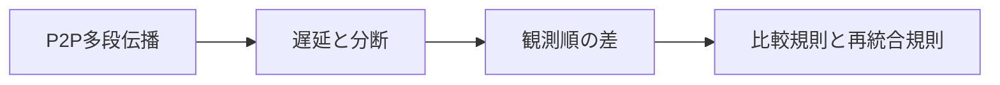

この章の結論は、P2Pの伝播特性が順序問題を難しくしているのではなく、順序問題そのものを定義しているという点です。次章では、この前提の上で取引データをどう表現すれば二重利用を排除できるかを扱います。[^S-CH04-001]

### 補助ケース: 遅延前提での運用設計

遅延を設計前提にするには、平常時だけでなく「遅延が増えたときの標準手順」を持つ必要があります。標準手順は、検知、判定、対応、復帰の四段に分けると運用しやすくなります。検知では遅延指標の閾値超過を捕捉し、判定では候補履歴分裂の有無を確認し、対応では暫定表示や再評価間隔を調整し、復帰では通常設定へ戻す条件を確認します。四段を分けると、担当交代時にも手順が維持されます。

この運用で重要なのは、閾値変更の履歴を残すことです。遅延閾値や再評価間隔をその場判断で変えると、後で「なぜその時だけ挙動が違ったか」を説明できません。閾値変更時は理由、変更値、適用時刻、解除条件を同時に記録します。順序共有の品質は、規則の中身だけでなく、規則変更の管理品質で決まります。

また、分断復帰時の再統合では「技術的再接続」と「業務的再接続」を分けて扱うべきです。技術的再接続はノード間通信が回復した状態、業務的再接続は利用者表示と内部判定が通常運用へ戻った状態です。前者だけを達成して後者を放置すると、システムは復旧していても利用者体験は復旧しません。第4章で扱う遅延・分断の議論は、必ず表示運用まで接続して評価します。

もう一つの実践論点は、観測指標の階層化です。ネットワーク指標（到達遅延、再送回数）と判定指標（候補履歴数、再統合時間）と体験指標（暫定表示時間、問い合わせ率）を同時に追うと、どの層がボトルネックかを判断できます。ネットワーク指標だけを見ていると、表示運用の不整合を見逃しやすくなります。順序共有の最終品質は、三層指標の整合で評価すべきです。

最後に、章末で使う確認質問を置きます。第一に「受信順の揺れを前提条件として文書化できているか」。第二に「再接続時の再統合手順が時系列で定義されているか」。第三に「暫定表示から確定表示への遷移条件が指標で定義されているか」。この三問に答えられれば、遅延をノイズではなく設計変数として扱えていると言えます。

補足として、導入初期は「安全側に倒す」運用判断を明示しておくと混乱を減らせます。具体的には、候補履歴の分岐率が閾値を超えた場合に自動で暫定表示へ切り替える、再統合完了前は高額取引の確定表示を遅らせる、といった方針です。安全側運用は短期的に体験速度を下げますが、大規模手戻りを防ぐ効果が高く、結果として全体体験を守ります。

実装レベルでは、ノード間の時刻同期を「前提」ではなく「参照情報」として扱う設計が安全です。同期精度を高める努力は重要ですが、同期誤差がゼロになることを要求すると、現実環境で運用できません。したがって採択規則は、時刻が揺れる条件でも同じ結論へ寄るように作る必要があります。時刻は解析と監視に使い、最終判定の唯一根拠には使わないという分離が有効です。

また、遅延対策の議論では「平均遅延」だけを見るのは不十分です。実務で問題になるのは、遅延分布の裾、つまりまれに発生する大きな遅れです。平均が改善していても裾が重いままだと、候補履歴の分岐は残ります。監視設計では平均値に加えて、パーセンタイル指標や最大遅延の推移を継続観測し、閾値超過時の自動手順へ接続する必要があります。

設計レビューの観点として、再統合手順をテスト可能な形へ落とすことも不可欠です。単に「再接続後に統合する」と書くのではなく、どの入力を比較し、どの条件で採択を更新し、どの時点で利用者表示を切り替えるかを時系列で定義します。さらに、同じシナリオを複数実装で再現し、採択結果が一致するかを確認します。ここまで行って初めて、P2P遅延前提の規則が実運用で機能していると言えます。

最後に、遅延前提設計の到達基準を置きます。第一に、受信順の差があっても候補比較の入力集合を説明できること。第二に、分断回復時の再統合手順を担当横断で同じ順序で実行できること。第三に、暫定表示から確定表示までの遷移条件を指標で示せること。この三基準を満たすと、第4章の内容は概念理解ではなく運用能力に変わります。

加えて、P2P設計では「観測不能時間」を前提にした運用も必要です。監視が一時的に途切れた場合、欠損区間をどう扱い、どの条件で再判定するかを決めておかないと、復旧後に候補履歴の解釈が担当者ごとに割れます。観測不能は異常系ではなく、分散運用の常在リスクとして手順化すべきです。

また、段階的ロールアウト時は旧規則ノードと新規則ノードが混在します。この混在期に比較入力が不一致になると、採択差が一時的に増える可能性があります。したがって、混在期間専用の監視閾値と切替判定を先に定義し、切替後に通常閾値へ戻す計画を持つ必要があります。更新戦略を規則化しておけば、性能改善と整合性維持を両立しやすくなります。

最後に、実務レビューでは「遅延が増えたときに誰が何を判断するか」を役割単位で固定してください。ネットワーク担当は遅延分布、合意担当は候補収束、運用担当は表示遷移を確認する、と責任を分けると初動が速くなります。P2Pの困難は技術だけでなく役割境界の設計問題でもあるため、責任分割の明文化が不可欠です。

加えて、レビュー会では「遅延増加を検知した時点の判断ログ」を時系列で残してください。検知から暫定表示への切替、再統合完了判定、確定表示復帰までを同じ時系列で比較できると、次回の閾値調整と手順改善が具体化します。時系列の欠落は、P2P運用改善で最も大きな阻害要因です。

時系列を残す運用が定着すれば、遅延対策は個人の経験則ではなく、再現可能な改善サイクルとして回せます。
再現可能性は、P2P運用で最も重要な品質指標です。
この基準が、改善判断のぶれを防ぎます。

# 第5章: 取引データモデル（UTXO）

この章の目的は、順序問題をデータ構造でどう扱うかを明確にすることです。第4章までで見た「観測順がずれる」という前提は、取引データの表現を誤ると吸収できません。Bitcoinは残高を直接更新するモデルではなく、未使用出力（UTXO）を消費するモデルで所有状態を表現します。ここに、二重消費排除と検証可能性を同時に満たす設計意図があります。[^S-CH05-001]

## 05-1 モデル選択

残高モデルは直感的です。口座に数字を持ち、入金で増やし、出金で減らします。日常の家計簿には向いていますが、分散環境では「どの順で増減を適用したか」が判定に強く影響します。観測順がずれると、同じ取引集合でも中間残高が一致しない場面が生まれます。

UTXOモデルは発想を変えます。所有状態を「未使用の出力集合」として持ち、取引は「過去出力の消費」と「新規出力の生成」で表現します。残高の数値を直接更新するのではなく、出力単位の状態遷移として記録するため、どの出力が使われたかを機械的に追跡できます。[^S-CH05-001]

破綻例A（残高直更新の弱点）: 同じ残高を前提にした二取引が同時観測されると、各ノードの適用順で中間残高が変わります。破綻例B（出力追跡の強み）: UTXOでは同一出力を二度消費しようとすると、二つ目は規則違反として棄却できます。差は「数値更新の順番」ではなく「出力IDの一意消費」で判定する点です。

橋渡しとして要件を置きます。必要なのは、観測順がずれても「同じ出力を二度使えない」ことを局所検証だけで判定できる構造です。UTXOはこの要件に直接対応します。

モデル選択で見落としやすい点は、障害解析のしやすさです。残高直更新モデルでは「どの更新で不整合が入ったか」を追うのに、履歴全体の再解釈が必要になる場合があります。UTXOでは、問題が起きた出力IDを起点に遷移を追えるため、影響範囲を限定しやすくなります。順序問題の世界では、解析可能性そのものが運用品質です。

また、UTXOは権限分離にも向いています。異なる用途の資金を別出力として保持すれば、支出条件を用途ごとに分けられます。これにより、単一残高の一括管理よりも細かい制御が可能になります。分散環境では「どこまで使えるか」を厳密に区切れることが、事故時の被害局所化に効きます。

さらに、モデル選択は利用者体験にも影響します。残高モデルは「いまの合計値」が見やすい一方で、履歴競合時の説明が難しくなりがちです。UTXOモデルは概念理解に初期コストがあるものの、競合時の棄却理由を具体的に説明しやすい利点があります。どちらを採るかは単なる好みではなく、順序共有要件への適合度で判断すべきです。

## 05-2 入出力構造

UTXO取引は、入力（どの未使用出力を使うか）と出力（次に誰が使えるか）で構成されます。入力は過去取引の出力を参照し、出力は新しい利用条件を定義します。取引検証は、入力参照の正当性と出力条件の整合性を確認する処理です。[^S-CH05-001]

単純化した例で見ます。取引T0が `Out-0(500)` と `Out-1(300)` を作ったとします。取引T1は `Out-0` を入力に取り、 `Out-2(200)` と `Out-3(300)` を生成します。このとき `Out-0` は消費済みに遷移し、再利用不可になります。判定対象は「残高値」ではなく「どの出力が未使用か」です。

破綻例A: 入力が存在しない出力を参照している取引は不正です。破綻例B: すでに消費済みの出力を再参照する取引は二重消費です。どちらも取引単体の参照検証で検出できます。グローバルな口座残高再計算を毎回行わなくても、局所規則で判定可能です。

ここで検証順序を固定しておくと混乱を防げます。第一に参照先が存在するかを確認し、第二に未使用かを確認し、第三に権限条件を確認します。順序を逆にすると、無効入力に対して不要な署名検証を走らせるなど、実装コストと解析コストが増えます。検証順序は性能問題であると同時に、説明可能性の問題でもあります。

入力と出力の整合には、量的整合も含まれます。単純化すれば「入力合計が出力合計以上か」を確認し、差分をどのように扱うかを規則で定義します。この定義が曖昧だと、同じ取引に対してノードごとの有効判定がずれる可能性があります。規則の明文化が分散一致を支えます。

実務では、取引構築時のミスも重要です。誤った出力参照、金額桁の取り違え、意図しない条件設定は、ネットワーク障害がなくても無効取引を生みます。UTXOモデルの利点は、こうしたミスを機械的に棄却できる点です。人手レビューに依存しない検証線を持つことが、中央裁定者なしの前提に合致します。

次の図は、入力参照と出力生成の関係を示します。

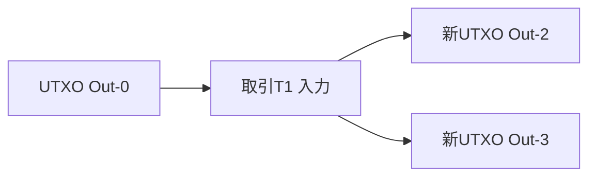

図から確認したいのは、状態遷移の単位が「口座」ではなく「出力」である点です。この単位化が、二重消費判定を機械化します。

## 05-3 署名検証

入力参照だけでは十分ではありません。参照した出力を「本当に使う権限があるか」を確認する必要があります。その中心が署名検証です。出力に設定された条件を満たす署名を提出できるかで、支出権限を判定します。[^S-CH05-001]

ここでの設計意図は、権限判断を人格信用から条件検証へ置き換えることです。誰が有名か、どの組織に所属しているかではなく、公開鍵対応の署名条件を満たすかだけを見ます。分散環境で必要なのは、参加者属性に依存しない同一検証規則です。

破綻例A: 正しい入力参照でも署名条件を満たさないなら無効です。破綻例B: 署名が正しくても、参照出力が消費済みなら無効です。つまり、入力参照検証と署名検証は直列に必要で、どちらか一方では不十分です。

橋渡しとして要件を明示します。必要なのは、権限確認（署名）と状態確認（未使用出力）を同時に満たすことです。UTXO検証はこの二条件を取引単位で実行し、分散ノード間で同一判定を作ります。

次の図は、検証手順の最小骨格です。

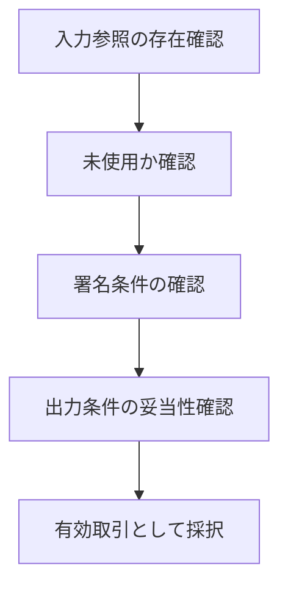

図の要点は、判定が一段ではないことです。参照、未使用性、署名、出力整合の連鎖が成立して初めて採択されます。

署名検証の設計で忘れてはならないのは、検証対象メッセージの固定です。何に署名したかが曖昧だと、同じ署名が別文脈で再利用される危険が出ます。したがって、署名対象の形式とエンコードを仕様として厳密に固定する必要があります。ここを緩くすると、権限検証の前提が崩れます。

さらに、署名検証は「通れば安全」という単純図式でもありません。秘密情報管理が崩れれば、正しい署名形式で不正支出が成立します。つまり、プロトコル検証と運用管理は分離不能です。第10章で扱う鍵管理問題が、ここで既に前提になっていることを意識しておく必要があります。

橋渡しとして要件を補足します。必要なのは、署名規則が公開され、すべてのノードが同じ検証結果を出せることです。特定実装だけが通す条件が存在すると、分散一致は壊れます。署名方式そのものより、検証条件の共有可能性が一致判定の核心です。

## 05-4 順序との関係

UTXOは順序問題を消しません。ですが、順序問題を「どの出力が先に消費されたか」という検証可能な形へ変換します。これにより、観測差が残る環境でも、最終的な採択規則と組み合わせて二重消費排除を実効化できます。[^S-CH05-001][^S-CH01-001]

破綻例A: 同じ出力を使う二取引が同時伝播すると、局所ノードでは一時的に両方が候補になります。破綻例B: 遅延で後着した取引が、先に採択済みの出力を再利用しようとします。UTXO規則では、最終的に採択された方が出力を消費し、もう一方は入力不正として棄却されます。

ここで重要なのは、棄却理由を第三者が追跡できることです。どの出力を参照し、どの時点で消費済みになったかを辿れるため、判定の説明可能性が高いです。説明可能性は、中央裁定者なしの運用で不可欠です。

橋渡しとして次章への要件を置きます。UTXOは取引単位の検証を整えますが、ネットワーク全体でどの候補履歴を正とするかは別問題です。第6章では、取引集合をブロック化し、連結履歴として検証する仕組みへ進みます。

ここで「UTXOがあるなら順序規則は不要」という誤解を明確に否定します。UTXOは二重消費を検出する単位を与えますが、競合候補が同時に存在する期間をなくすわけではありません。競合候補のどちらを正統履歴へ採択するかは、依然として順序規則の仕事です。つまりUTXOは必要条件の一部であり、十分条件ではありません。

運用上は、競合検知後の処理手順も必要です。候補を保留するか、優先規則で採択するか、利用者表示を暫定に切り替えるかを規定しないと、同じ競合でも対応がぶれます。対応のぶれは、技術的不一致より早く信頼を損ないます。UTXOを導入しただけで安心せず、競合時手順まで規則化することが重要です。

最後に、章全体の視点を固定します。本章で獲得したのは、順序問題をデータ検証可能な形へ落とす視点です。第6章以降では、この視点を履歴構造へ拡張し、取引単位の整合を履歴単位の整合へ接続していきます。

ここで補助的な実務観点を追加します。UTXO運用では、未使用出力集合の管理品質が性能と安全性の両方へ効きます。集合の更新遅延が大きいと、正しい取引でも検証待ちが増え、利用者体験が悪化します。反対に、更新を急ぎすぎて整合性検査を省くと、誤判定リスクが上がります。性能最適化は整合性検査とセットで設計する必要があります。

また、ウォレット設計では出力の粒度戦略が重要です。大きな出力を少数持つ設計は管理は簡単ですが、支出時に大きな残余出力が発生し、後続取引の構築が複雑化する場合があります。小さな出力を多数持つ設計は柔軟ですが、検証対象が増え、手数料や処理負荷へ影響します。UTXOは単なる理論ではなく、運用方針によって振る舞いが変わる実務モデルです。

さらに、監査の観点では「どの出力がどの取引で消費されたか」を追えることが決定的に重要です。問題発生時に、対象出力を起点に履歴を辿れるため、影響範囲を局所化できます。残高差分だけを追う設計よりも、原因の特定と再発防止が速くなります。中央裁定者なしの環境で説明責任を維持するうえで、この追跡可能性は強い利点です。

実務シナリオを置きます。システムAとシステムBが同じユーザーの支払いを別経路で受け付ける場面では、同一出力参照の競合が起きます。UTXO規則がなければ、双方が一時的に成立したように見え、後段で大きな手戻りが発生します。UTXO規則がある場合は、採択後に片方を機械的に棄却し、棄却理由を出力参照で説明できます。ここで差が出るのは、正誤判定の速さだけでなく、説明の再現性です。

運用ルールとしては、競合検知時の通知設計も必要です。単に「失敗」と表示するのではなく、「参照出力がすでに消費済みのため不成立」と示せば、利用者は次行動を選びやすくなります。技術的には同じ棄却でも、理由の可視化があるかないかでサポート負荷は大きく変わります。データモデル設計は、利用者コミュニケーション設計まで含めて初めて完成します。

最後に第5章の到達点を確認します。第一に、UTXOが残高の代替表現ではなく順序問題への設計回答だと説明できること。第二に、入力参照検証と署名検証が直列関係だと説明できること。第三に、UTXO単体では最終採択が決まらず、合意規則と組み合わせて初めて二重消費排除が完結すること。この三点を言語化できれば、第6章のブロック構造へ自然に接続できます。

最後に本章の論理を図で固定します。

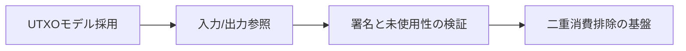

本章の結論は、UTXOが「順序問題をなくす道具」ではなく、「順序問題を検証可能なデータ問題へ変換する道具」だという点です。ここまでで、順序共有の前半設計が揃いました。[^S-CH05-001]

### 補助ケース: UTXO運用で起きる典型課題

UTXOを実運用へ載せると、理論説明だけでは見えない課題が出ます。第一は「どの出力を優先消費するか」という選択問題です。選択方針が揃っていないと、同じ支払い要求でもノードごとに構築される候補取引が変わり、結果として競合率が増える場合があります。したがって、出力選択方針は実装詳細ではなく合意品質の一部として扱うべきです。

第二は、変更出力（change output）の扱いです。入力合計と支払い額の差分をどのように出力へ戻すかを明文化しないと、利用者表示の残高感覚と内部状態がずれます。内部では正しくても、利用者が「減り方がおかしい」と感じれば運用負荷は増えます。UTXOモデルでは、内部整合と表示整合を分けて設計し、両方で説明可能性を確保する必要があります。

第三は、競合検知後の再試行設計です。同じ出力を参照した取引が棄却された場合、どの条件で再構築して再送するかを規定しないと、無限再試行や過剰再送が起きます。再試行は「即時再送」ではなく、最新UTXO集合を再取得し、入力再選択と手数料再計算を経て送る手順が必要です。ここを明示すると、競合時の運用が安定します。

第四は、監査ログの粒度です。少なくとも「参照入力」「検証結果」「棄却理由」「再試行有無」を記録しておくと、後から棄却の妥当性を再検証できます。棄却理由が「無効」だけだと、署名不一致なのか消費済み入力なのかが判別できず、改善が止まります。UTXO運用では、棄却理由の構造化が品質改善の起点です。

最後に、章末で使う運用質問を置きます。第一に「出力選択方針は全実装で一致しているか」。第二に「競合棄却時の再試行手順が文書化されているか」。第三に「棄却理由を出力ID単位で追跡できるか」。この三問に答えられる状態が、UTXOを“理論理解”から“運用可能設計”へ引き上げる基準になります。

加えて、UTXO設計では「どこで不変条件を守るか」を明示することが重要です。不変条件とは、同一出力は一度しか消費できないこと、入力参照は存在し未使用であること、署名条件が一致することです。これらを実装の暗黙知にせず、仕様・テスト・監視で同じ語彙で管理すると、ノード実装差による判定揺れを減らせます。

性能改善を進める際にも、この不変条件を先に固定します。検証キャッシュや並列化を導入すると処理速度は上がりますが、不変条件の確認順序が崩れると判定の再現性が落ちます。したがって最適化の評価指標は、スループットだけでなく「同一入力に対する判定一致率」を必ず含めるべきです。中央裁定者なしの環境で最も避けるべき失敗は、速いが一致しない実装です。

実務運用では、競合棄却後の案内文テンプレートも整備しておくと効果があります。たとえば「参照出力が既に消費済みのため不成立」「最新状態を再取得して再作成が必要」といった文言を標準化すると、利用者とサポートの認識差が小さくなります。棄却理由を曖昧にすると、再送を繰り返して負荷を上げる行動を誘発しやすくなります。UTXOの強みは、棄却理由を構造化して提示できる点にあります。

最後に、第5章の実務到達基準を四点で固定します。第一に、入力参照検証と署名検証の直列関係を時系列で説明できること。第二に、競合時の採択と棄却を出力IDで追跡できること。第三に、再試行手順が「状態取得→再構築→再送」で定義されていること。第四に、棄却理由が運用ログと利用者表示で同じ意味を保つこと。この四点を満たせば、UTXOは単なる概念理解ではなく、順序共有の運用基盤として機能します。

さらに、UTXOモデルを安定運用するには、入力選択ポリシーの一貫性を保つ必要があります。実装ごとに選択基準が違うと、同じ支払い要求から異なる候補取引が生成され、競合率が上がります。したがって、入力選択の優先規則、変更出力の扱い、再構築時の手順は仕様として固定し、実装差を許容しない範囲を明示すべきです。

監視の観点では、棄却率だけでなく棄却理由の内訳を追うことが重要です。署名不一致、入力未存在、入力消費済み、形式不正を分けて集計すると、問題が鍵管理にあるのか、取引構築にあるのか、同期遅延にあるのかを切り分けやすくなります。理由内訳がない監視は、対策の優先順位を誤らせます。

最後に、UTXO章の知識を次章へ接続する確認質問を置きます。第一に「同一出力の二重消費がどの検証段階で弾かれるか」を説明できるか。第二に「競合候補が同時に存在する期間をどう運用表示するか」を説明できるか。第三に「採択規則とデータ規則の役割分担」を一文で説明できるか。この三問に答えられれば、UTXOを単体機能ではなく、順序共有システムの構成要素として理解できています。

実務では、ここに「再試行上限」の設計も加えてください。棄却後に無制限で再送すると、同じ入力競合を増幅してネットワーク負荷を上げます。再試行回数、待機間隔、再構築条件を固定し、上限超過時は利用者へ明示的に再操作を促す方針を置くと、競合時の連鎖障害を抑えやすくなります。

この上限設計は、UTXOの検証可能性を保ちながら運用負荷を制御するための最終ガードレールです。
あわせて、上限到達時の利用者通知文を事前定義しておくと、再試行停止時の混乱を最小化できます。
通知文が統一されると、競合時の問い合わせ対応も安定します。
運用手順と通知文を対で更新する運用が、再発防止の効果を高めます。
ここまでで前半の土台は完成です。

# 第6章: ブロックとチェーン

第5章では、UTXOにより競合取引を同じ粒度で判定できる土台を作りました。本章の問いは、その判定結果をどのように記録すれば、第三者が後から同じ結論を追試できるかです。ここで中心になるのが、ブロック構造、ハッシュ連結、Merkle Treeです。結論を先に言うと、ブロックチェーンは「取引の羅列」ではなく、順序共有の結果を検証可能な記録として固定するための構造です。[^S-CH06-001][^S-CH05-001]

> 読み方: 節ID付きの4節（*-1〜*-4）が必須理解です。以降の節は発展理解です。

## 06-1 ブロック構造

最初に日常導入を置きます。領収書を机上に時系列で置くだけだと、監査するときに「どこまでが同じ検査単位か」が曖昧になります。月ごとに束ね、束ごとに表紙へ要約を付ければ、確認の境界が明確になります。ブロック構造は、この「束」と「表紙」の組み合わせに相当します。[^S-CH06-001]

ブロックは通常、ヘッダと本文に分かれます。ヘッダには前ブロック参照、タイムスタンプ、難易度関連情報、Merkle rootなどが入り、本文には取引集合が入ります。要点は、毎回全取引を読み直さなくても、ヘッダ情報から整合性チェックを始められることです。これにより、検証コストと検証順序が安定します。[^S-CH06-001]

素朴案として「取引を1件ずつ逐次ログへ書けば十分」と考えると、検証単位が固定できません。どこで切って比較するかが曖昧だと、ノード実装ごとに再検証範囲がずれ、同じ履歴に対する検証時間も大きくぶれます。順序共有では速度そのものより、同じ手順で同じ結論へ到達できることが重要です。[^S-CH06-001]

破綻例1は、単位境界なしの長大ログで、途中検証が実装依存になるケースです。破綻例2は、境界定義が曖昧で、ノードAは1000件単位、ノードBは時間単位で束ねるケースです。どちらも比較可能性を壊します。比較可能性が壊れると、収束規則の前段で論争が発生し、合意手順が遅延します。（要検証）

ここで橋渡しを明示します。ブロック構造に求められるのは、第一に検証単位の固定、第二に要約情報の固定、第三に後続単位との接続可能性です。この三点が揃うことで、次節のハッシュ連結が「改ざん検知」として意味を持ちます。[^S-CH06-001]

## 06-2 ハッシュ連結

ハッシュ連結は、各ブロックが前ブロックの要約値（ハッシュ）をヘッダに持つ仕組みです。過去ブロックの内容を変えると要約値が変わるため、後続ブロックの参照が不一致になります。つまり改ざんは「隠れて起こる」のではなく「参照不整合として露出する」ようになります。[^S-CH06-001]

日常導入として、契約書の各ページ末尾に前ページ要約を入れる運用を考えます。途中ページを差し替えると、次ページ以降の要約が一斉に不整合を起こします。ハッシュ連結はこの性質を計算機で再現したものです。ここで重要なのは、差し替え不能を魔法で保証するのではなく、差し替えを可視化しコスト化する前提を作ることです。[^S-CH06-001]

素朴案として「最新ブロックだけ整合していればよい」と考えると、履歴の説明責任を失います。中央裁定者がいない環境では、現在状態だけでなく、そこに至る順序の正当性を追える必要があります。履歴連鎖が切れると、現在状態の信頼根拠も弱くなります。[^S-CH06-001][^S-INTRO-001]

破綻例1は、過去ブロックの取引を改ざんしても後続参照を更新しないケースで、即座に不一致が検出されます。破綻例2は、過去改ざんに合わせて後続参照も再計算するケースで、再計算負荷が連鎖します。後者を実効的に重くするのが第7章のPoWと難易度設計です。[^S-CH06-001][^S-CH07-001]

橋渡しとして、役割分担を固定します。ハッシュ連結は「改ざん検知の骨格」を担い、PoWは「改ざん再計算コストの増幅」を担います。両者を混同すると、どこで安全余裕が削れたかを診断できません。設計比較では必ず別軸で評価する必要があります。[^S-CH06-001][^S-CH07-001]

## 06-3 Merkle Tree

Merkle Treeの役割は、ブロック内の取引包含を効率よく検証できるようにすることです。すべての取引を毎回全件走査しなくても、対象取引に対応する要約経路を辿れば包含の真偽を確認できます。これにより、軽量検証や部分監査でも整合性確認が可能になります。[^S-CH06-001]

ここで素朴案として「全部読めばよい」を採ると、理論的には正しくても運用コストが急増します。特に、頻繁な照会や多数利用者への証明提供が必要な場面では、全件走査はレイテンシと計算負荷の両面で非現実的です。Merkle構造は、検証の完全性を保ちながら必要データ量を絞る設計です。[^S-CH06-001]

破綻例1は、要約木がないため単一取引照会でも全件読み込みが必要になるケースです。破綻例2は、木の構築順序やペアリング規則が実装差で揺れ、同じ取引集合でもrootが一致しないケースです。後者は仕様準拠の手順固定がないと起きます。したがって「高速化」より先に「手順固定」を優先する必要があります。[^S-CH06-001]

日常導入で言い換えると、Merkle Treeは「分厚い台帳の総目次」です。ある項目が台帳に載っているかを確かめるのに、毎回全ページをめくる代わりに、目次経路だけを辿る。目次作成規則が統一されていれば、誰が確認しても同じ位置に到達できます。

橋渡しを明示します。Merkle Treeは順序そのものを決めません。順序で確定した取引集合を、検証しやすく提示する仕組みです。順序決定の章（第7〜第8章）と、検証効率の章（本節）を分けて理解すると、方式比較で論点が混ざりません。[^S-CH06-001][^S-CH08-001]

## 06-4 履歴固定

ここまでを統合すると、本章が担うのは「順序共有の結果を記録として固定すること」です。ブロック構造が検証単位を作り、ハッシュ連結が連鎖整合を作り、Merkle Treeが部分検証を可能にします。三者が揃うことで、履歴は第三者が追試できる公開記録になります。[^S-CH06-001]

ここで誤解を避けます。履歴固定は「一瞬で絶対不変」になることを意味しません。実運用では分岐と再編成があり、確定性は時間と閾値で運用されます。履歴固定は、その運用を追跡可能にする土台です。最終確定の扱いは第8章で詳細化します。[^S-CH08-001][^RB-003]

破綻例として、履歴固定が弱い設計を考えます。例1は、要約連結がなく、過去編集の検知が困難なケースです。例2は、部分検証手段がなく、利用者が常に全履歴同期を強いられるケースです。前者は改ざん検知性を失い、後者は参加障壁を上げ、ネットワークの健全性を長期的に下げます。（要検証）

この破綻から導く要件は三点です。要件1は改ざん検知可能性、要件2は追試可能性、要件3は検証コストの現実性です。要件1だけ満たして要件3を無視すると、理論上安全でも実務で維持できません。要件2だけ満たして要件1を弱めると、説明はできても防御余裕が不足します。三点の同時達成が必要です。[^S-CH06-001]

第7章への接続を明示します。次章は、ここで作った「検知できる履歴」に、PoWと難易度調整で「改ざんしにくさ」を重ねます。本章が記録の骨格を作り、第7章がその骨格に攻撃コストを与える関係です。[^S-CH07-001]

最後に結論を固定します。ブロックとチェーンの本質は、データを並べることではなく、順序共有の結果を公開・追試・比較できる記録へ変換することです。この変換があるからこそ、中央裁定者なしでも履歴の正当性を共有できます。[^S-CH06-001][^S-INTRO-001]

### 章内補足: 履歴固定を監査可能性まで拡張する

本章の議論を実務で使うには、「追試可能」という言葉を具体的な監査手順へ落とす必要があります。たとえば監査担当が特定取引の存在と順序位置を確認するとき、どのデータ（ブロックヘッダ、Merkle経路、前ブロック参照）をどの順序で検証すれば結論に到達できるかを明文化しておく必要があります。手順が明文化されていれば、担当者が変わっても同じ証拠から同じ判断に到達できます。（要検証）

監査手順を最小化すると、次の四段になります。第一段は対象ブロックヘッダの整合確認です。第二段は前ブロック参照を辿って連鎖整合を確認します。第三段は対象取引のMerkle経路を検証し、当該ブロックへの包含を確認します。第四段は該当取引の前後関係をブロック高と連鎖位置で確認します。ここで重要なのは、データの量より検証順序の固定です。[^S-CH06-001]

また、履歴固定の議論では「どこまでを同一事実として扱うか」を先に決める必要があります。ある運用はブロック受信時点を事実とし、別運用は一定深さ到達時点を事実とするかもしれません。どちらもルールとしては成立し得ますが、混在すると利用者説明が割れます。したがって技術仕様の上に、運用定義としての「事実確定点」を重ねる必要があります。（要検証）

ここで典型的な破綻を二つ挙げます。破綻1は、ヘッダ整合だけ確認して取引包含を確認しないケースです。この場合、連鎖は正しく見えても対象取引の存在証明になりません。破綻2は、取引包含だけ確認して前後関係を見ないケースです。この場合、存在は確認できても順序共有の主張にはなりません。順序と存在を同時に確認してはじめて本書の中心命題に合致します。[^S-CH06-001][^S-INTRO-001]

さらに、可用性観点の補足も必要です。全ノードが常に全履歴を即時検証できるとは限りません。帯域、保存容量、復元時間の制約があるため、軽量検証と完全検証の役割分担を設計段階で決める必要があります。役割分担がないと、「軽量ノードに何を期待するか」が曖昧になり、障害時に責任が宙に浮きます。（要検証）

この補足を踏まえた実務チェックを置きます。1) ブロック単位の検証境界が文書化されているか。2) 連鎖整合と取引包含の両方を確認しているか。3) 順序主張に必要な前後関係証拠を保持しているか。4) 完全検証と軽量検証の責任分担が定義されているか。5) 第7章のコスト設計と接続できる監査ログを持っているか。これらが揃えば、履歴固定は概念説明から監査実務へ進みます。[^S-CH06-001][^S-CH07-001]

最後に、本章補足の結論を明示します。ブロックとチェーンの価値は、データ圧縮や表示効率ではなく、第三者が追試できる形で順序と存在を同時に証明できることです。追試可能性を運用手順まで落とし込めるかどうかが、設計理解と実務運用の分岐点になります。[^S-CH06-001][^S-OUTRO-001]

### 章内補足2: 証拠としての履歴をどう残すか

履歴固定を実務へ落とす要点は、保存と証拠化を分けることです。保存はデータを残す行為ですが、証拠化は第三者が同じ手順で再検証できる形にする行為です。したがって障害対応時も、連鎖参照・包含証明・順序証拠を同時に残す運用を維持する必要があります。[^S-CH06-001]

### 章内補足3: 監査再現性の最終確認

本章の実務的な到達点は、任意の取引について「存在したか」「どの順序で含まれたか」を第三者が再現できることです。これができなければ、履歴は保存されていても証拠にはなりません。保存と証拠化を分ける視点を、常に維持する必要があります。[^S-CH06-001]

具体的には、監査担当が別環境で同じ検証を実行し、同じ結論へ到達できることを確認します。到達できない場合は、データ欠落、手順欠落、定義欠落のどれかです。欠落種類を切り分けて補うことで、履歴固定は技術説明から運用保証へ進みます。（要検証）

追補として、履歴固定を評価するときは「保存できるか」ではなく「第三者が同じ結論へ到達できるか」を基準にしてください。検証手順の共有まで含めてはじめて、記録は証拠として機能します。[^S-CH06-001]

追補として、履歴固定を運用評価する際は、障害時にどこまで遡って証拠を復元できるかを必ず確認してください。平常時に見える整合だけでは不十分で、復旧局面で同じ証拠列を再構成できるかが本当の評価点です。再構成できる設計は、障害後の説明と改善を早めます。再構成できない設計は、毎回ゼロベース調査となり、運用品質が累積的に低下します。[^S-CH06-001]

本章の締めとして、履歴固定の品質は「監査担当が別日に同じ証拠で同じ結論へ到達できるか」で測るべきだと強調します。到達できる設計は、障害後の意思決定を速くし、責任分界を明確にします。到達できない設計は、毎回の判断が属人的になり、同じ障害を繰り返します。ブロック構造、ハッシュ連結、Merkle経路は、この再現可能性を成立させるための三点セットです。[^S-CH06-001]

最終補足として、履歴固定を評価するときは、証拠の完全性と説明の一貫性を同時に点検してください。両方が揃う設計だけが、順序共有の主張を長期に維持できます。[^S-CH06-001]

要するに、履歴固定の品質は「後から追えるか」で決まります。追える設計は説明を短くでき、追えない設計は説明を長くしても納得を得にくくなります。[^S-CH06-001]

ここで終端を統合します。履歴固定の品質は「後から追えるか」で決まり、追える設計は障害後の説明と改善を速くします。追えない設計は、同じ障害を毎回ゼロから調査する状態を生みます。したがって本章の実務的最小基準は、ブロック境界、連鎖参照、包含経路、順序証拠を一体で再現できることです。これを満たしてはじめて、履歴固定は保存から証拠化へ進みます。[^S-CH06-001]

補足として、検証手順の共有を監査手順に組み込むことを必須要件にしてください。[^S-CH06-001]

この点を章内で明示した状態を維持してください。[^S-CH06-001]

補足として、履歴固定を評価するときは「証拠の寿命」を確認してください。平常時に検証できても、障害後に必要証跡が失われる設計では長期運用で説明責任を果たせません。どの証跡をどの期間保持し、誰が再検証可能かを先に定義しておくと、復旧後の原因分析速度が大きく変わります。ブロック連結とMerkle構造は短期検証だけでなく、時間が経った後の再説明を支えるためにあります。第6章をこの視点で読むと、保存と証拠化の差がより明確になります。（要検証）


## （発展）8. 図で確認(1): ブロック化で検証境界を固定する

第6章の核心は、取引群をブロック単位で固定し、検証対象を共有可能にする点です。境界が固定されると、後追い検証が「同じ対象」に対して実行できます。[^S-CH06-001]

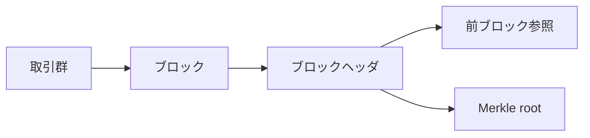

この図の要点は、ブロックが単なる入れ物ではなく、履歴比較の単位そのものだということです。

## （発展）9. 図で確認(2): ハッシュ連結による改ざん耐性

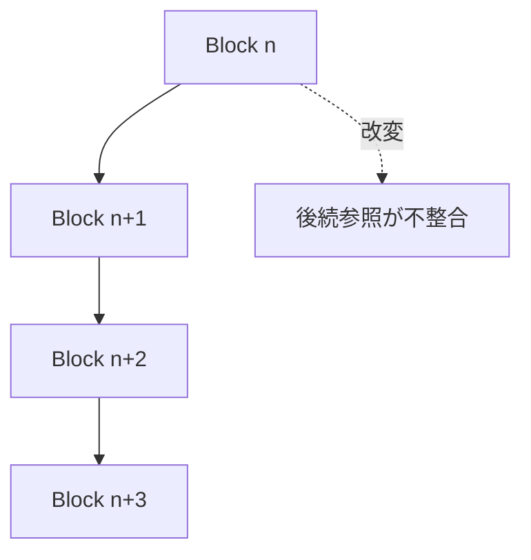

過去ブロックを改変すると後続参照が崩れるため、改ざんには連鎖再計算が必要になります。これが第7章のPoWコスト設計と結び付き、履歴固定の実効性を高めます。[^S-CH06-001][^S-CH07-001]

また、第三者検証の観点では「どの取引が含まれているか」を軽量に確認できることが重要です。Merkle構造の役割は、全取引再取得なしでも包含確認を可能にする点にあります。[^S-CH06-001]


## （発展）10. 追加整理: 履歴固定の評価軸

ブロックとチェーンを評価するときは、ハッシュ連結の有無だけでなく、第三者が同じ入力から同じ検証結果を再現できるかを確認してください。再現不能な履歴は、保存されていても検証可能性を持ちません。[^S-CH06-001]

Merkle構造の実務価値もここにあります。全取引を毎回再取得しなくても包含確認ができることで、軽量検証の説明可能性を保ちます。検証コストを下げつつ監査性を維持できる点が、単純なハッシュ列との違いです。[^S-CH06-001]

第7章へ向けた要点は、履歴改ざんが「可能/不可能」の二値ではなく「どれだけ高コストか」の連続量として評価されることです。PoWはこの連続量を現実的に押し上げる層として機能します。[^S-CH06-001][^S-CH07-001]


## （発展）11. 確認メモ: ブロック化の価値を取り違えない

ブロック化の価値を「大量取引をまとめて運ぶため」とだけ理解すると、検証境界という本質を見落とします。本章で重要なのは、第三者が同じ検証単位を再現できることです。検証単位が共有されると、異議申し立てや監査が同じ座標で行えます。[^S-CH06-001]

また、ハッシュ連結は改ざん不可能性を魔法のように与えるのではなく、改ざんコストを連鎖的に増やします。第7章のPoWと併せて読むことで、なぜ履歴固定が経済条件と結び付くかを説明できます。[^S-CH06-001][^S-CH07-001]


### 11.1 観測ポイント

第6章の実務監視では、ブロック検証失敗率と再同期時間を合わせて見ることが重要です。失敗率だけを見ても、復旧に要する時間が長ければ実効可用性は下がります。履歴固定の品質は、検証成功率と復旧速度の両方で評価すべきです。（要検証）


### 11.2 実装メモ

ブロック検証ログには「どの検証段階で失敗したか」を残してください。構文失敗、参照失敗、包含失敗を分離すると、障害切り分け速度が大きく改善します。（要検証）


## この章で最低限覚える3点
- ブロック化は検証境界を共有するための手段である。[^S-CH06-001]
- ハッシュ連結は改ざんコストを連鎖的に上げる。
- Merkle構造は包含確認を効率化する。

# 第7章: Proof of Work と難易度調整

第6章までで、取引を検証可能な履歴として記録する骨格を作りました。本章の問いは、その履歴をどのように改ざんしにくくするかです。ここで扱う中心要素は、Proof of Work（PoW, 計算コスト証明）と難易度調整です。PoWは履歴を書き換える行為に計算コストを埋め込み、難易度調整はそのコスト水準を時間変化の中で維持する制御機構として働きます。[^S-CH07-001]

この章で重要なのは「PoWがあるかないか」の二値ではありません。重要なのは、どの条件で攻撃コストが上がり、どの条件で安全余裕が縮むかを説明できることです。したがって本章は、PoWの仕組み説明だけでなく、難易度制御、攻撃評価、運用監視までを一つの連鎖として整理します。[^S-CH07-001][^S-CH09-001]

## 07-1 PoWの目的

最初に、PoWの目的を一文で固定します。PoWの目的は「計算を無駄に増やすこと」ではなく、「履歴改ざんの総コストを継続的に押し上げること」です。順序共有システムで怖いのは、過去の履歴を後から差し替えて正当性を作り変える行為です。PoWは、正しい履歴を1つ追加するにも計算労力を要求し、さらに過去改ざんには後続履歴分の再計算まで要求します。[^S-CH07-001]

この設計が有効なのは、計算課題が「解くのは重いが検証は軽い」という非対称を持つからです。提案者は重い計算を払い、検証者は比較的軽い処理で正否を確認できます。全ノードが同じ重い計算を背負う設計だと検証参加コストが上がり過ぎるため、分散検証の裾野が狭くなります。PoWは提案コストと検証コストの役割分離を作る仕組みでもあります。[^S-CH07-001]

ここで誤解されやすい点を整理します。署名検証があるなら改ざん耐性も十分だ、という説明は不十分です。署名検証が保証するのは「誰に支出権限があるか」であり、「過去履歴を差し替えるコスト」ではありません。履歴差し替えのコストは、ブロック提案に紐づいたPoWが支えます。したがって、署名とPoWは代替関係ではなく補完関係です。[^S-CH07-001]

次の図は、PoWがどこでコストを増やすかを示します。


図の確認点は明確です。攻撃者は1ブロックだけを直せばよいのではなく、後続を含む連鎖コストを払う必要があります。この連鎖構造が、履歴改ざんを実務上不利にします。[^S-CH07-001]

破綻例も二つ置きます。破綻例AはPoWがない履歴で、攻撃者が過去から高速に履歴を再生成するケースです。破綻例BはPoWがあっても難易度が極端に低く、再計算コストが十分に積み上がらないケースです。どちらも「改ざんを不利にする」という目的に対して未達です。ここから導く要件は、提案コストの存在だけでなく、遡及改変でコストが累積する構造を保つことです。[^S-CH07-001]

## 07-2 難易度

PoWを導入しても、ネットワーク全体の計算能力は一定ではありません。参加者数、設備更新、運用停止、電力事情などで総計算能力は常に揺れます。難易度（difficulty）は、この揺れに対してブロック生成ペースを目標帯へ戻すための制御変数です。難易度は強さの宣言ではなく、生成間隔を安定化するための運用パラメータです。[^S-CH07-001]

難易度を固定値にした場合の問題は直感的です。総計算能力が上がればブロックが速く出すぎ、分岐の同時発生が増えます。総計算能力が下がればブロックが遅れ、確定待ちが長くなります。どちらも順序共有の体感品質を悪化させます。したがって難易度は、静的安全値ではなく、変動環境に追随する制御量として扱う必要があります。[^S-CH07-001][^S-CH08-001]

ここで素朴案を二つ退けます。素朴案Aは「最初から高難易度に固定すれば安全」という案です。これは能力低下局面で可用性を大きく下げます。素朴案Bは「低難易度で高速化すれば使いやすい」という案です。これは改ざんコストを下げ、分岐頻度を増やします。どちらも単一目標の最適化で、全体要件を壊します。[^S-CH07-001]

この節の橋渡し要件は四つです。第一に目標生成間隔の明示、第二に調整窓の明示、第三に調整幅の制約、第四に更新規則の公開です。公開されない調整は検証不能であり、検証不能な調整は中央裁定者なしの設計原理と矛盾します。難易度の説明は数式だけでなく、公開規則としての再現可能性まで含める必要があります。[^S-CH07-001]

## 07-3 調整ルール

難易度調整ルールは「短期ノイズへ過敏に反応しない」ことが要点です。毎回の観測値へ大幅補正をかけると、制御は振動しやすくなります。逆に補正が弱すぎると、外乱後の逸脱が長期化します。したがって調整ルールは、追随性と安定性のトレードオフ設計として読む必要があります。[^S-CH07-001]

このトレードオフを可視化するため、制御ループを図で固定します。

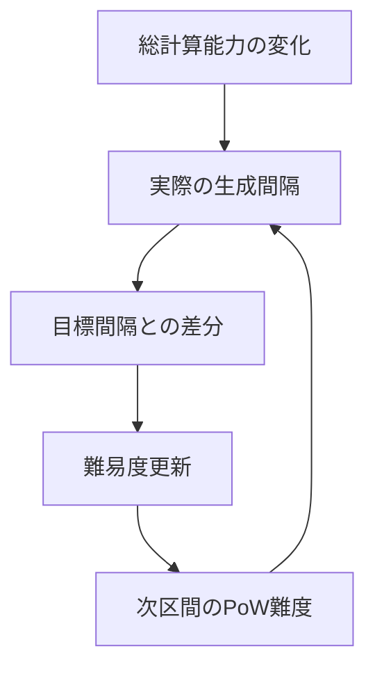

図の確認点は、難易度調整が単発処理ではなく閉ループ制御だという点です。観測、差分計算、更新、再観測が連続して回るため、運用では「更新後にどう戻るか」を評価する必要があります。[^S-CH07-001]

破綻例Aは、調整窓が短すぎてノイズ追従が過剰になり、間隔が上下振動するケースです。破綻例Bは、調整窓が長すぎて大きな外乱へ追随できず、逸脱期間が長引くケースです。どちらも平均だけ見ると見逃されるため、実務では偏差の継続時間と回復時間を同時に監視する必要があります。[^S-CH07-001]

さらに、実装差も注意点です。規則文面は同じでも、観測区間の解釈や丸め処理が実装ごとに異なると、更新値がずれる可能性があります。更新値の差は短期では微小でも、長期では分岐頻度や収束速度に影響します。したがって調整ルールの品質は、仕様記述の厳密さと実装互換試験の両方で担保する必要があります。[^S-CH07-001]

この節の橋渡しは次の一文です。難易度調整は「理論上戻る」だけでは不十分で、「異常後にどの速度で戻り、戻るまでの間にどの運用方針を採るか」を含めて初めて実効設計になります。ここが次節の攻撃耐性評価と直接つながります。[^S-CH07-001]

## 07-4 攻撃耐性

攻撃耐性は「攻撃不能」を宣言する概念ではありません。ここでの耐性は、攻撃者に必要な資源・時間・成功確率・便益回収条件を不利に保つことです。したがって評価は、技術軸（再計算量）と経済軸（費用対便益）を同時に扱う必要があります。どちらか一方だけでは、実際の危険域を正しく捉えられません。[^S-CH07-001][^S-CH09-001]

技術軸だけで議論すると「可能/不可能」の二値に寄りやすくなります。しかし実運用では、理論上可能でも経済的に非合理なら継続的脅威にはなりにくい一方、理論的ハードルが高くても便益が急騰すれば危険域へ近づく場合があります。経済軸だけで議論すると今度は実装制約を見落とします。両軸の同時管理が必要です。[^S-CH09-001]

この節の実務要件を四つに固定します。要件1は評価時点の明示、要件2は前提値の出典明示、要件3は更新周期の固定、要件4は閾値超過時の行動手順です。評価値は変化する前提なので、単発の「安全宣言」ではなく、更新可能な評価台帳として管理するべきです。[^S-CH07-001][^S-CH09-001]

破綻例Aは、評価を年1回だけ行い、市場変化に追随できないケースです。破綻例Bは、評価は頻繁でも閾値超過時の行動手順がなく、観測が行動へ接続しないケースです。前者は見逃し、後者は麻痺を生みます。どちらも「評価はあるのに防御が機能しない」状態です。[^S-CH09-001]

本章の結論を固定します。PoWは改ざんコストの地盤を作り、難易度調整はその地盤を維持する制御を担います。攻撃耐性は、この二つを前提に技術軸と経済軸を継続監視して初めて実効化されます。つまり第7章の到達点は、PoWを知ることではなく、PoWを条件付きで運用できることです。[^S-CH07-001][^S-CH09-001]

### 補助ケース: PoW運用を改善サイクルへ接続する

最後に、現場で使える最小サイクルを置きます。第一段は観測です。生成間隔分布、分岐頻度、再編成の深さ、主体集中度を定点観測します。第二段は判定です。観測値を閾値と照合し、どの前提が崩れたかを特定します。第三段は対応です。内部設定変更、利用者向け待機方針更新、監視強化を実行します。第四段は検証です。対応後に同じ指標で回復傾向を確認します。[^S-CH07-001][^S-CH08-001]

この四段を回すときに重要なのは、技術対応と説明対応を分離しないことです。内部では安全側へ切り替えていても、外部表示が旧前提のままだと利用者は誤った期待で行動します。逆に表示だけ更新して内部閾値を据え置くと、過剰警戒が長引きます。PoW安全性を実務で機能させるには、検知・判断・切替・説明を同じ時系列で設計する必要があります。[^S-CH07-001]

次章への橋渡しを一文で置きます。第8章では、この章で用意したコスト地盤の上で、分岐がどう収束するかを扱います。第7章は「改ざんしにくさ」の章であり、第8章は「分岐からの戻し方」の章です。[^S-CH08-001]

### 補助ケース2: 指標で見るPoW運用の健全性

PoW運用を実務で維持するには、単一の難易度値だけを見ても不十分です。少なくとも、生成間隔分布、分岐頻度、再編成深さ、提案主体の集中度を同時に観測する必要があります。生成間隔が目標に近くても、分岐深さが増えていれば収束品質は悪化している可能性があります。逆に、分岐は少なくても主体集中度が高まり続ければ、将来の耐性低下につながります。[^S-CH07-001][^S-CH08-001]
導入初期は、まず「生成間隔偏差」と「分岐頻度」の2指標から始め、運用が安定してから他指標を追加するのが実装しやすいです。[^S-CH07-001]

ここで大事なのは、指標の絶対値より「変化方向」です。ある週の値が許容範囲内でも、連続して悪化傾向なら早期対策が必要です。反対に一時的逸脱でも回復速度が速ければ、恒常的な制度変更は不要な場合があります。PoW監視は、静止画ではなく時系列で判断する設計へ寄せるべきです。[^S-CH07-001]

実務では、指標ごとに責任担当を分けると改善が速くなります。生成間隔と難易度追随はプロトコル運用担当、分岐と再編成はノード運用担当、主体集中度はガバナンス担当、利用者待機方針はプロダクト担当が持つ、といった分担です。責任担当が曖昧なままでは、異常が見えても「誰が最初に動くか」が決まらず、初動が遅れます。[^S-CH07-001]

また、指標の更新周期は同じでなくて構いません。高頻度で揺れる指標は短周期、構造変化を見る指標は長周期で確認するほうが効率的です。ただし、周期を分ける場合でも、月次レビューなどで統合判断を必ず行ってください。統合判断がないと、個別最適が全体最適を壊します。[^S-CH07-001]

この補助ケースの結論は、PoW安全性を数式だけで判断しないことです。数式は必要条件ですが、十分条件ではありません。運用では、観測・判断・対応・再検証のサイクルを回し、異常後の回復過程まで含めて評価する必要があります。これが「改ざんコスト設計を維持する」という実務意味です。[^S-CH07-001]

### 補助ケース3: 異常時プレイブックの最小構成

難易度や分岐指標が悪化したとき、現場が迷わないためのプレイブックを事前に作っておく必要があります。最小構成は五項目です。1) 発火条件、2) 一次切替手順、3) 利用者案内文、4) 再評価時刻、5) 復帰条件。この五項目がない運用は、検知はできても行動が遅れます。[^S-CH07-001]

発火条件には、単一閾値だけでなく複合条件を置くと誤検知を減らせます。例えば「生成間隔逸脱が一定時間継続し、かつ分岐頻度が上昇している」ような条件です。単一閾値だと一時ノイズで過剰反応しやすく、利用者体験を不必要に悪化させます。複合条件は反応を遅らせるためではなく、反応の精度を上げるために使います。[^S-CH07-001][^S-CH08-001]

一次切替手順では、内部と外部を同時に更新します。内部では監視強化と待機方針の切替、外部では確定見込み時間と再確認推奨を案内します。どちらか一方だけの更新は、利用者と運用者の前提不一致を広げます。前提不一致は、技術障害そのものより長く尾を引く問題になりやすいです。[^S-CH07-001]

再評価時刻の明示も重要です。異常対応へ入ったあとに再評価時刻がないと、暫定運用が惰性で続き、通常復帰が遅れます。復帰条件を先に置いておけば、担当交代があっても同じ基準で戻せます。PoW運用では、入る条件と戻る条件を対で定義することが基本です。[^S-CH07-001]

最後に、プレイブックは作成して終わりではありません。四半期ごとに演習し、手順の詰まりを更新してください。演習で詰まった箇所は、仕様不足ではなく運用記述不足であることが多いです。記述を改めるだけで、同じ指標悪化に対する復旧速度が大きく変わります。[^S-CH07-001]

### 補助ケース4: 監視会議を設計して判断を早める

PoW運用の改善が遅れる最大要因は、指標がないことより会議設計がないことです。数値は収集していても、誰が、どの順で、どの基準で判断するかが決まっていないと、会議のたびに議論が初期化されます。初期化を防ぐには、会議の入力と出力を固定してください。入力は前回からの変化量、出力は次回までの行動項目です。[^S-CH07-001]

会議入力の最小セットは四つで足ります。1) 生成間隔の偏差推移、2) 分岐発生率、3) 再編成深さ分布、4) 主体集中度です。四つを同じ時系列で並べると、どの層で変化が起きているかを素早く把握できます。入力項目を増やし過ぎると、議論は詳細化しても意思決定が遅れるため、まずは四つへ絞ることが有効です。[^S-CH07-001][^S-CH08-001]

会議出力も四つへ固定します。A) 継続監視、B) 閾値調整、C) 運用切替、D) 利用者案内更新です。各項目に責任者と期限を付けると、会議が報告会で終わらず実装へ接続します。責任者不在の出力は、次回会議で同じ議論を再生産するだけです。[^S-CH07-001]

さらに、会議では「現時点の最適」だけでなく「最悪条件での戻し方」を毎回確認してください。平常時に最適な設定でも、異常時に復帰できなければ安全余裕は維持できません。戻し方の確認とは、復帰条件、復帰順序、復帰後検証の三点を明示することです。三点を毎回確認する習慣があると、外乱時の判断速度が上がります。[^S-CH07-001]

この補助ケースの最終結論を置きます。PoW安全性は、難易度式だけでなく判断運用の品質で実効性が決まります。監視会議を設計し、入力と出力を固定し、戻し方まで確認する運用を持てば、同じ外乱でも被害を小さくできます。第7章の学習目標は、PoWを説明することではなく、PoW運用を再現可能に回せることです。[^S-CH07-001]

### 補助ケース5: 章末の実践チェック

第7章を実務で使うときは、章末に三つの確認を置いてください。第一に「改ざんコスト」を一文で説明できるか。第二に「難易度調整」を制御問題として説明できるか。第三に「異常時の戻し方」を時系列で説明できるか。この三点が揃うと、PoW理解は概念でなく運用能力になります。[^S-CH07-001]

確認を行う際は、平常時の成功例だけでなく異常時の失敗例も必ず含めてください。成功例だけの確認は、障害時に最も必要な判断力を育てません。失敗例を明示してこそ、閾値設定と切替条件の妥当性を点検できます。[^S-CH07-001]

また、説明対象を技術者に限定しないことも重要です。運用担当やサポート担当が同じ言葉で説明できると、障害時の連携が速くなります。PoW章の内容は実装者専用知識ではなく、関係者が共有すべき判断基盤です。[^S-CH07-001]

最後に、定期点検の周期を固定してください。点検周期が曖昧だと、繁忙期ほど確認が後回しになり、結果として外乱時に準備不足が顕在化します。準備不足を防ぐ最も簡単な方法は、短くても固定周期で点検を続けることです。[^S-CH07-001]

補足として、章末に「今回の外乱でどの前提が崩れたか」を一文で残す運用を推奨します。この一文があると、次回の同型外乱で初動判断が速くなります。外乱の内容は毎回違っても、崩れる前提の型は繰り返されることが多いためです。前提の型を記録する習慣は、PoW運用の学習速度を大きく上げます。[^S-CH07-001]

さらに、前提記録は技術チームだけで閉じず、運用チームと共有してください。共有されない前提は、問い合わせ対応や案内更新に反映されません。PoW安全性を実務で維持するには、前提認識を部署横断で同期することが必要です。[^S-CH07-001]

最後の実務メモとして、章の指標レビューに「戻せるか」の観点を必ず入れてください。改善策が有効でも、戻し条件が不明だと暫定運用が恒常化し、平常時の効率を下げます。入る条件と戻る条件を対で管理する運用は、PoW安全性の維持だけでなく、運用疲弊の抑制にも効きます。[^S-CH07-001]
加えて、戻し条件の確認は技術指標だけでなく説明指標でも行ってください。内部が正常化しても説明遅延が続くなら、実務上はまだ異常局面です。技術復帰と説明復帰の両方を満たして初めて通常運用へ戻す、という基準を固定すると判断のぶれを抑えられます。[^S-CH07-001]
この基準を章末チェックへ組み込めば、PoW運用は「計算が正しい」から一歩進んで「運用が再現できる」状態になります。[^S-CH07-001]
再現できる運用を持つことこそが、PoWを理論ではなく実務の防御線として機能させる条件です。[^S-CH07-001]
この防御線を維持するために、章の点検結果を次回の初期設定へ必ず反映してください。[^S-CH07-001]
反映されない点検は、実務上は未実施と同義です。[^S-CH07-001]
未実施を減らすことが、PoW運用の安定化に直結します。[^S-CH07-001]
安定化の積み上げが、最終的に改ざんコスト維持へつながります。[^S-CH07-001]
ここを運用で守ることが重要です。[^S-CH07-001]
継続監視を止めないでください。[^S-CH07-001]

# 第8章: 合意の収束とフォーク

第7章で、履歴改ざんへコストを課す地盤としてPoWと難易度調整を整理しました。本章の問いは、観測差が残る状況で一時的に複数履歴が生まれたとき、どうやって全体を一本へ収束させるかです。ここで扱う中心要素は、フォーク発生、収束規則、再編成、実用確定性です。結論を先に置くと、フォークは異常ではなく中間状態であり、品質を決めるのは「分岐の有無」より「分岐後の戻し方」です。[^S-CH08-001][^S-CH04-001]

本章は「フォークをなくす方法」を説明する章ではありません。分散環境でフォークが発生し得ることを前提に、どうすれば再現可能な手順で戻せるかを説明する章です。フォークを失敗として隠す設計は、短期的に見栄えが良くても、長期的には説明不能な不整合を増やします。[^S-CH08-001]

## 08-1 フォークの発生

フォーク（fork）は、同じ親ブロックから複数の子ブロック候補が同時近傍に発生し、履歴候補が一時的に分岐する現象です。分岐の根本原因は、悪意の有無ではなく、観測時点のずれと伝播遅延です。善意ノードだけの環境でも、複数候補が同時に見つかれば分岐は起きます。[^S-CH08-001][^S-CH04-001]

この点を日常例で置き換えます。共同編集中の文書で、同じ時刻帯に別端末から保存が走ると、短時間だけ版が分かれます。版分岐が起きたこと自体は失敗ではありません。失敗は、どの規則で統合するかが決まっていないことです。フォークも同じです。問題は発生そのものではなく、発生後手順の欠落です。[^S-CH08-001]

素朴案Aは「最初に見えた枝を固定する」です。これは局所観測依存が強く、ノードごとに先着枝が違えば全体収束しません。素朴案Bは「運用者判断で都度決める」です。短期収束しても再現性がなく、後追い監査で説明不能になります。どちらも分散前提に対して弱い設計です。[^S-CH08-001]

次の図は、フォークが自然に発生する構図を示します。

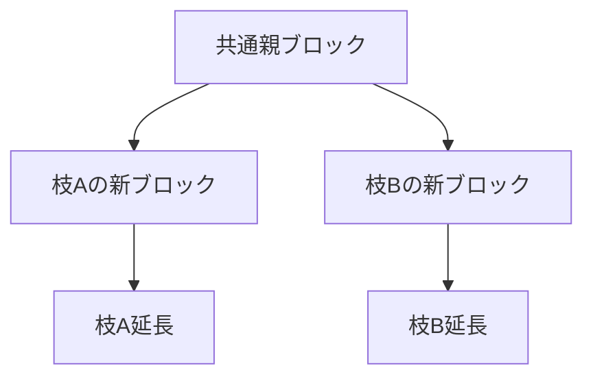

図の確認点は、AとBの同時存在が仕様上起こり得ることです。ここで必要なのは「どちらが悪いか」の判定ではなく、どちらを最終採択するかの公開規則です。[^S-CH08-001]

この節の橋渡し要件は三つです。第一に分岐発生を許容すること、第二に採択基準を公開すること、第三に採択変更時の状態遷移を機械的に再現できることです。第三要件が欠けると、規則はあっても実装差で結果が割れます。[^S-CH08-001]

## 08-2 収束規則

収束規則の目的は、分岐時に全ノードが同じ枝へ向かう意思決定条件を提供することです。Bitcoinの説明では、より大きな作業量が積まれた側を追う考え方が採られます。ここで大事なのは名称ではなく、規則が公開され、全ノードが同じ入力から同じ判断を再現できることです。[^S-CH08-001]

「多数派が選んだ側を正とする」という説明だけでは不足です。多数の定義は観測範囲と時点に依存し、遅延中には別多数が同時成立します。したがって収束規則は、感覚的な多数論でなく、検証可能な計算手順として記述する必要があります。[^S-CH08-001]

実装で見落とされやすいのは、採択基準と適用手順の混同です。採択基準が一致していても、状態更新の順序が実装ごとに違えば一時不整合が発生します。たとえば旧枝の巻き戻しと新枝の適用順が逆転すると、照会タイミングによって中間状態の見え方がずれます。したがって収束規則は、基準だけでなく遷移順序まで含めて定義する必要があります。[^S-CH08-001]

次の図は、収束規則の意思決定点を示します。

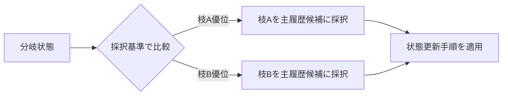

図で確認するポイントは、比較と更新が分かれていることです。比較基準が正しくても更新手順が曖昧なら、運用上の整合は崩れます。[^S-CH08-001]

この節の橋渡しは明確です。採択変更が起きる以上、再編成を例外障害として扱うのではなく、標準業務として扱う必要があります。次節で再編成を手順として固定します。[^S-CH08-001]

## 08-3 再編成

再編成（reorganization, reorg）は、暫定採択していた枝から別枝へ主履歴候補を切り替える処理です。再編成を「起きてはいけない事故」と定義すると、現場は情報隠蔽へ寄りやすくなります。再編成は収束過程の一部として定義し、検知・切替・通知を手順化するほうが実務品質は上がります。[^S-CH08-001]

再編成手順の最小構成は四段です。第一段は再編成候補の検知。第二段は旧枝状態の巻き戻し。第三段は新枝状態の再適用。第四段は利用者表示と監査ログの更新です。第二段と第三段だけ実装して第四段を省くと、内部整合は取れても利用者説明が壊れます。[^S-CH08-001]

破綻例Aは、内部再編成は成功したが対外表示が旧状態のまま残り、利用者が誤前提で次行動を取るケースです。破綻例Bは、通知は出したが影響範囲を示さず、問い合わせごとに回答が揺れるケースです。どちらも技術故障ではなく、再編成を標準業務として設計していないことが原因です。[^S-CH08-001]

この節の要件を固定します。要件1は状態語彙の統一（受信、候補、暫定採択、運用上確定）。要件2は巻き戻しと再適用の順序固定。要件3は通知テンプレートの標準化。要件4は再編成後監査ログの保存です。四要件が揃うと、再編成は「混乱イベント」ではなく「再現可能な更新手続き」になります。[^S-CH08-001]

## 08-4 実用確定性

分散環境での確定性は、絶対不変の宣言ではありません。実務では、再編成可能性が十分小さいと判断した時点を運用上の確定とみなします。この「確率を管理する確定」が実用確定性です。ここで重要なのは、閾値そのものより、閾値をどう決め、どう更新し、どう説明するかです。[^S-CH08-001]

誤解を二つ除きます。誤解Aは「確率的確定=不正確」という見方です。実際には、不確実性を明示的に扱う運用設計です。誤解Bは「同じ確認回数がすべての業務に最適」という見方です。取引規模、許容損失、再試行コストで適切閾値は変わります。閾値は万能定数でなく、業務条件付きの運用パラメータです。[^S-CH08-001]

実務要件を四つ置きます。第一に閾値決定理由の記録。第二に未確定状態の明確表示。第三に再編成時の再確認手順。第四に閾値更新時の移行計画です。第四要件がないと、環境変化で閾値を変えるたびに利用者説明が揺れます。[^S-CH08-001]

この章の結論を固定します。フォークは避けがたい。再編成も起き得る。品質を決めるのは、それらを隠すことではなく、収束規則と実用確定性の運用で一貫処理できることです。第9章では、この運用を支える誘因設計を扱います。[^S-CH08-001][^S-CH09-001]

### 補助ケース: 収束品質を継続監視する

収束運用を安定させるには、単発指標ではなく時系列監視が必要です。最小セットとして、分岐の同時存在時間、再編成の深さ分布、再編成後の復旧時間を継続観測してください。分岐件数だけでは、浅い揺れが増えたのか深い再編成が増えたのかを区別できません。[^S-CH08-001]

また、監視結果は必ず行動手順へ接続します。たとえば深い再編成が増えた局面では、確定閾値の見直し、通知文言の更新、監査範囲の拡大を同時に検討します。観測と行動が分離すると、報告書は増えても事故予防にはつながりません。[^S-CH08-001]

最後に終章への橋渡しを置きます。第8章で得たのは「収束を管理する語彙と手順」です。終章ではこの手順を、他の方式を読むときの評価軸へ変換します。分岐を恐れるのではなく、分岐後を再現可能に扱えるかで技術を評価する姿勢が次の学習土台になります。[^S-CH08-001][^S-OUTRO-001]

### 補助ケース2: 状態語彙を統一して説明負債を減らす

フォーク運用で実務差が出るのは、アルゴリズム本体より状態語彙の整備です。同じ状態を部署Aが「確定」と呼び、部署Bが「暫定」と呼ぶと、内部では同じ処理でも外部説明が矛盾します。矛盾が続くと、利用者は技術的な揺れより先に説明不一致へ不信を持ちます。したがって収束規則の設計には、状態語彙の標準化を必ず含めるべきです。[^S-CH08-001]

状態語彙の最小セットとして、`受信`、`候補`、`暫定採択`、`運用上確定` を固定する方法が有効です。`受信` は局所観測の段階、`候補` は有効性確認中、`暫定採択` は枝選択中、`運用上確定` は閾値到達後の段階です。語彙が固定されると、通知文と監査ログの対応が取りやすくなり、障害時の照合速度が上がります。[^S-CH08-001]
導入順は「語彙統一→再編成手順→問い合わせ手順→閾値更新」の順で進めると、依存関係を崩しにくくなります。[^S-CH08-001]

ここで重要なのは、語彙固定を文書作業で終わらせないことです。APIの状態コード、管理画面表示、サポート台本、監査帳票を同じ語彙へ揃える必要があります。どれか一つだけ旧語彙のままだと、再編成時に部署間で翻訳コストが発生し、対応遅延を招きます。収束品質は、技術速度だけでなく翻訳不要性でも決まります。[^S-CH08-001]

この補助ケースの結論は、収束規則の実効性を高める最短経路は状態語彙の統一である、という点です。フォークは避けにくくても、説明不一致は設計で減らせます。説明不一致が減ると、再編成そのものの心理負荷も下がり、利用者行動の予測可能性が上がります。[^S-CH08-001]

### 補助ケース3: 確定閾値の変更手順を先に定義する

実用確定性の運用で頻繁に起きる失敗は、閾値変更を場当たりで行うことです。環境変化に応じて閾値を変えること自体は必要ですが、変更手順がないまま値だけ変えると、利用者は「なぜ昨日と今日で基準が違うのか」を理解できません。閾値変更は数値調整ではなく、説明責任を伴う運用変更として設計する必要があります。[^S-CH08-001]

変更手順の最小構成は五つです。1) 変更理由、2) 適用時刻、3) 対象範囲、4) 旧閾値との移行手順、5) 変更後の見直し時刻。特に4)を欠く運用では、境界時刻付近の取引説明が揺れます。境界説明の揺れは、再編成件数よりも利用者不信へ直結しやすい点に注意が必要です。[^S-CH08-001]

また、閾値変更の評価は「事故が減ったか」だけで判断しないでください。確認すべきは、再確認コスト、待機時間、問い合わせ再発率、説明文改定頻度の総合です。事故件数が減っても待機負担が過大になれば、別の運用問題へ置き換わっている可能性があります。実用確定性は単一最適でなく、複数負担のバランス最適です。[^S-CH08-001]

最後に、閾値変更後は必ず事後レビューを行い、変更理由と結果を対で記録してください。この記録があると、次回変更で前提差を比較でき、説明の一貫性を保ちやすくなります。記録がない変更は、短期的に有効でも長期運用では再現不能になります。[^S-CH08-001]

### 補助ケース4: 再編成時の問い合わせ対応を設計する

再編成が発生したとき、技術処理が正しくても問い合わせ対応が不統一だと運用品質は下がります。利用者は内部状態を直接見られないため、問い合わせ窓口の説明が事実上のシステム状態として受け取られます。したがって再編成対応では、技術手順と同じ優先度で問い合わせ手順を設計する必要があります。[^S-CH08-001]

問い合わせ手順の最小構成は、1) 事象識別、2) 状態説明、3) 利用者の次行動、4) 次回更新時刻です。1)では対象取引が再編成影響範囲に入っているかを確認し、2)では固定語彙で現状態を説明し、3)では再送や待機の判断基準を示し、4)で再確認タイミングを約束します。この四点を同じ順で案内すると、担当者による説明差を減らせます。[^S-CH08-001]

また、問い合わせ対応の品質は「正しいか」だけでなく「揃っているか」で評価してください。正しい回答でも担当者ごとに表現が異なると、利用者は矛盾を感じます。したがってテンプレート文を作るだけでなく、実際の応答ログで語彙逸脱を点検する運用が必要です。語彙逸脱の是正は地味ですが、再編成時の不信連鎖を抑える効果が高いです。[^S-CH08-001]

さらに、問い合わせログは再編成後レビューへ戻してください。どの説明が誤解を生んだか、どの用語が理解されにくかったかを分析し、次回テンプレートへ反映します。技術側の再発防止だけでなく説明側の再発防止を回すと、同じ再編成でも混乱量を段階的に減らせます。[^S-CH08-001]

この補助ケースの結論は、収束品質はノード間合意だけでなく、利用者との合意でも測るべきだという点です。再編成を標準業務として扱うなら、問い合わせを例外業務にしないことが重要です。再編成手順と問い合わせ手順を同じ設計図で管理できれば、分岐後収束は技術的にも運用的にも一貫したものになります。[^S-CH08-001]

### 補助ケース5: 収束レビューの実施手順

第8章の内容を定着させるには、定期的な収束レビューが有効です。レビューでは、最新期間の分岐発生、再編成深さ、復旧時間、説明更新時間を同じ時系列で確認します。指標を別々に見ると、どの遅れが原因で混乱が拡大したかを特定しにくくなります。[^S-CH08-001]

レビュー結果は三段で整理してください。第一段は事実整理で、何が起きたかを時系列で固定します。第二段は規則整理で、どの規則が働いたかを確認します。第三段は運用整理で、説明と手順のどこが詰まったかを確認します。三段を分けると、感想ベースの議論を減らせます。[^S-CH08-001]

また、レビューには必ず次回改善項目を残します。改善項目は「規則変更」「手順変更」「説明変更」の三分類で管理すると追跡しやすくなります。分類しない改善項目は、次回レビューで再び同じ論点として現れやすく、改善が循環しません。[^S-CH08-001]

最後に、収束レビューの目的を固定します。目的は「分岐をゼロにすること」ではなく、「分岐後の戻し方を毎回速くすること」です。この目的を共有できると、フォーク発生そのものへの過剰反応が減り、実務上の改善速度が上がります。[^S-CH08-001]

補足として、レビューでは毎回「説明遅延」を確認してください。再編成そのものより、説明更新が遅れた時間が長いと、利用者体験の損失が大きくなります。説明遅延を指標化すると、技術改善と説明改善の優先順位を同じ土俵で決められます。[^S-CH08-001]

また、再編成が小規模でも必ず簡易振り返りを残してください。小規模事象を記録しない運用では、大規模事象のときに比較対象がなく、改善が遅れます。小規模の反復記録こそが、収束運用の再現性を支える基盤です。[^S-CH08-001]

加えて、簡易振り返りでは「技術上の原因」と「説明上の原因」を分けて記録してください。二つを混ぜると、技術対策で説明問題を解こうとして効果が出ない、または説明改善で技術問題を覆い隠す、といった誤対応が起きます。原因分類を固定するだけで、再編成後の改善速度は大きく上がります。[^S-CH08-001]
さらに、原因分類ごとに次回検証項目を一つずつ残してください。技術原因なら再現テスト項目、説明原因なら案内文テスト項目を置く、といった形です。検証項目まで定義されると、振り返りが反省で終わらず改善実装へ接続します。分岐後収束の品質は、この接続の有無で大きく変わります。[^S-CH08-001]
加えて、検証項目には完了条件を必ず添えてください。完了条件がないと、改善の進捗を客観的に判断できません。完了条件を明示したレビュー運用は、フォーク対応を属人判断から標準業務へ移すための最短経路です。[^S-CH08-001]
標準業務へ移せれば、分岐発生時に「誰が」「何を」「いつまでに」行うかが即時に決まり、収束までの時間と説明のぶれを同時に減らせます。[^S-CH08-001]
この即時性を保つには、役割表と連絡順序を定期的に更新し、実際の担当体制とずれないように維持することが必要です。[^S-CH08-001]
体制更新が追いついていれば、フォーク発生時の初動遅延を安定して抑えられます。[^S-CH08-001]
初動遅延の抑制は、そのまま再編成後の説明負債の抑制にもつながります。[^S-CH08-001]
説明負債を抑える運用は、確定性への信頼を長期で支える基盤です。[^S-CH08-001]
この基盤があると、同規模の分岐でも体験上の混乱を小さくできます。[^S-CH08-001]
継続的な記録が、その改善を支えます。[^S-CH08-001]
記録があるほど復旧は速くなります。[^S-CH08-001]
速い復旧が信頼を守ります。[^S-CH08-001]
記録は継続してください。[^S-CH08-001]

# 第9章: インセンティブと攻撃コスト

第8章で、分岐が起きる前提でも収束規則で履歴を一本化できることを確認しました。本章の問いは、その規則を参加者がなぜ守り続けるかです。技術仕様が正しくても、規則準拠行動が合理的でなければ長期運用は崩れます。したがって本章は、報酬設計、手数料市場、利得比較、攻撃コスト評価を一体として扱います。[^S-CH09-001]

ここでの中心命題は明確です。順序共有の持続性は、アルゴリズムだけでなく行動設計で決まります。仕様層が「何が正しいか」を定義し、インセンティブ層が「なぜそれを選ぶか」を支えます。この二層を分離して評価すると、短期では動くが長期では弱い設計を見抜きやすくなります。[^S-CH09-001][^S-CH08-001]

## 09-1 報酬設計

報酬設計の目的は、規則準拠行動を偶然ではなく継続的な合理性として成立させることです。Bitcoin文脈では、規則を満たしたブロック提案に報酬が紐づきます。ここで重要なのは、報酬を「成功者へのボーナス」としてではなく、「望ましい行動を再生産する制御信号」として扱う視点です。[^S-CH09-001]

日常例として、交通ルールを考えます。標識だけでは秩序は維持されません。違反コストと遵守メリットが設計されることで、行動の安定が生まれます。ブロックチェーンでも同じく、規則準拠が期待利得で優位になる条件を用意しなければ、逸脱行動は消えません。[^S-CH09-001]

素朴案Aは「技術的に正しい規則なら自然に守られる」です。これは行動主体の利得構造を無視しています。素朴案Bは「報酬を増やせば必ず安定する」です。報酬総量だけ増やしても、分配構造や長期持続性が弱ければ、参加主体の偏りと退出リスクが増えます。報酬設計は金額最適化ではなく行動安定化の設計です。[^S-CH09-001]

この節の橋渡し要件は三つです。第一に規則準拠行動の観測可能化。第二に報酬算定ルールの公開。第三に長期持続性の点検です。第三が欠けると、短期は安定しても中長期で準拠主体が減り、結果として収束規則の実効性が落ちます。[^S-CH09-001]

## 09-2 手数料

手数料市場は、限られた処理容量の中で取引順序を選別する信号です。したがって手数料は単なる利用コストではなく、順序形成そのものに影響する設計変数です。提案者は手数料だけでなく取引条件も見て集合を構成するため、手数料設計は公平性、予測可能性、耐混雑性の均衡問題になります。[^S-CH09-001]

日常例で言えば、通常便と速達便の関係に近いです。優先サービスは利便を与えますが、全体が優先化すると通常サービスの予測性が崩れます。ブロック空間も同様で、高手数料取引だけが常態的に先行すると、小額利用者の待ち時間が読めなくなります。反対に手数料信号が弱すぎると、混雑時の選別が機能せず滞留が慢性化します。[^S-CH09-001]

ここで誤解を整理します。誤解Aは「高手数料優先は常に市場効率的で問題がない」。誤解Bは「低手数料を徹底すれば公平で安全」。前者はアクセス格差を、後者は混雑耐性低下を招く場合があります。重要なのは、どの業務要件でどの程度の優先度設計を許容するかを明示することです。[^S-CH09-001]

この節の橋渡し要件を固定します。要件1は優先順位規則の公開。要件2は混雑時挙動の説明可能性。要件3は利用者が予測できる指標提供です。要件2と3がない運用では、処理結果が恣意に見えやすく、規則準拠への協力が弱くなります。[^S-CH09-001]

## 09-3 利得比較

利得比較の目的は、正直行動と逸脱行動のどちらが合理的かを条件付きで評価することです。ここでの期待利得は単発利益ではありません。成功確率、必要資源、失敗時損失、機会費用、再参加可能性まで含めた評価が必要です。単純な「成功したら得」という計算では、現実の行動予測として弱すぎます。[^S-CH09-001]

利得比較を実務で使うときは、主体を分けて評価します。提案主体、利用主体、運用主体で利得関数は異なります。ある主体に合理的な変更が別主体に過大負担を与える場合、全体安定性は下がります。したがって「誰の合理性か」を明示せずに均衡を語ると、現場での反発と回避行動を見落とします。[^S-CH09-001]

破綻例Aは、提案主体最適化だけを進め、利用主体の予測可能性が低下するケースです。破綻例Bは、短期収益を優先した設定変更で、長期参加主体の退出が増えるケースです。どちらも局所最適が全体最適を壊す典型です。利得比較は数式の精緻化だけでなく、主体間連鎖の観察まで含める必要があります。[^S-CH09-001]

この節の橋渡しを置きます。利得比較は一回計算で終わりません。外部条件で優劣は反転し得るため、次節で扱う攻撃コスト評価に接続し、時系列で更新する必要があります。[^S-CH09-001]

## 09-4 攻撃コスト評価

攻撃コスト評価は、計算資源価格だけでなく、調達可能性、実行時間、成功確率、便益回収可能性を合わせた動的評価です。ここでの目的は「恐怖を増やす」ことではなく、安全余裕の縮小兆候を早期に検出し、対策優先度を決めることです。[^S-CH09-001]

この評価で避けるべき誤解は二つあります。第一に「コストが高いから恒久安全」という誤解。第二に「単一指標の改善で安全性全体が改善する」という誤解です。実際には指標間の連鎖があり、一つが良化しても他が悪化すれば総合危険度は上がり得ます。したがって、評価は複合指標で管理する必要があります。[^S-CH09-001]

実務要件を四つ置きます。要件1は評価時点の固定。要件2は前提値の出典固定。要件3は更新周期の固定。要件4は閾値超過時の行動計画です。要件4がない評価は「分かった」で終わり、予防行動へ接続しません。評価手順は必ず運用手順とセットで設計するべきです。[^S-CH09-001]

次の図は、攻撃コスト評価を運用へ接続する最小ループです。

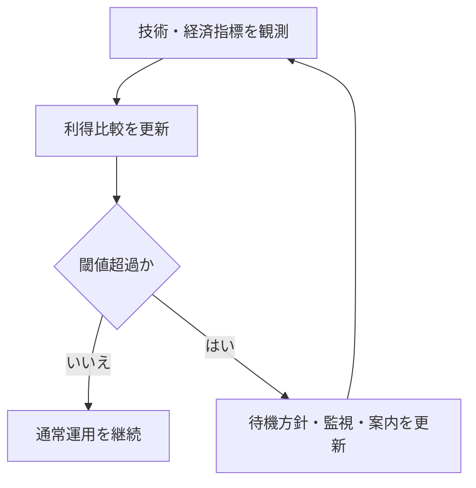

図の要点は、評価と行動を切り離さないことです。観測だけ、更新だけ、通知だけの運用では、異常局面で判断が遅れます。[^S-CH09-001]

この章の結論を固定します。インセンティブ設計の品質は、派手な数式より、規則準拠行動を長期に維持できるかで測るべきです。報酬、手数料、利得比較、攻撃コスト評価を同じ改善ループで運用できれば、順序共有は仕様上の正しさから実務上の安定へ接続できます。[^S-CH09-001]

### 補助ケース: 指標改善と説明改善を同時に回す

最後に、実務で抜けやすい観点を置きます。多くの運用では指標改善に集中し、説明改善が後回しになります。しかし順序共有システムでは、利用者が処理結果を予測できること自体が準拠行動を支える条件です。したがって、内部指標が改善していても、説明が不透明なら長期信頼は下がります。[^S-CH09-001]

運用会議では、技術指標と説明指標を同時に扱ってください。技術指標の例は滞留時間分布、分岐頻度、復旧時間。説明指標の例は案内文更新遅延、問い合わせ再発率、誤解起因の再送率です。両者を同周期で見ると、どこがボトルネックかを切り分けやすくなります。[^S-CH09-001]

第10章への橋渡しを置きます。第9章が示したのは「守りたくなる条件」を作る設計でした。第10章では、その設計があっても残る限界を扱います。つまり次章は、誘因設計の外側にある責任境界を固定する章です。[^S-CH10-001]

### 補助ケース2: 主体別の利得を同じ表で比較する

利得比較を実務へ落とすとき、最初に行うべき作業は主体分割です。提案主体、利用主体、運用主体、監査主体で「得」と「損」の定義は異なります。主体分割なしに総合指標だけを見ると、誰かの改善が別の誰かの悪化を覆い隠します。順序共有の長期安定には、この見えない転嫁を早めに検知する必要があります。[^S-CH09-001]

例えば、提案主体の収益性だけを最適化すると、利用主体の待機負担や予測困難が増える場合があります。短期的には提案効率が上がっても、長期的には利用離脱でネットワーク基盤が弱くなる可能性があります。逆に、利用主体の即時性だけを最適化すると、提案主体の持続参加が難しくなり、全体可用性が落ちます。したがって利得比較は、主体ごとの均衡点を探る作業です。[^S-CH09-001]

主体別比較を実装する最小方法は、同じ時点のデータを主体別KPIへ分解して並べることです。重要なのはKPIの数を増やすことではなく、意思決定に直結する組み合わせを固定することです。固定されていないKPIは、会議ごとに評価軸が変わり、改善の再現性を失います。[^S-CH09-001]

この補助ケースの結論は、均衡とは単一最適値でなく「主体間で壊れにくい配置」であるという点です。壊れにくい配置を持つと、外乱が来ても小さな調整で回復できます。壊れやすい配置しか持たない運用は、外乱のたびに大幅改修が必要になり、結果として手戻りが増えます。[^S-CH09-001]

### 補助ケース3: 攻撃コスト評価をプレイブック化する

攻撃コスト評価は、評価値を出して終わると機能しません。評価値を行動へ接続するプレイブックが必要です。プレイブックの最小要素は、1) 指標取得元、2) 更新周期、3) 閾値区分、4) 区分別行動、5) 事後レビュー項目です。この五要素が揃うと、担当者が変わっても同じ条件で同じ対応を選びやすくなります。[^S-CH09-001]

特に重要なのは、閾値区分を二値で終わらせないことです。実務では「通常」「注意」「警戒」の三段以上に分けるほうが有効です。二値区分は切替が急で、過剰反応か反応遅れのどちらかになりやすいです。段階区分を持つと、利用者案内も段階的に更新でき、運用ショックを抑えられます。[^S-CH09-001]

また、プレイブックには「更新しない判断」の記録欄を置いてください。閾値近傍で更新を見送った理由が残っていないと、次回同条件で逆判断をしやすくなります。判断理由の蓄積は、指標精度より先に運用品質を上げる場合があります。順序共有の安定は、数値精度だけでなく判断一貫性で決まるからです。[^S-CH09-001]

最後に、この章の補助ケースを一文でまとめます。インセンティブ設計は、数学的に美しいことより、同じ条件で同じ行動を選べることが重要です。主体分割とプレイブック化を同時に進めると、規則準拠は理論上の均衡から実務上の習慣へ移ります。[^S-CH09-001]

### 補助ケース4: 料金と順序の説明責任を設計する

手数料と順序は、利用者にとって最も体感しやすいインセンティブ要素です。ここで説明責任が弱いと、技術的には妥当な処理でも不公平感が増え、結果として規則準拠行動が弱まります。したがって第9章の運用では、料金算定と順序形成を「内部ロジック」で終わらせず、「外部説明可能なルール」として設計する必要があります。[^S-CH09-001]

実務で有効なのは、説明の三層分離です。第一層は原理説明で「なぜ優先度が必要か」を示します。第二層は現在説明で「いまの混雑で何が起きているか」を示します。第三層は行動説明で「利用者は何を選べるか」を示します。三層を分けない説明は、原理だけで行動が分からない、または行動だけで原理が伝わらない状態を生みます。[^S-CH09-001]

さらに、説明責任は文言だけでなく更新速度でも決まります。内部で方針変更したあと、外部説明の更新が遅れると、古い前提での判断を利用者へ強いることになります。更新遅延を防ぐには、方針変更フローに説明更新タスクを必須工程として組み込む必要があります。説明更新を任意タスクにすると、忙しい局面ほど後回しになります。[^S-CH09-001]

ここで重要なのは、説明品質を定量化することです。例えば、説明更新のリードタイム、問い合わせ再発率、誤解起因の再送率を継続計測すると、説明改善の効果を評価できます。測らない説明は改善できません。インセンティブ設計は経済指標だけでなく、説明指標も同じ会議で扱うべきです。[^S-CH09-001]

この補助ケースの結論を固定します。第9章で守るべき均衡は「収益均衡」だけではありません。「行動理解の均衡」も同時に必要です。料金と順序の理由を利用者が理解できる運用は、短期の不満を減らすだけでなく、長期の規則準拠を支える基盤になります。[^S-CH09-001]

### 補助ケース5: 章末運用テンプレート

第9章を実務へ接続するため、章末テンプレートを固定します。テンプレートは「観測」「判断」「対応」「説明」「検証」の五欄で構成します。観測欄に指標を記録し、判断欄で閾値判定を記録し、対応欄で実施行動を記録し、説明欄で外部案内を記録し、検証欄で効果を記録します。五欄を毎回埋めるだけで、改善の抜け漏れを減らせます。[^S-CH09-001]
導入順は「指標固定→テンプレート導入→再評価条件設定」の三段で進めると、現場の混乱を抑えられます。[^S-CH09-001]

このテンプレートの利点は、担当者交代に強いことです。前任者の判断理由が記録されていれば、後任者は同じ前提で判断できます。理由が記録されていない運用は、同じ指標でも結論が揺れ、長期的に方針が不安定になります。安定したインセンティブ運用には、判断履歴の継続が不可欠です。[^S-CH09-001]

また、テンプレート運用では「やらない判断」も明示してください。対応見送りを明記すると、次回に同じ状況が来たとき比較ができます。見送り理由がないと、判断が遅れたのか意図的に待ったのかを後から区別できません。区別できない運用は改善速度が上がりません。[^S-CH09-001]

この補助ケースの結論は、インセンティブ設計の実効性は判断履歴の品質で決まるという点です。数式モデルが優れていても、現場判断が再現できなければ準拠行動は持続しません。第9章の到達点は、利得比較を意思決定手順として回せることです。[^S-CH09-001]

補足として、章末に「今週の最重要トレードオフ」を一つだけ選んで記録してください。例えば、待機時間短縮を優先したのか、確定性を優先したのか、説明安定性を優先したのかを明示します。最重要トレードオフを明文化すると、次週の判断差を比較しやすくなります。[^S-CH09-001]

さらに、その選択が利用者行動へどう影響したかを翌週に確認してください。設計意図と利用者行動が一致していれば、誘因設計は機能しています。一致しなければ、数値が改善していても設計意図は未達です。行動確認を定例化することで、インセンティブ設計を机上最適化から運用最適化へ移せます。[^S-CH09-001]

最後の補足として、判断テンプレートには「今回見送った施策」を必ず残してください。見送り施策を記録すると、後日の再評価で比較対象が増え、意思決定の一貫性を保ちやすくなります。見送り記録がない運用は、同じ状況で毎回同じ議論を繰り返しやすく、改善が停滞します。[^S-CH09-001]
加えて、見送り施策には再評価条件を併記してください。例えば「分岐頻度が一定値を超えたら再評価」のように条件があると、見送り判断が固定化せず、環境変化へ追随できます。再評価条件まで記録する運用は、誘因設計の劣化を早期に検知するうえで有効です。[^S-CH09-001]
この運用が定着すると、インセンティブ設計は場当たりの微調整ではなく、検証可能な改善サイクルとして機能します。[^S-CH09-001]
改善サイクルが回れば、規則準拠は短期の偶然ではなく、長期の習慣として維持しやすくなります。[^S-CH09-001]
長期の習慣化こそが、順序共有を安定運用へ接続する最終条件です。[^S-CH09-001]
その習慣化を測るために、判断履歴の欠損率も監視対象へ入れてください。[^S-CH09-001]
欠損率の低下は、意思決定品質の安定化を示す有効な先行指標です。[^S-CH09-001]
先行指標を追う運用が、劣化の早期検知を可能にします。[^S-CH09-001]
早期検知は手戻りを減らします。[^S-CH09-001]
その効果は長期で大きく出ます。[^S-CH09-001]

# 第10章: 限界と運用上の注意

第9章で、規則準拠を維持するためのインセンティブ設計を確認しました。本章の問いは、誘因設計が整っていても残る限界をどう扱うかです。ここでの結論は単純です。安全性主張は脅威モデル内でのみ有効であり、鍵管理や順序依存リスクはプロトコル健全性と別層で管理しなければなりません。したがって運用では、できることとできないことを先に境界化する必要があります。[^S-CH10-001][^S-CH10-002]

本章は悲観を述べる章ではありません。限界を明示して責任配分を正しく設計する章です。境界が曖昧なままでは、障害時に「誰が何を直すか」が決まらず、技術的に修復可能な事象でも復旧が遅れます。境界条件の明示は、弱気の宣言ではなく、復旧速度を上げるための設計行為です。[^S-CH10-001]

## 10-1 脅威モデル

脅威モデルは、安全性主張の有効範囲を定義する枠組みです。最低でも「何を守るか」「何から守るか」「どこまで守らないか」を明示する必要があります。これを曖昧にすると、同じシステムでも担当者ごとに安全性の意味が変わり、障害時の判断が分裂します。[^S-CH10-001]

日常例として、防災計画を考えます。防災計画は「すべての災害を防ぐ」宣言ではなく、「特定条件で被害をどこまで抑えるか」を定義する計画です。ブロックチェーン運用でも同じで、脅威モデルは万能宣言ではなく、条件付き保証の設計図です。[^S-CH10-001]

素朴案Aは「分散しているから安全」というラベル化です。分散の度合い、通信条件、実装差、更新手順を分解しなければ、どの条件で主張が崩れるかを説明できません。素朴案Bは「脅威モデル文書を作ったから十分」という満足です。更新条件がない文書は、現実変化に追随できず実務では陳腐化します。[^S-CH10-001]

この節の要件を固定します。要件1は対象脅威と非対象脅威の明示。要件2は更新トリガーの明示。要件3は更新責任者と影響手順の明示。要件4は利用者向け説明範囲の明示です。要件3と4がない運用では、内部更新があっても外部認識が追随せず、信頼低下を招きます。[^S-CH10-001]

## 10-2 鍵管理

鍵管理は、プロトコル安全性とは独立した損失要因です。ネットワークが健全でも、秘密情報の漏えいや喪失が起きれば資産は失われます。この分離を理解しないと、「仕様は安全なのに被害が出た」事象を正しく説明できません。[^S-CH10-001]

BIP32のような階層的鍵管理は、運用分離の道具を提供しますが、道具があることと運用が成立していることは別です。実務で必要なのは、保管分散、復旧手順、権限分割、監査記録を同時に回すことです。どれか一つだけ強化しても、他が弱いと単一点障害が残ります。[^S-CH10-001]

誤解を二つ整理します。誤解Aは「複雑に分散すれば安全」。過剰複雑化は手順ミスと復旧失敗を増やします。誤解Bは「簡単運用なら安全」。単純化し過ぎると漏えい時の被害範囲が広がります。鍵管理は単純化と分散化の均衡設計であり、環境ごとに適正点が変わります。[^S-CH10-001]

この節の要件は四つです。要件1は秘密情報の分散保管。要件2は復旧演習の定期実施。要件3は演習失敗時の是正期限。要件4は権限変更の監査証跡です。特に要件2と3が欠ける運用では、平常時に問題が見えず、障害時に初めて失敗が露呈します。[^S-CH10-001]

## 10-3 順序依存リスク

順序共有システムでは、順序そのものが価値になるため、順序操作の誘因が生まれます。代表例が Maximal Extractable Value（MEV）で、取引の含有・除外・並べ替えにより追加利得が発生する現象です。重要なのは、存在を否認することではなく、観測・抑制・説明の対象として定義することです。[^S-CH10-002]

誤解Aは「順序で利得が出るのは自然だから問題ではない」です。自然であることと受容可能であることは別です。誤解Bは「すべての順序操作を禁止できる」です。完全禁止が難しいなら、影響範囲を測り、許容境界を公開し、閾値超過時の対応を決めるほうが実務的です。[^S-CH10-002]

この節の要件を固定します。要件1は順序依存指標の継続観測。要件2は閾値超過時の待機・再確認手順。要件3は利用者向け説明テンプレート。要件4は再発分析ログです。要件3がないと、内部対応があっても外部には恣意的な処理に見えます。[^S-CH10-002]

次の図は、順序依存リスクの運用連鎖を示します。

```mermaid
flowchart LR
  A[順序依存指標を観測] --> B{閾値超過か}
  B -- いいえ --> C[通常運用]
  B -- はい --> D[待機・再確認方針へ切替]
  D --> E[利用者説明と監査記録]
  E --> A
```

図の要点は、検知と説明を同じループで回すことです。検知だけ、説明だけでは運用品質は上がりません。[^S-CH10-002]

## 10-4 限界整理

ここまでを境界条件として統合します。技術でできることは、公開規則にもとづく順序共有、改ざんコストの上昇、追試可能な履歴保持です。技術だけではできないことは、鍵運用ミスの自動吸収、脅威モデル外事象の完全防止、順序依存副作用のゼロ化です。[^S-CH10-001][^S-CH10-002]

この境界を明示する理由は、責任配分を固定するためです。プロトコル層、運用層、利用者層で責任を分けると、障害時の初動が速くなります。逆に境界が曖昧だと、全員が他層の対応を期待し、実際には誰も動かない時間が生まれます。限界整理は、改善速度を上げるための前提です。[^S-CH10-001]

実務で有効な最小チェックを置きます。第一に境界条件の更新履歴があるか。第二に更新内容が手順へ反映されたか。第三に利用者説明も同時更新されたか。この三点を同時に満たすと、境界条件が文書だけでなく運用に着地していると判断できます。[^S-CH10-001][^S-CH10-002]

本章の結論を固定します。限界を示すことは弱気ではなく、責任と手順を誤配分しないための設計です。脅威モデル、鍵管理、順序依存リスクを別層で管理し、境界更新を継続運用できる体制を持つことが、実務上の安全性を支えます。終章ではこの境界を評価軸へ変換します。[^S-CH10-001]

### 補助ケース: 境界更新を失敗させない運用

最後に、境界更新で起きやすい失敗を置きます。失敗Aは、内部文書だけ更新して実運用手順を据え置くことです。失敗Bは、運用手順は更新したが利用者説明を据え置くことです。前者は現場混乱を、後者は信頼低下を招きます。境界更新は必ず「文書」「手順」「説明」の三点同時更新で実施する必要があります。[^S-CH10-001]

さらに、更新しない判断をした場合も理由を残してください。前提条件が変わっていないのか、変更コストが高過ぎるのか、代替策で吸収するのかを記録すると、次回更新で判断一貫性を保てます。更新履歴だけでなく非更新履歴を持つ運用は、後追い検証の品質を上げます。[^S-CH10-001]

終章への橋渡しを一文で置きます。第10章で定義した境界条件は、次の主張を評価するときの「比較しない範囲」を決める道具です。境界を持つと、強みの比較と弱みの比較を同じ土俵で行えるようになります。[^S-OUTRO-001]

### 補助ケース2: 鍵管理を手順化して属人化を外す

鍵管理で最も頻出する失敗は、方針はあるが手順がない状態です。「分散保管する」「復旧できるようにする」といった方針だけでは、担当者交代時に解釈が割れます。手順化では、保管場所の種類、アクセス条件、復旧演習の頻度、演習記録の保存先を具体化する必要があります。[^S-CH10-001]

ここで重要なのは、手順の簡潔さです。過剰に複雑な手順は守られません。守られない手順は存在しないのと同じです。したがって鍵管理手順は「最小構成で必ず実行できる」ことを優先し、必要に応じて段階的に強化する設計が現実的です。[^S-CH10-001]

また、復旧演習は成功率だけでなく所要時間も記録してください。復旧できるが時間がかかり過ぎる手順は、実障害時に業務停止を長引かせます。時間記録があると、どの工程がボトルネックかを切り分けやすく、改善効果も測定できます。[^S-CH10-001]

### 補助ケース3: 順序依存リスクの説明を定型化する

順序依存リスクは技術側で観測していても、利用者説明が自由文だと品質が揺れます。そこで、説明テンプレートを固定します。最小テンプレートは「何が起きたか」「利用者へ何の影響があるか」「今どう対処しているか」「次の更新時刻はいつか」の四文です。四文で統一すると、問い合わせ対応の再現性が上がります。[^S-CH10-002]

さらに、テンプレートには「確定情報」と「暫定情報」を分けて記載する欄を置いてください。暫定情報を確定口調で出すと、後から修正したときに信頼を損ないます。逆に確定情報まで曖昧にすると、利用者は行動を決められません。情報種別を分けるだけで、説明品質は大きく改善します。[^S-CH10-002]

この補助ケースの結論を置きます。第10章の限界管理は、技術制約の列挙ではなく、制約下での行動を安定化させる設計です。鍵管理手順の実行性と順序依存リスク説明の再現性を同時に上げることで、境界条件は実務上の防御線として機能します。[^S-CH10-001][^S-CH10-002]

### 補助ケース4: 境界条件レビューの定例化

限界管理を継続するには、境界条件レビューを定例化する必要があります。レビューの目的は、境界条件の正しさを一度証明することではなく、環境変化に対して境界がまだ妥当かを継続確認することです。定例化されていないレビューは、重大障害後だけ実施され、平常時の小さな劣化を見逃しやすくなります。[^S-CH10-001]

定例レビューの最小議題は四つです。1) 前回以降の前提変化、2) 境界条件への影響、3) 手順更新の要否、4) 利用者説明更新の要否です。議題を固定すると、会議が抽象論に流れにくくなり、更新判断の速度が上がります。議題が固定されていない会議は、論点が毎回変わり、結論の比較ができません。[^S-CH10-001][^S-CH10-002]
初期運用では月次レビューを基本にし、重大事象発生時は臨時レビューを追加する形が実装しやすいです。[^S-CH10-001]

また、レビュー結果には必ず「採用」「保留」「却下」の区分を付けてください。保留の理由を残すことで、次回レビュー時に前提差を比較できます。理由がない保留は、実務上は未処理と同じ扱いになります。限界管理の品質は、結論の多さではなく判断履歴の透明性で決まります。[^S-CH10-001]

この補助ケースの最終結論を置きます。境界条件は作るより回すほうが難しく、回せる体制こそが安全性主張の実効性を支えます。定例レビューを通じて、境界・手順・説明を同時更新できる運用を維持することが、第10章の実装到達点です。[^S-CH10-001]

### 補助ケース5: 境界条件を現場へ浸透させる

境界条件は文書化しただけでは定着しません。現場へ浸透させるには、短い教育単位で繰り返す必要があります。例えば月次で15分の境界確認を行い、前月の変更点を一枚資料で共有します。長時間研修より短時間反復のほうが、運用現場では定着しやすいです。[^S-CH10-001]

浸透確認では、知識テストより行動テストを優先してください。具体的には「この事象は脅威モデル内か外か」「誰が最初に対応するか」「利用者へ何を案内するか」を三問で確認します。三問へ即答できる状態なら、境界条件は行動へ変換されています。[^S-CH10-001][^S-CH10-002]

この補助ケースの結論は、限界管理の成熟度は文書の出来栄えでなく、現場の即応性で測るべきだという点です。境界条件が即応性へつながっているなら、技術変更や外乱があっても運用は大崩れしません。[^S-CH10-001]

補足として、境界条件レビューの最後に「今月の境界逸脱予兆」を一項目だけ選んでください。項目を一つに絞ると、関係者が同じ注意点を共有しやすくなります。予兆を共有した状態で月次運用を回すと、重大化前に小さく修正できる確率が上がります。[^S-CH10-001]

また、予兆項目には必ず観測方法と連絡先を添えてください。予兆を知っていても観測責任が曖昧なら、実際には誰も監視しません。限界管理の実効性は、知識量より責任配置で決まることを忘れないでください。[^S-CH10-001]

補足として、境界条件の変更履歴には「変更しなかった理由」も残してください。変更理由だけ残す運用では、見送り判断の妥当性を後から検証できません。見送り理由まで残ると、次回レビューで前提差を比較でき、意思決定の再現性が上がります。[^S-CH10-001]
さらに、変更履歴には「次回の確認時刻」を必ず付けてください。確認時刻がない履歴は、実務上は先送りと区別できません。時刻を固定するだけで、境界条件レビューの継続性が上がり、限界管理が形式的な作業で終わりにくくなります。[^S-CH10-001]
この最小ルールを守るだけで、限界管理は「読む文書」から「使う手順」へ変わります。[^S-CH10-001]
使う手順へ変わった時点で、境界条件は説明責任と復旧速度の両方を支える実務資産になります。[^S-CH10-001]
この実務資産を維持するには、定例レビューを止めないことが最も重要です。[^S-CH10-001]
止めない運用こそが、境界条件の劣化を最小化します。[^S-CH10-001]
継続性が、そのまま限界管理の実効性です。[^S-CH10-001]
実効性を維持できれば、境界条件は事故予防に直結します。[^S-CH10-001]
ここが運用要点です。[^S-CH10-001]
継続が品質を決めます。[^S-CH10-001]

# 終章: 何を理解したか

本書の目的は、ブロックチェーンを「暗号資産を発行する技術」として覚えることではなく、「中央裁定者がいない条件で取引順序を共有する技術」として理解することでした。序章から第10章までの議論は、すべてこの中心命題に接続しています。終章では、到達点を再確認し、次に新しい方式を読むときの評価軸を固定します。[^S-INTRO-001][^S-OUTRO-001]

ここで大事なのは、章の内容を暗記したかどうかではありません。大事なのは、未知の主張を読んだときに「何の問題を解く提案か」「どの要件を満たすか」「どこが限界か」を自分の言葉で再構成できるかです。再構成できるなら、自走学習が可能です。再構成できないなら、情報を増やす前に評価軸を整える必要があります。[^S-OUTRO-001]

## 11-1 中心命題の再確認

中心命題をもう一度固定します。ブロックチェーンの核心は、中央裁定者がいない環境で、取引順序を検証可能な形で共有することです。コイン発行はこの仕組みの一部であって中心ではありません。この順序共有という軸を失うと、方式比較は名称比較に落ちます。[^S-INTRO-001]

本書で追った流れは一貫しています。第1章で順序不在の破綻を確認し、第2章で中央裁定者ありの比較軸を作り、第3章と第4章で観測差と伝播遅延を前提化し、第5章から第8章でデータ構造と収束規則を組み立てました。第9章と第10章は、その仕組みを持続させる誘因と限界を明示しました。この構造が理解できていれば、章番号を忘れても論理は再現できます。[^S-INTRO-001]

## 11-2 評価軸

新しい方式や新しい記事を読むときは、次の五軸で評価してください。

1. 問題軸: どの破綻を防ぐ提案か。  
2. 要件軸: 比較可能性、重複利用排除、収束性、追試可能性をどう満たすか。  
3. 記録軸: 履歴固定と改ざんコストをどの層で担保するか。  
4. 行動軸: 参加者が規則準拠を選び続ける誘因があるか。  
5. 境界軸: 何を保証し、何を保証しないかを明示しているか。

この五軸の利点は、流行語の違いに引きずられないことです。実装言語、ブランド名、宣伝文句が変わっても、同じ物差しで比較できます。評価軸を持たないと、速さや話題性が判断を支配し、要件未達を見落としやすくなります。[^S-OUTRO-001]

次の図は、五軸評価を運用手順へ落とした最小フローです。

```mermaid
flowchart TD
  A[主張を受け取る] --> B[問題・要件・仕組みに分解]
  B --> C[一次資料で根拠確認]
  C --> D{境界条件が明示されているか}
  D -- はい --> E[暫定採用して比較継続]
  D -- いいえ --> F[要検証として保留]
```

図の要点は、保留判断を弱さではなく検証手順として扱うことです。確認できない主張を保留できる能力は、情報過多環境で誤判断を減らします。[^S-OUTRO-001]

## 11-3 誤解の除去

終章で外しておきたい誤解を三つに絞ります。誤解Aは「ブロックチェーン=コイン発行技術」。これは中心命題を外します。誤解Bは「仕様が強ければ運用問題は消える」。鍵管理や順序依存リスクは別層です。誤解Cは「確定は絶対不変」。実務では確率的確定を管理します。[^S-INTRO-001][^S-OUTRO-001]

これらの誤解に共通する原因は、層の混同です。問題設定層、仕組み層、運用層、説明層を混ぜると、主張は強く見えても再現性が下がります。層を分けて読む習慣を持つと、断定的な文章に出会っても「どの層の話か」を切り分けられます。切り分けができれば、必要以上に信じることも、必要以上に否定することも減ります。[^S-OUTRO-001]

## 11-4 次の学習

ここから先の学習は、一次資料へ戻る習慣で進めてください。二次解説は理解の入口として有効ですが、保証境界や前提条件は一次資料でしか確定できない場合が多いです。したがって、主張を見たら一次資料の対応箇所を探し、対応しない点は保留する、という順序を固定するのが有効です。[^S-OUTRO-001]

実務で使える最小チェックを置きます。第一に、この主張は何の破綻を扱っているか。第二に、根拠は一次資料で確認できるか。第三に、境界条件は明示されているか。第四に、失敗時手順は書かれているか。第五に、代替案との比較軸は明示されているか。五つのうち二つ以上が欠ける場合は、採用前に要検証として保留するのが妥当です。[^S-OUTRO-001]

本書全体の結論を最後に一文で置きます。ブロックチェーン理解とは、方式名を覚えることではなく、順序共有という問いに対して、仕組み・誘因・限界を分けて説明できることです。この説明ができる状態が、終章で目指した到達点です。[^S-INTRO-001][^S-OUTRO-001]

### 補助ケース: 読了後30分で行う再構成

読了後の確認として、30分で次の作業を行ってください。最初の10分で中心命題を三文に要約します。次の10分で、五軸評価を使って任意の技術記事を1本採点します。最後の10分で、採点結果のうち保留項目を一次資料へ引き戻します。この短い演習を繰り返すと、要約力と検証力が同時に上がります。[^S-OUTRO-001]

終章の本当のゴールは、ここで学習を止めることではありません。評価軸を持ったまま、新しい情報を自力で整理し続けることです。中心命題へ戻る習慣と、根拠を一次資料で確認する習慣を維持できれば、どの方式を読むときも判断の再現性を保てます。[^S-INTRO-001][^S-OUTRO-001]

### 補助ケース2: 90日で評価軸を定着させる

終章で学んだ評価軸を実際に使える形へ定着させるには、短期で反復する計画が有効です。目安として90日を三期に分けます。第1期（1〜30日）は要約訓練です。毎週1本、技術記事を五軸で200字要約します。第2期（31〜60日）は照合訓練です。要約した主張を一次資料の対応箇所へ紐づけます。第3期（61〜90日）は比較訓練です。異なる2方式を同じ五軸で比較し、強みと限界を並べます。[^S-OUTRO-001]

この計画で重要なのは、完璧な正解を狙わないことです。狙うべきは、同じ手順で評価できる再現性です。再現性があれば、誤りがあっても次回修正できます。再現性がない評価は、当たっていても次に使えません。終章の目的は知識量より判断品質の継続改善です。[^S-OUTRO-001]

また、90日計画には「保留ログ」を必ず含めてください。確認できなかった主張を保留として記録し、後日一次資料で再判定します。保留ログを持つと、断定したくなる心理を抑え、判断を根拠へ戻しやすくなります。保留は弱さではなく、検証を継続するための技術です。[^S-OUTRO-001]

最後に、終章全体の到達点を再度固定します。中心命題を言えること、五軸で評価できること、根拠不十分な主張を保留できること。この三点が揃えば、本書の学習目標は達成です。ここから先は、同じ手順を新しい主張へ適用し続けるだけです。[^S-INTRO-001][^S-OUTRO-001]

### 補助ケース3: 学習記録を残して判断再現性を高める

評価軸を定着させるには、読書履歴ではなく判断履歴を残してください。具体的には「読んだ主張」「採用した根拠」「保留した理由」「次回確認先」を1件ずつ記録します。判断履歴があると、数週間後に見直したときでも同じ前提へ戻れます。前提へ戻れることが、終章で重視した再現性です。[^S-OUTRO-001]

また、判断履歴は短文で十分です。長い感想より、判断理由を1〜2文で固定するほうが再利用しやすくなります。終章のゴールは文章量を増やすことではなく、判断品質を安定させることです。記録形式を簡潔に保つと、継続率が上がり、結果として評価軸が定着します。[^S-OUTRO-001]

最後に、記録は必ず週次で見直してください。見直しを入れると、判断の癖や前提の漏れが早く見つかります。見直しのない記録は蓄積しても活用されません。終章で目指した自走学習は、記録と見直しを対で回すことで実現します。[^S-OUTRO-001]
週次メモは「主張」「根拠」「保留理由」の3列で記録すると、比較と更新がしやすくなります。[^S-OUTRO-001]

加えて、週次見直しでは「最も迷った主張」を一つ選び、保留理由を更新してください。迷いを可視化すると、次回の学習優先度を決めやすくなります。[^S-OUTRO-001]
この更新習慣を続けることが、終章で定義した自走学習の実装です。[^S-OUTRO-001]
迷いを記録し続ける姿勢そのものが、判断品質を長期で押し上げます。[^S-OUTRO-001]

## 参考文献（脚注）

[^S-INTRO-001]: Satoshi Nakamoto (2008). Bitcoin: A Peer-to-Peer Electronic Cash System. https://bitcoin.org/bitcoin.pdf
[^S-CH02-001]: Visa (2025). Visa Core Rules and Visa Product and Service Rules. https://usa.visa.com/content/dam/VCOM/download/about-visa/visa-rules-public.pdf
[^S-CH03-001]: Leslie Lamport (1978). Time, Clocks, and the Ordering of Events in a Distributed System. https://cacm.acm.org/research/time-clocks-and-the-ordering-of-events-in-a-distributed-system/
[^S-CH04-001]: Christian Decker, Roger Wattenhofer (2013). Information Propagation in the Bitcoin Network. https://www.research-collection.ethz.ch/handle/20.500.11850/74095
[^S-CH01-001]: Satoshi Nakamoto (2008). Bitcoin: A Peer-to-Peer Electronic Cash System. https://bitcoin.org/bitcoin.pdf
[^S-CH05-001]: Bitcoin.org (n.d.). Transactions — Bitcoin Developer Guide. https://developer.bitcoin.org/devguide/transactions.html
[^S-CH06-001]: Bitcoin.org (n.d.). Block Chain — Bitcoin Developer Reference. https://developer.bitcoin.org/reference/block_chain.html
[^S-CH07-001]: Satoshi Nakamoto (2008). Bitcoin: A Peer-to-Peer Electronic Cash System. https://bitcoin.org/bitcoin.pdf
[^S-CH08-001]: Bitcoin.org (n.d.). Block Chain — Bitcoin Developer Guide. https://developer.bitcoin.org/devguide/block_chain.html
[^RB-003]: 要検証。第8章の論点「再編成（reorg）の発生頻度と深さの実測分布」。詳細は ops/research_backlog.md の RB-003 を参照。
[^S-OUTRO-001]: IETF (2022). RFC 9293: Transmission Control Protocol (TCP). https://www.rfc-editor.org/rfc/rfc9293
[^S-CH09-001]: Satoshi Nakamoto (2008). Bitcoin: A Peer-to-Peer Electronic Cash System. https://bitcoin.org/bitcoin.pdf
[^S-CH10-001]: Pieter Wuille (2012). BIP 32: Hierarchical Deterministic Wallets. https://bips.dev/32/
[^S-CH10-002]: ethereum.org (n.d.). Maximal extractable value (MEV). https://ethereum.org/developers/docs/mev
